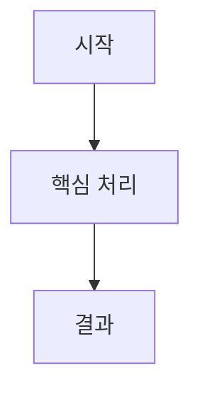

# File Classifier & Summarizer Skill

폴더 안의 다양한 파일(HTML, DOCX, PPTX, PDF, TXT, MD, 소스코드 등)을 **유형별로 분류·복사**하고,
각 파일의 내용을 AI가 분석하여 **구조화된 한국어 요약 + Mermaid 다이어그램**이 포함된 Markdown 보고서를 생성합니다.

> **핵심 도구**: [classify_and_summarize.py](file:///d:/code/docs/chores/classify_and_summarize.py)

---

## 1. 사용 시점 (When to Activate)

- 사용자가 폴더 내 파일들을 유형별로 정리하고 요약해 달라고 요청할 때
- 특정 파일의 요약·분석을 요청할 때
- 문서 내용 기반 Mermaid 시각화(흐름도, 시퀀스, 상태도 등)를 요청할 때

---

## 2. 실행 전 필수 입력 (3가지)

스킬 실행 전에 **반드시** 사용자에게 다음 3가지를 확인하세요. `ask_question` 도구를 사용합니다.

### 질문 1: 원본 폴더 경로
```
분류·요약할 파일이 있는 원본 폴더 경로를 입력해 주세요.
(예: D:\documents\project-reports)
```

### 질문 2: 결과 저장 경로
```
분류된 파일과 요약 결과를 저장할 폴더 경로를 입력해 주세요.
(예: D:\output\classified-reports)
```

### 질문 3: 사용할 AI 모델
```
요약에 사용할 AI를 선택해 주세요:
- Claude
- Gemini
- GPT
```

---

## 3. 실행 절차 (Step-by-Step Workflow)

### 3-1단계: 파일 분류 및 텍스트 추출 스크립트 실행

사용자에게 입력받은 값으로 다음 명령어를 실행합니다:

```powershell
python d:\code\docs\chores\classify_and_summarize.py "<원본폴더>" "<결과폴더>" --ai <claude|gemini|gpt>
```

이 스크립트는 다음을 수행합니다:
1. 원본 폴더의 모든 파일을 재귀적으로 스캔
2. 확장자 기반으로 카테고리 분류 (documents, presentations, web, code, markup 등)
3. 결과 폴더 아래에 카테고리별 하위 폴더를 만들고 파일 **복사** (원본 유지)
4. 텍스트 추출 가능한 파일에서 내용 추출
5. `_manifest.json` (파일 목록 + 추출 텍스트) 및 `_classification_report.md` (분류 리포트) 생성

### 3-2단계: manifest 읽기 및 AI 요약 수행

스크립트 실행 완료 후:

1. `<결과폴더>/_manifest.json` 파일을 `view_file`로 읽습니다.
2. manifest의 `files` 배열을 순회하면서, `has_text`가 `true`인 각 파일에 대해:
   - `extracted_text` 내용을 기반으로 아래 **요약 템플릿**에 따라 Markdown 요약문을 작성합니다.
   - 요약문을 해당 파일이 복사된 카테고리 폴더 안에 `<파일명>_summary.md`로 저장합니다.
3. PDF 파일(`extracted_text`가 빈 경우)은 `view_file`로 직접 열어 분석합니다.

### 3-3단계: 전체 요약 리포트 업데이트

모든 개별 요약이 완료되면 `_classification_report.md`에 **전체 요약 섹션**을 추가합니다:
- 카테고리별 핵심 인사이트
- 전체 문서 간 관계나 공통 주제 Mermaid 다이어그램

---

## 4. 요약 문서 표준 템플릿

각 파일의 요약은 다음 구조를 따릅니다:

```markdown
# 📄 [문서 제목 또는 핵심 주제]

## 1. 문서 개요 (Overview)
- **문서명**: `[파일명]`
- **문서 포맷**: `[포맷]`
- **카테고리**: `[분류 카테고리]`
- **대상 독자 및 목적**: [간략 설명]
- **핵심 키워드**: `키워드1`, `키워드2`, `키워드3`

## 2. 핵심 요약 (Executive Summary)
[3~5문장으로 명확하게 요약]

## 3. 상세 내용 분석 (Key Content & Analysis)
[섹션/장/슬라이드별 핵심 내용]

## 4. 시각화 다이어그램 (Mermaid Diagrams)



## 5. 결론 및 시사점 (Key Takeaways)
- **주요 결론**: ...
- **권장 조치**: ...
```

---

## 5. Mermaid 다이어그램 작성 규칙

1. **지원 유형**: `flowchart TD/LR`, `sequenceDiagram`, `stateDiagram-v2`, `classDiagram`, `erDiagram`
2. **필수 규칙**:
   - 괄호·특수문자가 포함된 라벨은 반드시 큰따옴표로 감싸기: `id["라벨 (설명)"]`
   - 노드 ID는 알파벳+숫자로 간결하게 (예: `A`, `B`, `step1`)
   - HTML 태그 사용 금지

---

## 6. 결과 안내

작업 완료 후 사용자에게 다음을 안내합니다:
- 분류 리포트 경로: `file:///<결과폴더>/_classification_report.md`
- 카테고리별 폴더 구조
- 개별 요약 파일 위치
- 전체 파일 수 및 요약 성공/실패 현황
