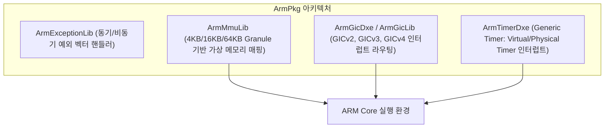
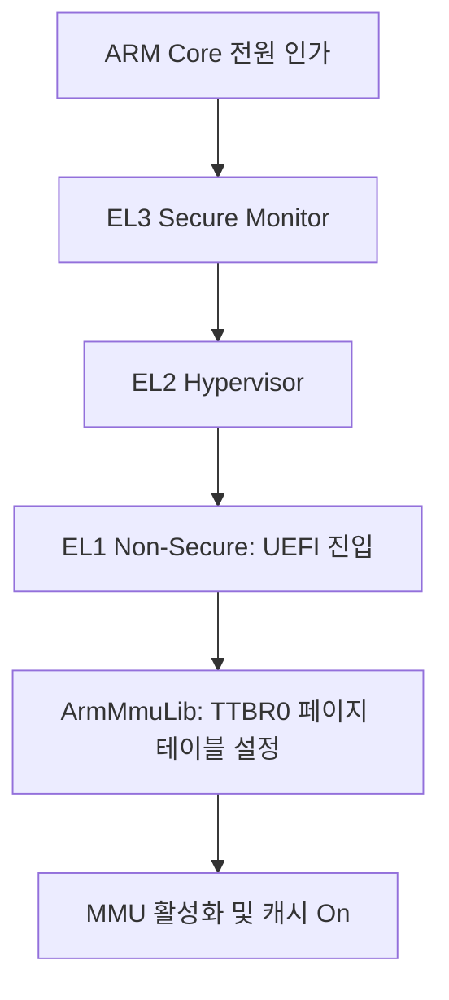

# ArmPkg (ARM Architecture Package) 상세 분석 보고서

## 1. 패키지 개요 (Overview)

- **패키지 디렉터리**: `ArmPkg/`
- **분류 (Category)**: Hardware & Architecture
- **주요 실행 단계 (Target Phases)**: `SEC, PEI, DXE`
- **포함된 모듈 수**: 총 42개 (`.inf` 모듈 기준)

ARMv7-A 및 ARMv8-A/AArch64 프로세서 아키텍처를 지원하는 EDK II 핵심 CPU 패키지입니다. 예외 벡터(Exception Vector), GIC(Generic Interrupt Controller), 시스템 타이머, MMU 변환 테이블(Translation Table) 설정을 담당합니다.

---

## 2. 패키지 아키텍처 및 시스템 블록 다이어그램

---

## 3. 핵심 아키텍처 및 심층 분석

### 핵심 기술 요소
- **Exception Levels (EL0~EL3)** 지원: UEFI는 통상적으로 일반적인 가상화 환경에서 EL2 또는 EL1에서 실행됩니다.
- **ArmGicLib**: 다중 코어 간 IPI(Inter-Processor Interrupt) 및 주변장치 IRQ를 처리하는 표준 GIC 드라이버를 제공합니다.

---

## 4. 핵심 실행 워크플로우 및 시퀀스 다이어그램

---

## 5. 제공 및 소비하는 주요 Protocols / PPIs / PCDs

### 5.1 주요 Protocols (DXE/SMM)
- `gArmScmiBaseProtocolGuid`
- `gArmScmiClockProtocolGuid`
- `gArmScmiClock2ProtocolGuid`
- `gArmScmiPerformanceProtocolGuid`
- `gEdkiiPiMmCpuDriverEpProtocolGuid`

### 5.2 주요 PPIs (PEI)
- `gArmMpCoreInfoPpiGuid`
- `gArmTransferListPpiGuid`

---

## 6. 주요 모듈 및 소스 파일 맵 (Module Summary Table)

| 모듈 유형 | 모듈명 (BASE_NAME) | 소스 경로 (.inf) |
|---|---|---|
| `BASE` | **ArmArchTimerLib** | `Library/ArmArchTimerLib/ArmArchTimerLib.inf` |
| `BASE` | **ArmCacheMaintenanceLib** | `Library/ArmCacheMaintenanceLib/ArmCacheMaintenanceLib.inf` |
| `BASE` | **ArmGenericTimerPhyCounterLib** | `Library/ArmGenericTimerPhyCounterLib/ArmGenericTimerPhyCounterLib.inf` |
| `BASE` | **ArmGenericTimerVirtCounterLib** | `Library/ArmGenericTimerVirtCounterLib/ArmGenericTimerVirtCounterLib.inf` |
| `BASE` | **ArmHvcLib** | `Library/ArmHvcLib/ArmHvcLib.inf` |
| `BASE` | **ArmHvcLibNull** | `Library/ArmHvcLibNull/ArmHvcLibNull.inf` |
| `DXE_DRIVER` | **ArmCrashDumpDxe** | `Drivers/ArmCrashDumpDxe/ArmCrashDumpDxe.inf` |
| `DXE_DRIVER` | **ArmGicDxe** | `Drivers/ArmGicDxe/ArmGicDxe.inf` |
| `DXE_DRIVER` | **ArmGicV2Dxe** | `Drivers/ArmGicDxe/ArmGicV2Dxe.inf` |
| `DXE_DRIVER` | **ArmGicV3Dxe** | `Drivers/ArmGicDxe/ArmGicV3Dxe.inf` |
| `DXE_DRIVER` | **ArmPciCpuIo2Dxe** | `Drivers/ArmPciCpuIo2Dxe/ArmPciCpuIo2Dxe.inf` |
| `DXE_DRIVER` | **ArmPsciMpServicesDxe** | `Drivers/ArmPsciMpServicesDxe/ArmPsciMpServicesDxe.inf` |
| `DXE_RUNTIME_DRIVER` | **ArmMmCommunication** | `Drivers/MmCommunicationDxe/MmCommunication.inf` |
| `DXE_RUNTIME_DRIVER` | **PsaFwuLib** | `Library/FmpDevicePsaFwuLib/FmpDevicePsaFwuLib.inf` |
| `MM_CORE_STANDALONE` | **ArmStandaloneMmCoreEntryPoint** | `Library/ArmStandaloneMmCoreEntryPoint/ArmStandaloneMmCoreEntryPoint.inf` |
| `MM_CORE_STANDALONE` | **ArmMmuStandaloneMmCoreLib** | `Library/StandaloneMmMmuLib/ArmMmuStandaloneMmLib.inf` |
| `MM_STANDALONE` | **StandaloneMmCpu** | `Drivers/StandaloneMmCpu/StandaloneMmCpu.inf` |
| `PEIM` | **CpuPei** | `Drivers/CpuPei/CpuPei.inf` |
| `PEIM` | **MmCommunicationPei** | `Drivers/MmCommunicationPei/MmCommunicationPei.inf` |
| `PEIM` | **PeiServicesTablePointerLib** | `Library/PeiServicesTablePointerLib/PeiServicesTablePointerLib.inf` |
| `UEFI_DRIVER` | **SemihostFs** | `Filesystem/SemihostFs/SemihostFs.inf` |
| ... | *(총 42개 모듈 중 대표 모듈 21개 수록)* | ... |

---

## 7. 관련 문서 및 참조 링크

- [EDK II 전체 아키텍처 개요](../EDK2_Architecture_Overview.md)
- [전체 패키지 분석 인덱스](Package_Analysis_Index.md)
- [FatPkg 상세 분석 보고서](FatPkg_Analysis.md)