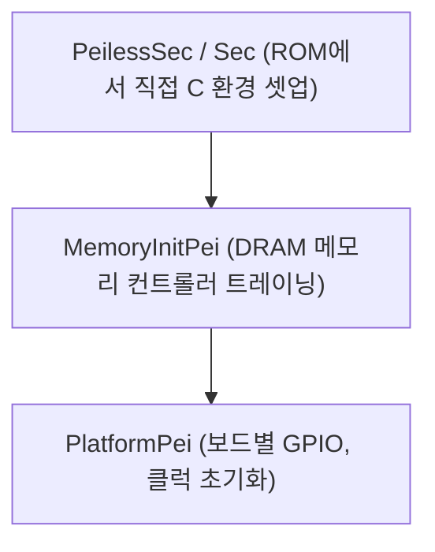

# ArmPlatformPkg (ARM Platform Package) 상세 분석 보고서

## 1. 패키지 개요 (Overview)

- **패키지 디렉터리**: `ArmPlatformPkg/`
- **분류 (Category)**: Hardware & Architecture
- **주요 실행 단계 (Target Phases)**: `SEC, PEI, DXE`
- **포함된 모듈 수**: 총 20개 (`.inf` 모듈 기준)

ARM 개발 보드 및 참조 플랫폼(Reference Platform)을 위한 부팅 초기화 패키지입니다. 시스템 메모리 컨트롤러 초기화(MemoryInitPei) 및 단일 바이너리 부팅(PeilessSec)을 제공합니다.

---

## 2. 패키지 아키텍처 및 시스템 블록 다이어그램

---

## 3. 핵심 아키텍처 및 심층 분석

### 핵심 역할
- PEI 단계를 대폭 간소화하거나 생략하고 바로 DXE로 점프하는 ARM 고유의 경량 부팅 아키텍처(PrePi / PeilessSec)를 지원합니다.

---

## 4. 핵심 실행 워크플로우 및 시퀀스 다이어그램

---

## 5. 제공 및 소비하는 주요 Protocols / PPIs / PCDs

---

## 6. 주요 모듈 및 소스 파일 맵 (Module Summary Table)

| 모듈 유형 | 모듈명 (BASE_NAME) | 소스 경로 (.inf) |
|---|---|---|
| `BASE` | **ArmMaliDp** | `Library/ArmMaliDp/ArmMaliDp.inf` |
| `BASE` | **ArmPlatformLibNull** | `Library/ArmPlatformLibNull/ArmPlatformLibNull.inf` |
| `BASE` | **HdLcd** | `Library/HdLcd/HdLcd.inf` |
| `BASE` | **LcdHwLibNull** | `Library/LcdHwLibNull/LcdHwLibNull.inf` |
| `BASE` | **LcdPlatformLibNull** | `Library/LcdPlatformLibNull/LcdPlatformLibNull.inf` |
| `BASE` | **PL011SerialPortLib** | `Library/PL011SerialPortLib/PL011SerialPortLib.inf` |
| `DXE_DRIVER` | **LcdGraphicsOutputDxe** | `Drivers/LcdGraphicsOutputDxe/LcdGraphicsOutputDxe.inf` |
| `DXE_DRIVER` | **PL061GpioDxe** | `Drivers/PL061GpioDxe/PL061GpioDxe.inf` |
| `DXE_DRIVER` | **SP805WatchdogDxe** | `Drivers/SP805WatchdogDxe/SP805WatchdogDxe.inf` |
| `PEIM` | **MemoryInit** | `MemoryInitPei/MemoryInitPeim.inf` |
| `PEIM` | **PlatformPei** | `PlatformPei/PlatformPeim.inf` |
| `SEC` | **PeilessSec** | `PeilessSec/PeilessSec.inf` |
| `SEC` | **ArmPlatformPeiLib** | `PlatformPei/PlatformPeiLib.inf` |
| `SEC` | **Sec** | `Sec/Sec.inf` |
| ... | *(총 20개 모듈 중 대표 모듈 14개 수록)* | ... |

---

## 7. 관련 문서 및 참조 링크

- [EDK II 전체 아키텍처 개요](../EDK2_Architecture_Overview.md)
- [전체 패키지 분석 인덱스](Package_Analysis_Index.md)
- [FatPkg 상세 분석 보고서](FatPkg_Analysis.md)