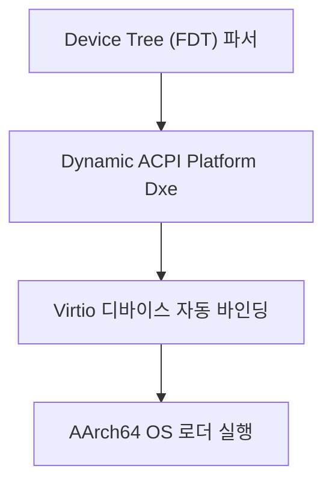
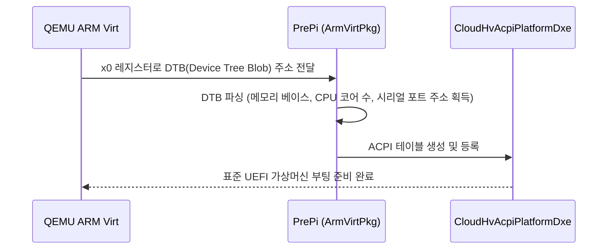

# ArmVirtPkg (ARM Virtual Platform Package) 상세 분석 보고서

## 1. 패키지 개요 (Overview)

- **패키지 디렉터리**: `ArmVirtPkg/`
- **분류 (Category)**: Virtualization & Platforms
- **주요 실행 단계 (Target Phases)**: `SEC, PEI, DXE`
- **포함된 모듈 수**: 총 44개 (`.inf` 모듈 기준)

ARM64 기반의 가상머신(QEMU `virt` 머신, KVMtool, Xen 가상화)을 위한 최신 펌웨어 패키지입니다. Linux 장치 트리(FDT/DTB)를 동적으로 파싱하여 하드웨어를 자동으로 검색하고 ACPI 테이블로 변환합니다.

---

## 2. 패키지 아키텍처 및 시스템 블록 다이어그램

---

## 3. 핵심 아키텍처 및 심층 분석

### 혁신적 특징
- 컴파일 타임에 고정된 하드웨어 정보 없이, QEMU가 전달한 FDT 바이너리를 런타임에 해석하여 임의의 코어 수와 메모리 크기에서도 유연하게 동작합니다.

---

## 4. 핵심 실행 워크플로우 및 시퀀스 다이어그램

---

## 5. 제공 및 소비하는 주요 Protocols / PPIs / PCDs

---

## 6. 주요 모듈 및 소스 파일 맵 (Module Summary Table)

| 모듈 유형 | 모듈명 (BASE_NAME) | 소스 경로 (.inf) |
|---|---|---|
| `BASE` | **ArmCcaBootSyncCryptoLib** | `Library/ArmCcaBootSyncCryptoLib/ArmCcaBootSyncCryptoLib.inf` |
| `BASE` | **ArmCcaInitPeiLib** | `Library/ArmCcaInitPeiLib/ArmCcaInitPeiLib.inf` |
| `BASE` | **ArmCcaInitPeiLib** | `Library/ArmCcaInitPeiLibNull/ArmCcaInitPeiLibNull.inf` |
| `BASE` | **ArmCcaLib** | `Library/ArmCcaLib/ArmCcaLib.inf` |
| `BASE` | **ArmCcaLib** | `Library/ArmCcaLibNull/ArmCcaLibNull.inf` |
| `BASE` | **ArmCcaRsiLib** | `Library/ArmCcaRsiLib/ArmCcaRsiLib.inf` |
| `DXE_DRIVER` | **CloudHvAcpiPlatformDxe** | `CloudHvAcpiPlatformDxe/CloudHvAcpiPlatformDxe.inf` |
| `DXE_DRIVER` | **CloudHvPlatformHasAcpiDtDxe** | `CloudHvPlatformHasAcpiDtDxe/CloudHvHasAcpiDtDxe.inf` |
| `DXE_DRIVER` | **ConfigurationManagerDxe** | `KvmtoolCfgMgrDxe/ConfigurationManagerDxe.inf` |
| `DXE_DRIVER` | **KvmtoolPlatformDxe** | `KvmtoolPlatformDxe/KvmtoolPlatformDxe.inf` |
| `DXE_DRIVER` | **ArmVirtDxeHobLib** | `Library/ArmVirtDxeHobLib/ArmVirtDxeHobLib.inf` |
| `DXE_DRIVER` | **ArmVirtGicPlatformDxe** | `Library/ArmVirtGicPlatformDxe/ArmVirtGicPlatformDxe.inf` |
| `DXE_RUNTIME_DRIVER` | **DxeRuntimeDebugLibFdtPL011Uart** | `Library/DebugLibFdtPL011Uart/DxeRuntimeDebugLibFdtPL011Uart.inf` |
| `PEIM` | **MemoryInit** | `MemoryInitPei/MemoryInitPeim.inf` |
| `SEC` | **ArmVirtMemoryInitPeiLib** | `Library/ArmVirtMemoryInitPeiLib/ArmVirtMemoryInitPeiLib.inf` |
| `SEC` | **ArmVirtPrePiUniCoreRelocatable** | `PrePi/ArmVirtPrePiUniCoreRelocatable.inf` |
| ... | *(총 44개 모듈 중 대표 모듈 16개 수록)* | ... |

---

## 7. 관련 문서 및 참조 링크

- [EDK II 전체 아키텍처 개요](../EDK2_Architecture_Overview.md)
- [전체 패키지 분석 인덱스](Package_Analysis_Index.md)
- [FatPkg 상세 분석 보고서](FatPkg_Analysis.md)