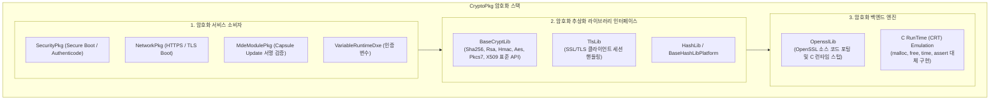
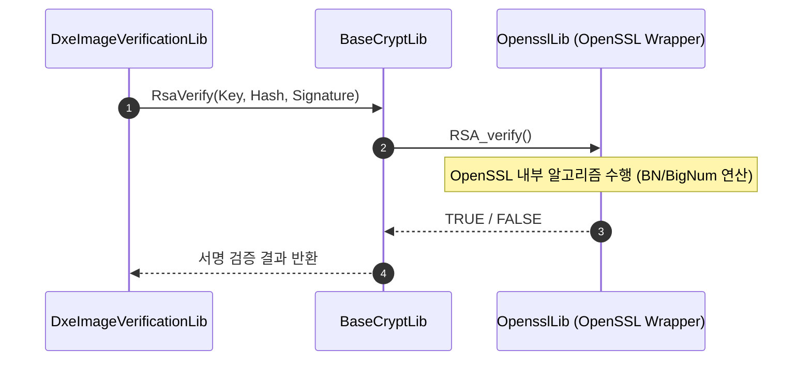

# CryptoPkg (Cryptography Package) 상세 분석 보고서

## 1. 패키지 개요 (Overview)

- **패키지 디렉터리**: `CryptoPkg/`
- **분류 (Category)**: Security & Cryptography
- **주요 실행 단계 (Target Phases)**: `SEC, PEI, DXE, SMM`
- **포함된 모듈 수**: 총 40개 (`.inf` 모듈 기준)

EDK II 전반에 필요한 모든 암호화 연산(해시, 대칭키, 공개키, 인증서 검증, TLS 보안 통신)을 제공하는 패키지입니다. 오픈소스 OpenSSL 엔진을 UEFI 펌웨어의 베어메탈 환경에 완벽하게 빌드 및 바인딩할 수 있도록 최적화된 어댑터와 Wrapper 라이브러리를 포함합니다.

---

## 2. 패키지 아키텍처 및 시스템 블록 다이어그램

---

## 3. 핵심 아키텍처 및 심층 분석

### 핵심 구현 특징
1. **`BaseCryptLib`**:
   - 호출자가 복잡한 OpenSSL 내부 구조체를 알 필요 없이, 단순하고 직관적인 C 함수 호출(`Sha256Init`, `Sha256Update`, `RsaVerify`, `Pkcs7Verify`)을 통해 암호화 작업을 처리할 수 있도록 캡슐화합니다.
2. **PEI/DXE/SMM 멀티 환경 지원**:
   - `PeiCryptLib`: PEI 환경의 엄격한 메모리 제한을 고려하여 크기를 최소화한 라이브러리
   - `SmmCryptLib`: SMM의 격리된 SMRAM 공간에서 안전하게 구동되는 보안 인스턴스
3. **C 런타임 스텁 구현**:
   - OpenSSL이 요구하는 표준 C 라이브러리 함수(`printf`, `time`, `malloc`)들을 EDK II의 `MemoryAllocationLib`과 `DebugLib`으로 에뮬레이션하여 외부 라이브러리 의존성을 완벽히 제거했습니다.

---

## 4. 핵심 실행 워크플로우 및 시퀀스 다이어그램

---

## 5. 제공 및 소비하는 주요 Protocols / PPIs / PCDs

### 5.1 주요 Protocols (DXE/SMM)
- `gEdkiiCryptoProtocolGuid`
- `gEdkiiSmmCryptoProtocolGuid`

### 5.2 주요 PPIs (PEI)
- `gEdkiiCryptoPpiGuid`

---

## 6. 주요 모듈 및 소스 파일 맵 (Module Summary Table)

| 모듈 유형 | 모듈명 (BASE_NAME) | 소스 경로 (.inf) |
|---|---|---|
| `BASE` | **SecCryptLib** | `Library/BaseCryptLib/SecCryptLib.inf` |
| `BASE` | **SecCryptLib** | `Library/BaseCryptLibMbedTls/SecCryptLib.inf` |
| `BASE` | **BaseCryptLibNull** | `Library/BaseCryptLibNull/BaseCryptLibNull.inf` |
| `BASE` | **BaseHashApiLib** | `Library/BaseHashApiLib/BaseHashApiLib.inf` |
| `BASE` | **BaseIntrinsicLib** | `Library/IntrinsicLib/IntrinsicLib.inf` |
| `BASE` | **MbedTlsLib** | `Library/MbedTlsLib/MbedTlsLib.inf` |
| `DXE_DRIVER` | **CryptoDxe** | `Driver/CryptoDxe.inf` |
| `DXE_DRIVER` | **BaseCryptLib** | `Library/BaseCryptLib/BaseCryptLib.inf` |
| `DXE_DRIVER` | **BaseCryptLib** | `Library/BaseCryptLibMbedTls/BaseCryptLib.inf` |
| `DXE_DRIVER` | **BaseCryptLib** | `Library/BaseCryptLibMbedTls/TestBaseCryptLib.inf` |
| `DXE_DRIVER` | **BaseCryptLib** | `Library/BaseCryptLibMbedTls/UnitTestHostBaseCryptLib.inf` |
| `DXE_DRIVER` | **DxeCryptLib** | `Library/BaseCryptLibOnProtocolPpi/DxeCryptLib.inf` |
| `DXE_RUNTIME_DRIVER` | **RuntimeCryptLib** | `Library/BaseCryptLib/RuntimeCryptLib.inf` |
| `DXE_RUNTIME_DRIVER` | **RuntimeCryptLib** | `Library/BaseCryptLibMbedTls/RuntimeCryptLib.inf` |
| `DXE_SMM_DRIVER` | **CryptoSmm** | `Driver/CryptoSmm.inf` |
| `DXE_SMM_DRIVER` | **SmmCryptLib** | `Library/BaseCryptLib/SmmCryptLib.inf` |
| `DXE_SMM_DRIVER` | **SmmCryptLib** | `Library/BaseCryptLibMbedTls/SmmCryptLib.inf` |
| `DXE_SMM_DRIVER` | **SmmCryptLib** | `Library/BaseCryptLibOnProtocolPpi/SmmCryptLib.inf` |
| `HOST_APPLICATION` | **BaseCryptLib** | `Library/BaseCryptLib/UnitTestHostBaseCryptLib.inf` |
| `HOST_APPLICATION` | **MockBaseCryptLib** | `Test/Mock/Library/GoogleTest/MockBaseCryptLib/MockBaseCryptLib.inf` |
| `HOST_APPLICATION` | **BaseCryptLibUnitTestHost** | `Test/UnitTest/Library/BaseCryptLib/TestBaseCryptLibHost.inf` |
| `HOST_APPLICATION` | **BaseCryptLibUnitTestHost** | `Test/UnitTest/Library/BaseCryptLib/TestBaseCryptLibHostMbedTls.inf` |
| `MM_STANDALONE` | **CryptoStandaloneMm** | `Driver/CryptoStandaloneMm.inf` |
| `MM_STANDALONE` | **StandaloneMmCryptLib** | `Library/BaseCryptLibOnProtocolPpi/StandaloneMmCryptLib.inf` |
| `PEIM` | **CryptoPei** | `Driver/CryptoPei.inf` |
| ... | *(총 40개 모듈 중 대표 모듈 25개 수록)* | ... |

---

## 7. 관련 문서 및 참조 링크

- [EDK II 전체 아키텍처 개요](../EDK2_Architecture_Overview.md)
- [전체 패키지 분석 인덱스](Package_Analysis_Index.md)
- [FatPkg 상세 분석 보고서](FatPkg_Analysis.md)