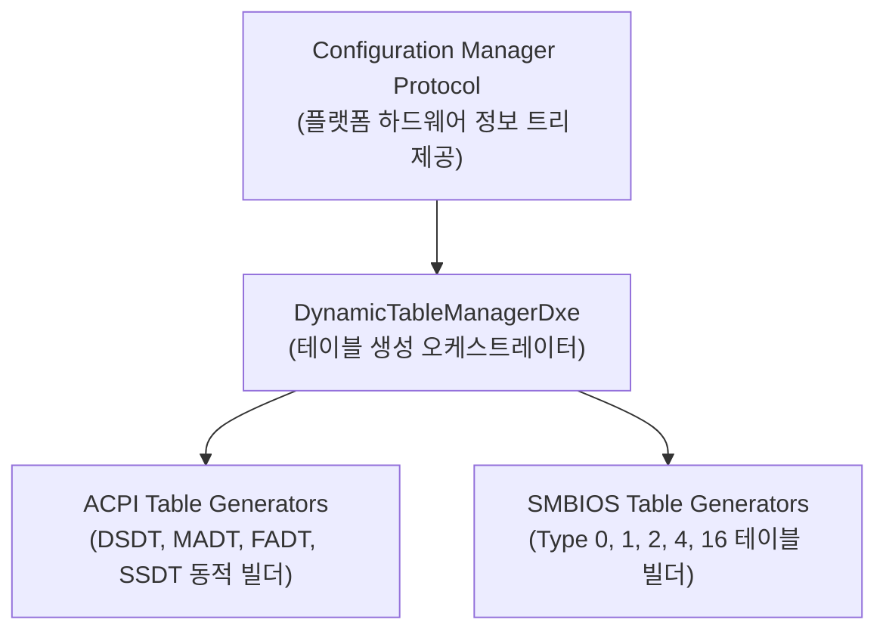

# DynamicTablesPkg (Dynamic Tables Package) 상세 분석 보고서

## 1. 패키지 개요 (Overview)

- **패키지 디렉터리**: `DynamicTablesPkg/`
- **분류 (Category)**: Management & Standards
- **주요 실행 단계 (Target Phases)**: `DXE`
- **포함된 모듈 수**: 총 79개 (`.inf` 모듈 기준)

하드웨어 구성 요소가 동적으로 변경될 수 있는 시스템(특히 다핵 ARM SoC 플랫폼)을 위해, 런타임에 하드웨어 정보를 수집하여 ACPI 및 SMBIOS 테이블을 자동으로 생성 및 설치해 주는 프레임워크입니다.

---

## 2. 패키지 아키텍처 및 시스템 블록 다이어그램

---

## 3. 핵심 아키텍처 및 심층 분석

### 설계 장점
- 과거 수작업으로 ASL(ACPI Source Language) 코드를 하드코딩하던 방식에서 탈피하여, C 구조체 파라미터만 넘기면 완전한 ACPI 바이트코드가 자동 합성됩니다.

---

## 4. 핵심 실행 워크플로우 및 시퀀스 다이어그램

---

## 5. 제공 및 소비하는 주요 Protocols / PPIs / PCDs

### 5.1 주요 Protocols (DXE/SMM)
- `gEdkiiConfigurationManagerProtocolGuid`
- `gEdkiiDynamicTableFactoryProtocolGuid`

---

## 6. 주요 모듈 및 소스 파일 맵 (Module Summary Table)

| 모듈 유형 | 모듈명 (BASE_NAME) | 소스 경로 (.inf) |
|---|---|---|
| `BASE` | **SmbiosSmcLib** | `Library/Smbios/Arm/SmbiosSmcLib/SmbiosSmcLib.inf` |
| `DXE_DRIVER` | **DynamicTableFactoryDxe** | `Drivers/DynamicTableFactoryDxe/DynamicTableFactoryDxe.inf` |
| `DXE_DRIVER` | **DynamicTableManagerDxe** | `Drivers/DynamicTableManagerDxe/DynamicTableManagerDxe.inf` |
| `DXE_DRIVER` | **AcpiApmtLibArm** | `Library/Acpi/Arm/AcpiApmtLibArm/AcpiApmtLibArm.inf` |
| `DXE_DRIVER` | **AcpiGtdtLibArm** | `Library/Acpi/Arm/AcpiGtdtLibArm/AcpiGtdtLibArm.inf` |
| `DXE_DRIVER` | **AcpiIortLibArm** | `Library/Acpi/Arm/AcpiIortLibArm/AcpiIortLibArm.inf` |
| `DXE_DRIVER` | **AcpiMadtLibArm** | `Library/Acpi/Arm/AcpiMadtLibArm/AcpiMadtLibArm.inf` |
| `HOST_APPLICATION` | **CedtGeneratorGoogleTest** | `Library/Acpi/Common/AcpiCedtLib/GoogleTest/CedtGeneratorGoogleTest.inf` |
| `HOST_APPLICATION` | **Dbg2GeneratorGoogleTest** | `Library/Acpi/Common/AcpiDbg2Lib/GoogleTest/Dbg2GeneratorGoogleTest.inf` |
| `HOST_APPLICATION` | **HmatGeneratorGoogleTest** | `Library/Acpi/Common/AcpiHmatLib/GoogleTest/HmatGeneratorGoogleTest.inf` |
| ... | *(총 79개 모듈 중 대표 모듈 10개 수록)* | ... |

---

## 7. 관련 문서 및 참조 링크

- [EDK II 전체 아키텍처 개요](../EDK2_Architecture_Overview.md)
- [전체 패키지 분석 인덱스](Package_Analysis_Index.md)
- [FatPkg 상세 분석 보고서](FatPkg_Analysis.md)