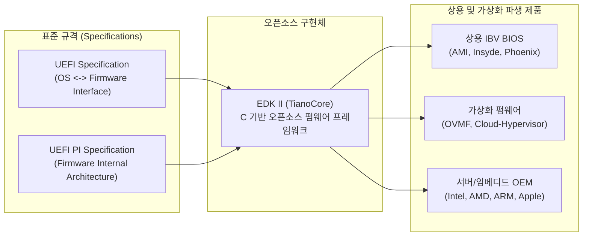
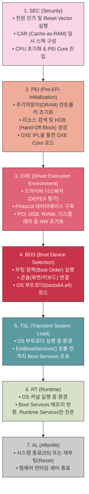
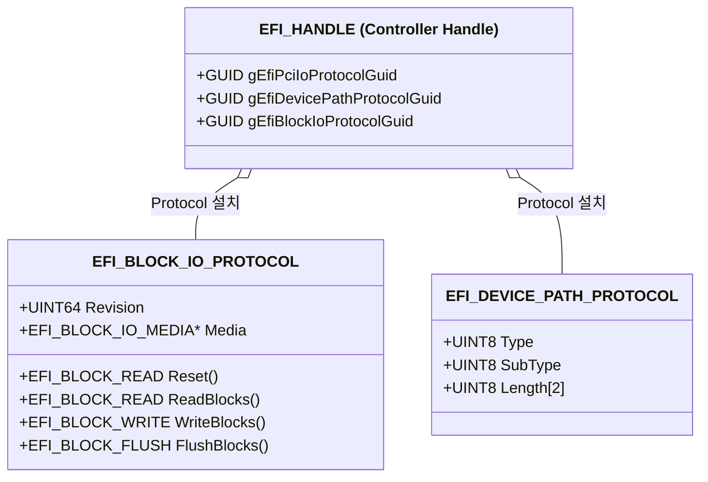
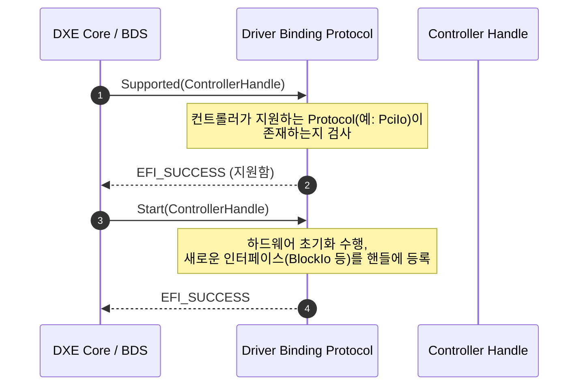
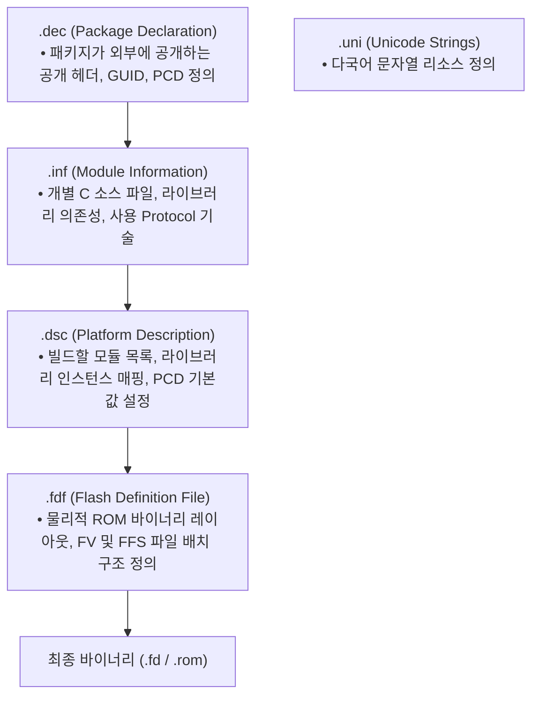
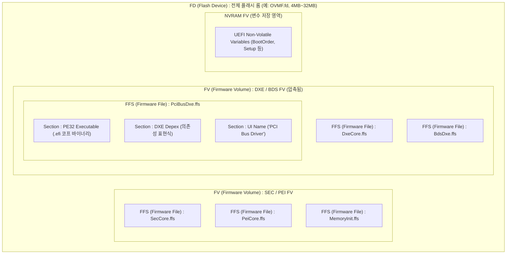
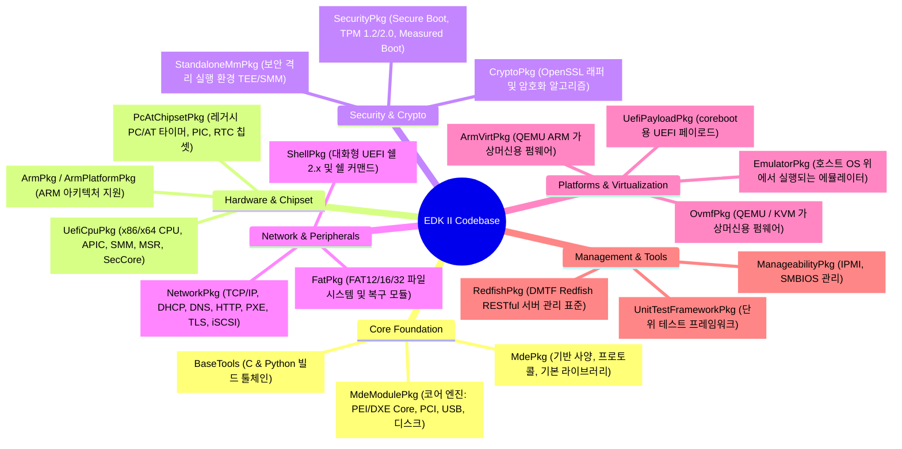
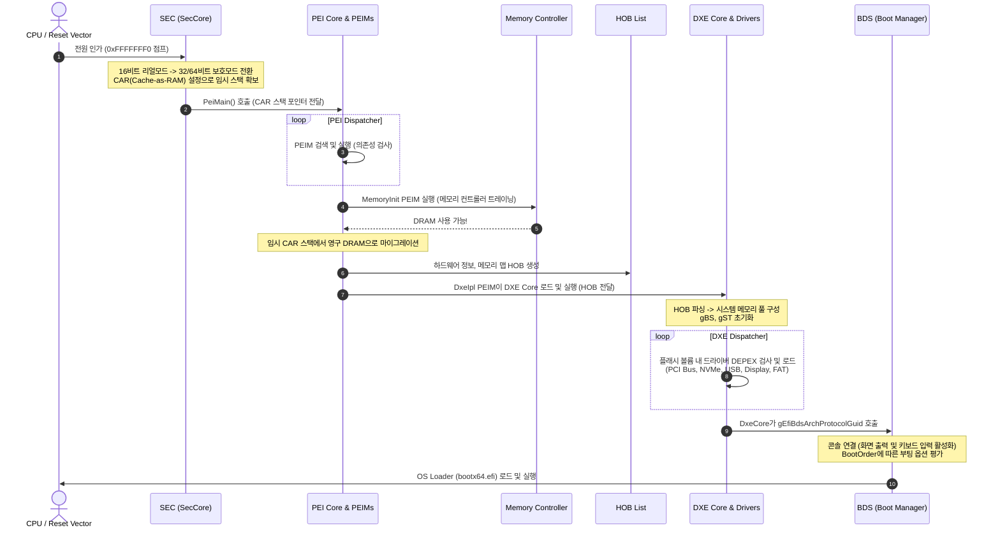
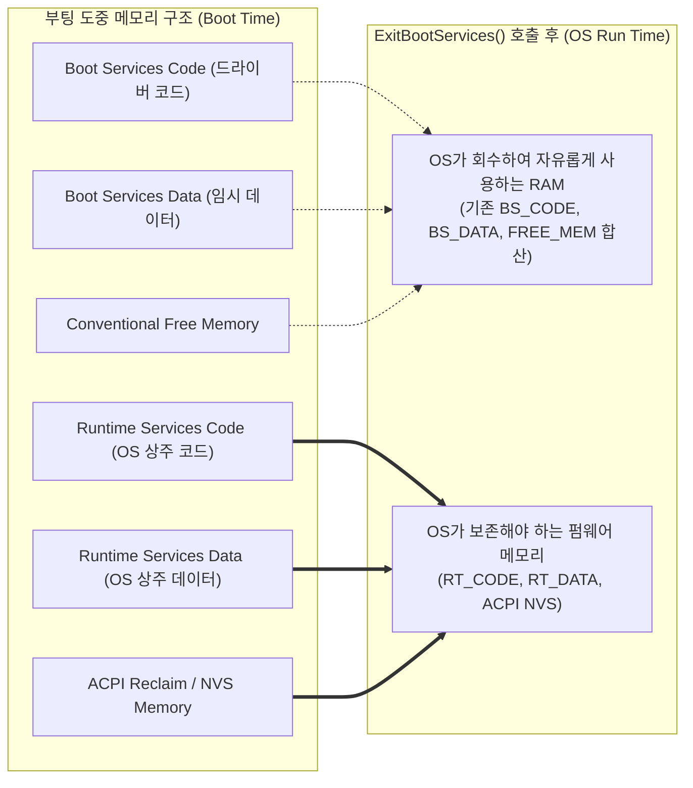

# EDK II (TianoCore) 전체 아키텍처 및 프로젝트 완벽 가이드

## 1. EDK II 프로젝트 개요 (Overview)

### 1.1 EDK II란 무엇인가?
**EDK II(EFI Development Kit II)**는 인텔과 글로벌 오픈소스 커뮤니티(TianoCore)가 주도하는 최신 크로스 플랫폼 펌웨어 개발 환경입니다. PC, 서버, 가상머신(QEMU/KVM), 모바일/임베디드(ARM, RISC-V)에 이르기까지 전 세계 현대 컴퓨터 시스템의 부팅 펌웨어(UEFI/BIOS)의 사실상 표준(De-facto Standard) 오픈소스 레퍼런스 구현체입니다.

### 1.2 핵심 표준 규격
EDK II는 **UEFI 포럼(UEFI Forum)**에서 제정한 두 가지 핵심 사양을 엄격하게 구현합니다:
1. **UEFI Specification (Unified Extensible Firmware Interface)**:
   - 펌웨어와 운영체제(OS Loader, OS Kernel) 사이의 표준 인터페이스 규격
   - Boot Services(`gBS`), Runtime Services(`gRT`), Protocol, Event/Timer 모델 정의
2. **UEFI PI Specification (Platform Initialization)**:
   - 칩셋/플랫폼 제조사들이 펌웨어 내부를 모듈화하여 개발할 수 있도록 하는 내부 아키텍처 규격
   - SEC, PEI, DXE, BDS 단계별 구조, PPI, HOB, Dispatcher 메커니즘 정의



---

## 2. UEFI 부팅 7단계 라이프사이클 (Execution Phases)

시스템 전원 버튼을 누른 순간(Power-On)부터 운영체제(Windows, Linux 등)가 완전히 실행될 때까지 EDK II는 **7개의 명확한 단계(Phase)**를 거치며 실행 환경을 점진적으로 확장합니다.



### 단계별 상세 비교표
| 단계 | 메모리 환경 | 핵심 실행 주체 | 통신 메커니즘 | 주요 산출물 / 목표 |
|---|---|---|---|---|
| **SEC** | CPU Cache (CAR) | 어셈블리 + C 언어 | 파라미터 레지스터 | 임시 스택, BIST(자가진단), PEI 핸드오프 |
| **PEI** | CAR $\rightarrow$ 영구 DRAM | PEI Core & PEIMs | **PPI (PEIM-to-PEIM Interface)** | DRAM 초기화, **HOB(Hand-Off Block) 리스트** |
| **DXE** | 영구 DRAM (전체 영역) | DXE Core & DXE Drivers | **Protocol & Handles** | 칩셋/버스/주변장치 제어, UEFI 서비스 완성 |
| **BDS** | DRAM | BDS Architectural Protocol | UEFI Events, KeyPress | 부팅 디바이스 검색, OS 로더 호출 |
| **TSL** | DRAM | OS Loader (GRUB, Windows BootMgr) | UEFI Boot Services | OS 커널 이미지 메모리 로드 및 검증 |
| **RT** | OS 제어 메모리 | OS Kernel | **UEFI Runtime Services (`gRT`)** | Variable(NVRAM), Time, ResetSystem 제공 |
| **AL** | - | 하드웨어 전원 제어기 | ACPI/PM 제어 | 전원 차단(Power Off) 또는 시스템 리셋 |

---

## 3. EDK II 핵심 개념과 동작 원리

EDK II를 이해하기 위해 반드시 알아야 하는 **5대 핵심 프로그래밍 개념**입니다.

### 3.1 Handles & Protocols (DXE 핵심)
- **Handle**: 시스템 내의 객체(디바이스, 파티션, 드라이버 이미지 등)를 식별하는 불투명한 포인터(`VOID*`).
- **Protocol**: Handle에 부착되는 함수 포인터 구조체. 고유한 **GUID**로 식별됩니다. (객체지향의 Interface와 동일 개념)



### 3.2 PPI (PEIM-to-PEIM Interface)
- PEI 단계에서는 메모리(DRAM)가 없거나 극히 제한적이므로, DXE의 Protocol보다 훨씬 단순한 포인터 배열 구조로 모듈 간 통신을 수행합니다.

### 3.3 HOB (Hand-Off Block)
- PEI 단계가 끝나고 DXE 단계로 넘어갈 때, **단방향 링크드 리스트** 형식으로 하드웨어 정보(메모리 맵, 플래시 볼륨 위치, CPU 정보 등)를 전달합니다.
- HOB는 DXE 초기화 완료 후 읽기 전용 데이터로 취급됩니다.


### 3.4 PCD (Platform Configuration Database)
플랫폼 전체에서 공통으로 사용하는 설정값(예: 시리얼 통신 속도, 디버그 메시지 활성화 여부 등)을 일관되게 관리하는 메커니즘입니다.
- **FixedAtBuild**: 빌드 타임 컴파일 상수로 치환 (최고 속도, 코드 크기 최소)
- **FeaturePcd**: 기능 활성화 여부를 나타내는 불리언 상수
- **PatchableInModule**: 바이너리 패치가 가능한 구조체 변수
- **Dynamic / DynamicEx**: 런타임에 PCD 프로토콜을 통해 읽고 쓸 수 있는 동적 데이터

### 3.5 UEFI Driver Model (바인딩 구조)
UEFI 드라이버는 컨트롤러에 직접 접근하지 않고, `EFI_DRIVER_BINDING_PROTOCOL`을 통해 부모-자식 컨트롤러 관계를 형성합니다.



---

## 4. 빌드 시스템 및 펌웨어 바이너리 구조

EDK II는 독자적인 메타데이터 파일 체계를 통해 수천 개의 소스 코드를 조합하여 최종 ROM 바이너리를 생성합니다.

### 4.1 메타데이터 파일 5종



### 4.2 펌웨어 바이너리 레이아웃 (Flash Binary Hierarchy)
EDK II 빌드의 최종 결과물인 `.fd` 파일은 다음과 같은 정밀한 계층 구조로 패키징됩니다.



---

## 5. EDK II 전체 패키지 디렉터리 맵

EDK II 루트 폴더의 방대한 패키지들은 기능과 계층에 따라 다음과 같이 분류됩니다.



### 주요 패키지 핵심 상세 설명

| 분류 | 패키지명 | 설명 및 핵심 모듈 |
|---|---|---|
| **기반 코어** | **`MdePkg`** | 모든 EDK II 모듈의 기초. UEFI/PI 사양의 모든 데이터 타입, 헤더, 프로토콜 GUID 정의, 기본 C 라이브러리(`BaseLib`, `BaseMemoryLib`) 포함 |
| **코어 모듈** | **`MdeModulePkg`** | UEFI 펌웨어의 핵심 모듈 세트. `DxeCore`, `PeiCore`, `BdsDxe`, 가변 서비스(`VariableRuntimeDxe`), PCI/USB 버스 드라이버, 그래픽 콘솔 등 포함 |
| **CPU 제어** | **`UefiCpuPkg`** | x86/x64 프로세서 초기화, 멀티프로세서(MP) 서비스, SMM(System Management Mode) 인프라, CPU Reset Vector 및 SecCore |
| **보안/암호** | **`SecurityPkg`** | UEFI Secure Boot(PK, KEK, db, dbx 서명 검증), TPM 1.2/2.0 물리 장치 제어 및 Measured Boot, Opal 드라이브 보안 |
| **암호 라이브러리** | **`CryptoPkg`** | OpenSSL을 EDK II 펌웨어 환경에 맞게 포팅한 패키지. RSA, SHA-256/384/512, AES, TLS 통신 기능 제공 |
| **네트워크** | **`NetworkPkg`** | 엔터프라이즈급 네트워크 스택. IPv4/IPv6 이중 스택, TCP, UDP, PXE 부팅, UEFI HTTP Boot, DNS, iSCSI 지원 |
| **파일시스템** | **`FatPkg`** | UEFI 표준 FAT12/16/32 드라이버(`EnhancedFatDxe`) 및 PEI 단계 복구 전용 경량 드라이버(`FatPei`) |
| **가상화 펌웨어** | **`OvmfPkg`** | Open Virtual Machine Firmware. QEMU 가상머신에서 실제 하드웨어 없이 EDK II 펌웨어를 즉시 부팅 및 디버깅할 수 있는 대표 플랫폼 |
| **쉘 환경** | **`ShellPkg`** | OS 부팅 전 파일 조작, 메모리/PCI 레지스터 검사, 스크립트 실행이 가능한 대화형 UEFI Shell 및 표준 명령어 세트 |
| **빌드 도구** | **`BaseTools`** | C 및 Python으로 작성된 빌드 도구 모음 (`build`, `GenFv`, `GenFfs`, `GenSec`, `VfrCompiler` 등) |

---

## 6. 전원 인가부터 OS 진입까지의 상세 워크플로우

### 6.1 SEC $\rightarrow$ PEI $\rightarrow$ DXE 상세 실행 흐름도



### 6.2 OS 진입과 메모리 맵 전환 (`ExitBootServices`)

OS 부트로더가 커널을 메모리에 올리고 실행 준비가 끝나면, 펌웨어의 역할을 끝내기 위해 `gBS->ExitBootServices()`를 호출합니다.



---

## 7. 개발자 실습: 환경 설정 및 OVMF 가상머신 빌드

EDK II 프로젝트를 로컬 환경에서 직접 빌드하고 QEMU 가상머신을 통해 실행해 보는 표준 절차입니다.

### 7.1 기본 준비 사항
- **Windows 환경**: Visual Studio 2019/2022 (C++ 데스크톱 개발 워크로드), Python 3.10+, Git, NASM(어셈블러)
- **Linux 환경**: `build-essential`, `uuid-dev`, `python3`, `git`, `gcc`, `nasm`, `qemu-system-x86`

### 7.2 단계별 빌드 명령 (Windows 기준)

```powershell
# 1. EDK II 루트 디렉터리로 이동
cd D:\code\edk2

# 2. BaseTools C 도구 컴파일 및 환경 변수 설정
edksetup.bat Rebuild

# 3. Target 플랫폼 설정 및 빌드 (QEMU X64용 OVMF 빌드 예시)
#    -p: 플랫폼 DSC 파일 지정
#    -a: 대상 아키텍처 (X64)
#    -t: 툴체인 태그 (VS2019 또는 VS2022)
#    -b: 빌드 타깃 (DEBUG 또는 RELEASE)
build -p OvmfPkg/OvmfPkgX64.dsc -a X64 -t VS2019 -b DEBUG

# 4. 빌드 완료 후 생성된 바이너리 확인
#    결과물 위치: D:\code\edk2\Build\OvmfX64\DEBUG_VS2019\FV\OVMF.fd
```

### 7.3 QEMU를 통한 즉시 가상 실행
```powershell
qemu-system-x86_64 -bios D:\code\edk2\Build\OvmfX64\DEBUG_VS2019\FV\OVMF.fd -net none
```
실행 시 화면에 TianoCore 로고가 나타나며 즉시 대화형 **UEFI Shell** 화면으로 진입합니다.

---

## 8. 핵심 요약 (Summary)

1. **표준화된 계층 구조**:
   - EDK II는 **UEFI Spec**(OS-펌웨어 통신)과 **UEFI PI Spec**(내부 모듈 초기화)의 레퍼런스 구현체입니다.
2. **점진적 부팅 파이프라인**:
   - **SEC**(CAR 임시 스택) $\rightarrow$ **PEI**(DRAM 초기화 및 HOB 생성) $\rightarrow$ **DXE**(드라이버 및 Protocol 데이터베이스 구축) $\rightarrow$ **BDS**(부팅 옵션 탐색 및 OS 호출)의 명확한 책임을 갖습니다.
3. **완전한 모듈성과 유연성**:
   - Handle & Protocol 구조와 바인딩 드라이버 모델 덕분에 새로운 하드웨어(NVMe, USB4, WiFi) 드라이버를 코어 코드 수정 없이 독립적인 모듈(`INF`)로 즉시 추가할 수 있습니다.
4. **엔터프라이즈 기능 집약**:
   - Secure Boot, TPM Measured Boot, Full IPv4/IPv6 Network Stack, Redfish 관리 시스템 등 현대 컴퓨팅에 필요한 모든 엔터프라이즈 보안 및 관리 기능이 패키지화되어 있습니다.

