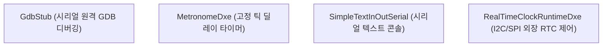

# EmbeddedPkg (Embedded Package) 상세 분석 보고서

## 1. 패키지 개요 (Overview)

- **패키지 디렉터리**: `EmbeddedPkg/`
- **분류 (Category)**: Embedded & Diagnostics
- **주요 실행 단계 (Target Phases)**: `SEC, DXE, Runtime`
- **포함된 모듈 수**: 총 35개 (`.inf` 모듈 기준)

임베디드 보드 및 스마트폰, IoT 디바이스 개발에 특화된 유틸리티 드라이버 모음 패키지입니다. 시리얼 콘솔 입출력, 메트로놈 타이머, GDB 시리얼 디버깅 스텁, FDT/DTB 지원을 포함합니다.

---

## 2. 패키지 아키텍처 및 시스템 블록 다이어그램

---

## 3. 핵심 아키텍처 및 심층 분석

### 임베디드 실용성
- 표준 PC 마더보드 환경이 아닌 커스텀 임베디드 하드웨어에서 최소한의 시리얼 라인 하나만으로 펌웨어를 올리고 디버깅할 수 있는 환경을 마련해 줍니다.

---

## 4. 핵심 실행 워크플로우 및 시퀀스 다이어그램

---

## 5. 제공 및 소비하는 주요 Protocols / PPIs / PCDs

### 5.1 주요 Protocols (DXE/SMM)
- `gHardwareInterruptProtocolGuid`
- `gHardwareInterrupt2ProtocolGuid`
- `gEmbeddedDeviceGuid`
- `gEmbeddedExternalDeviceProtocolGuid`
- `gEmbeddedGpioProtocolGuid`
- `gPeCoffLoaderProtocolGuid`
- `gEmbeddedMmcHostProtocolGuid`
- `gAndroidFastbootTransportProtocolGuid`
- `gAndroidFastbootPlatformProtocolGuid`
- `gUsbDeviceProtocolGuid`
- `gPlatformBootManagerProtocolGuid`
- `gPlatformGpioProtocolGuid`
- *(외 11개 프로토콜 정의 생략)*

### 5.2 주요 PPIs (PEI)
- `gEdkiiEmbeddedGpioPpiGuid`

---

## 6. 주요 모듈 및 소스 파일 맵 (Module Summary Table)

| 모듈 유형 | 모듈명 (BASE_NAME) | 소스 경로 (.inf) |
|---|---|---|
| `BASE` | **AndroidBootImgLib** | `Library/AndroidBootImgLib/AndroidBootImgLib.inf` |
| `BASE` | **CoherentDmaLib** | `Library/CoherentDmaLib/CoherentDmaLib.inf` |
| `BASE` | **DebugAgentTimerLibNull** | `Library/DebugAgentTimerLibNull/DebugAgentTimerLibNull.inf` |
| `BASE` | **NorFlashInfoLib** | `Library/NorFlashInfoLib/NorFlashInfoLib.inf` |
| `BASE` | **NvVarStoreFormattedLib** | `Library/NvVarStoreFormattedLib/NvVarStoreFormattedLib.inf` |
| `BASE` | **PlatformHasAcpiLib** | `Library/PlatformHasAcpiLib/PlatformHasAcpiLib.inf` |
| `DXE_DRIVER` | **ConsolePrefDxe** | `Drivers/ConsolePrefDxe/ConsolePrefDxe.inf` |
| `DXE_DRIVER` | **DtPlatformDxe** | `Drivers/DtPlatformDxe/DtPlatformDxe.inf` |
| `DXE_DRIVER` | **FdtClientDxe** | `Drivers/FdtClientDxe/FdtClientDxe.inf` |
| `DXE_DRIVER` | **MemoryAttributeManagerDxe** | `Drivers/MemoryAttributeManagerDxe/MemoryAttributeManagerDxe.inf` |
| `DXE_DRIVER` | **NonCoherentIoMmuDxe** | `Drivers/NonCoherentIoMmuDxe/NonCoherentIoMmuDxe.inf` |
| `DXE_DRIVER` | **AcpiLib** | `Library/AcpiLib/AcpiLib.inf` |
| `DXE_RUNTIME_DRIVER` | **EmbeddedMonotonicCounter** | `EmbeddedMonotonicCounter/EmbeddedMonotonicCounter.inf` |
| `DXE_RUNTIME_DRIVER` | **RealTimeClock** | `RealTimeClockRuntimeDxe/RealTimeClockRuntimeDxe.inf` |
| `HOST_APPLICATION` | **MockDtPlatformDtbLoaderLib** | `Test/Mock/Library/GoogleTest/MockDtPlatformDtbLoaderLib/MockDtPlatformDtbLoaderLib.inf` |
| `SEC` | **PrePiMemoryAllocationLib** | `Library/PrePiMemoryAllocationLib/PrePiMemoryAllocationLib.inf` |
| `UEFI_APPLICATION` | **AndroidBootApp** | `Application/AndroidBoot/AndroidBootApp.inf` |
| `UEFI_APPLICATION` | **AndroidFastbootApp** | `Application/AndroidFastboot/AndroidFastbootApp.inf` |
| `UEFI_DRIVER` | **TcpFastbootTransportDxe** | `Drivers/AndroidFastbootTransportTcpDxe/FastbootTransportTcpDxe.inf` |
| `UEFI_DRIVER` | **FastbootTransportUsbDxe** | `Drivers/AndroidFastbootTransportUsbDxe/FastbootTransportUsbDxe.inf` |
| `UEFI_DRIVER` | **VirtualKeyboardDxe** | `Drivers/VirtualKeyboardDxe/VirtualKeyboardDxe.inf` |
| `UEFI_DRIVER` | **GdbStub** | `GdbStub/GdbStub.inf` |
| `UEFI_DRIVER` | **GdbSerialDebugPortLib** | `Library/GdbSerialDebugPortLib/GdbSerialDebugPortLib.inf` |
| `UEFI_DRIVER` | **GdbSerialLib** | `Library/GdbSerialLib/GdbSerialLib.inf` |
| ... | *(총 35개 모듈 중 대표 모듈 24개 수록)* | ... |

---

## 7. 관련 문서 및 참조 링크

- [EDK II 전체 아키텍처 개요](../EDK2_Architecture_Overview.md)
- [전체 패키지 분석 인덱스](Package_Analysis_Index.md)
- [FatPkg 상세 분석 보고서](FatPkg_Analysis.md)