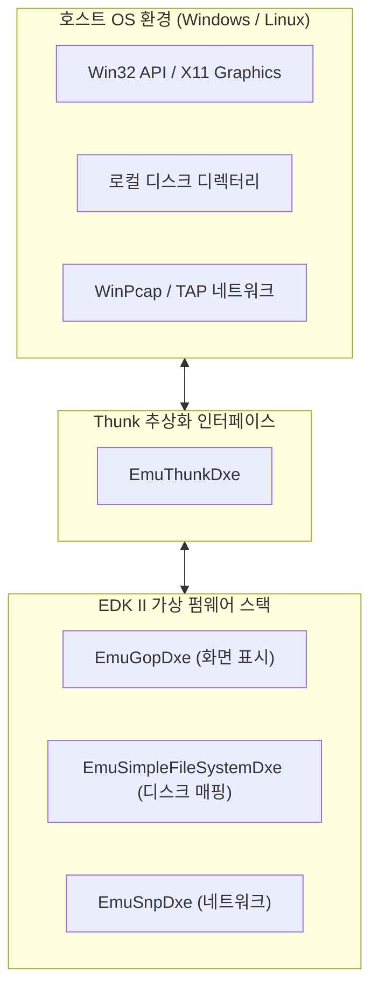
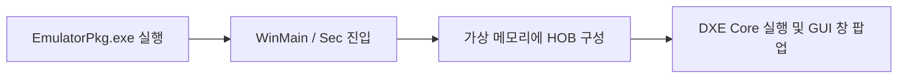

# EmulatorPkg (Emulator Package) 상세 분석 보고서

## 1. 패키지 개요 (Overview)

- **패키지 디렉터리**: `EmulatorPkg/`
- **분류 (Category)**: Virtualization & Platforms
- **주요 실행 단계 (Target Phases)**: `SEC, PEI, DXE, BDS (모두 호스트 프로세스 내에서 에뮬레이션)`
- **포함된 모듈 수**: 총 44개 (`.inf` 모듈 기준)

실제 하드웨어나 가상머신(QEMU) 없이도 개발자의 호스트 OS(Windows 데스크톱 또는 Linux) 상에서 일반 유저 모드 프로세스로 동작하는 EDK II 에뮬레이션 환경입니다. Thunk 메커니즘을 통해 호스트의 창(Window), 파일 시스템, 키보드를 UEFI 디바이스로 연결합니다.

---

## 2. 패키지 아키텍처 및 시스템 블록 다이어그램

---

## 3. 핵심 아키텍처 및 심층 분석

### 개발자 생산성
- 펌웨어 코드를 수정하고 롬을 굽는 시간 없이, Visual Studio나 GDB 디버거를 붙여 중단점(Breakpoint)을 잡고 라인 단위 디버깅을 즉시 수행할 수 있습니다.

---

## 4. 핵심 실행 워크플로우 및 시퀀스 다이어그램

---

## 5. 제공 및 소비하는 주요 Protocols / PPIs / PCDs

### 5.1 주요 Protocols (DXE/SMM)
- `gEmuThunkProtocolGuid`
- `gEmuIoThunkProtocolGuid`
- `gEmuGraphicsWindowProtocolGuid`
- `gEmuThreadThunkProtocolGuid`
- `gEmuBlockIoProtocolGuid`
- `gEmuSnpProtocolGuid`

### 5.2 주요 PPIs (PEI)
- `gEmuThunkPpiGuid`

---

## 6. 주요 모듈 및 소스 파일 맵 (Module Summary Table)

| 모듈 유형 | 모듈명 (BASE_NAME) | 소스 경로 (.inf) |
|---|---|---|
| `BASE` | **EmuPeiTimerLib** | `Library/PeiTimerLib/PeiTimerLib.inf` |
| `BASE` | **SecPpiListLib** | `Library/SecPpiListLib/SecPpiListLib.inf` |
| `BASE` | **ThunkPpiList** | `Library/ThunkPpiList/ThunkPpiList.inf` |
| `BASE` | **ThunkProtocolList** | `Library/ThunkProtocolList/ThunkProtocolList.inf` |
| `DXE_DRIVER` | **Cpu** | `CpuRuntimeDxe/Cpu.inf` |
| `DXE_DRIVER` | **EmuThunk** | `EmuThunkDxe/EmuThunk.inf` |
| `DXE_DRIVER` | **EmuDxeCodeTimerLib** | `Library/DxeCoreTimerLib/DxeCoreTimerLib.inf` |
| `DXE_DRIVER` | **DxeEmuLib** | `Library/DxeEmuLib/DxeEmuLib.inf` |
| `DXE_DRIVER` | **DxeEmuPeCoffExtraActionLib** | `Library/DxeEmuPeCoffExtraActionLib/DxeEmuPeCoffExtraActionLib.inf` |
| `DXE_DRIVER` | **EmuDxeTimerLib** | `Library/DxeTimerLib/DxeTimerLib.inf` |
| `DXE_RUNTIME_DRIVER` | **FwBlockService** | `FvbServicesRuntimeDxe/FvbServicesRuntimeDxe.inf` |
| `HOST_APPLICATION` | **Host** | `Unix/Host/Host.inf` |
| `HOST_APPLICATION` | **WinHost** | `Win/Host/WinHost.inf` |
| `PEIM` | **AutoScanPei** | `AutoScanPei/AutoScanPei.inf` |
| `PEIM` | **BootModePei** | `BootModePei/BootModePei.inf` |
| `PEIM` | **FirmwareVolumePei** | `FirmwareVolumePei/FirmwareVolumePei.inf` |
| `PEIM` | **FlashMapPei** | `FlashMapPei/FlashMapPei.inf` |
| `PEIM` | **DxeEmuSerialPortLib** | `Library/DxeEmuSerialPortLib/DxeEmuSerialPortLib.inf` |
| `PEIM` | **DxeEmuStdErrSerialPortLib** | `Library/DxeEmuStdErrSerialPortLib/DxeEmuStdErrSerialPortLib.inf` |
| `SEC` | **EmuSec** | `Sec/Sec.inf` |
| `UEFI_APPLICATION` | **RedfishPlatformConfig** | `Application/RedfishPlatformConfig/RedfishPlatformConfig.inf` |
| `UEFI_DRIVER` | **EmuBlockIo** | `EmuBlockIoDxe/EmuBlockIoDxe.inf` |
| `UEFI_DRIVER` | **EmuBusDriver** | `EmuBusDriverDxe/EmuBusDriverDxe.inf` |
| `UEFI_DRIVER` | **EmuGopDxe** | `EmuGopDxe/EmuGopDxe.inf` |
| `UEFI_DRIVER` | **EmuSimpleFileSystem** | `EmuSimpleFileSystemDxe/EmuSimpleFileSystemDxe.inf` |
| ... | *(총 44개 모듈 중 대표 모듈 25개 수록)* | ... |

---

## 7. 관련 문서 및 참조 링크

- [EDK II 전체 아키텍처 개요](../EDK2_Architecture_Overview.md)
- [전체 패키지 분석 인덱스](Package_Analysis_Index.md)
- [FatPkg 상세 분석 보고서](FatPkg_Analysis.md)