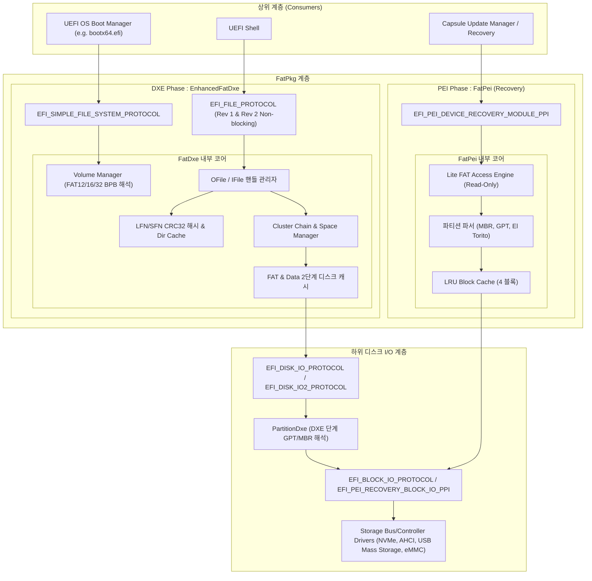
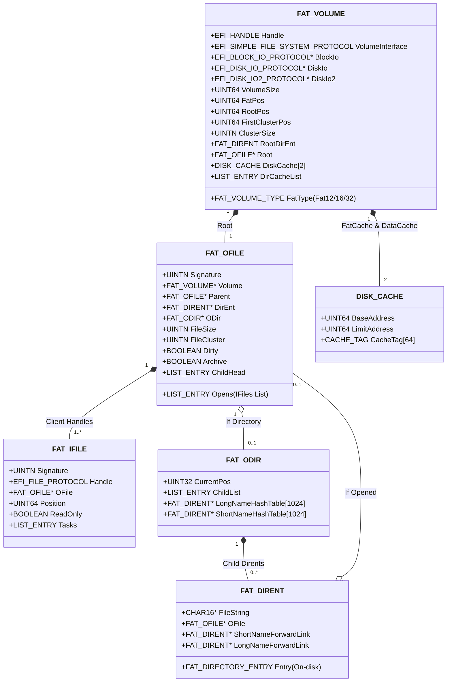
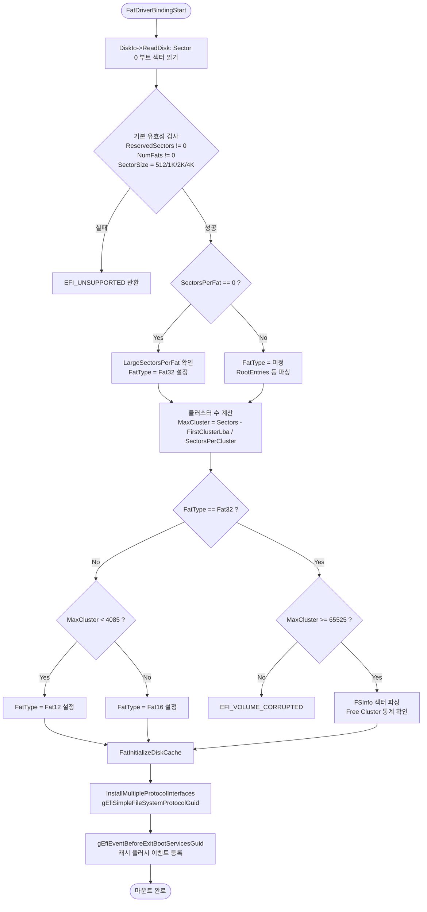
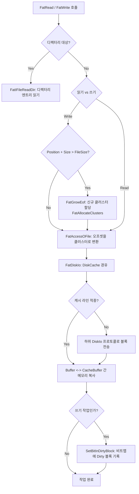
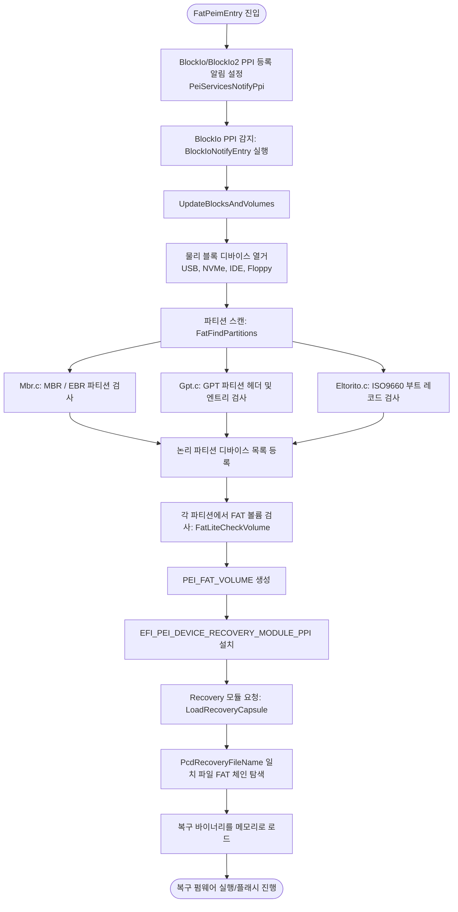

# EDK II FatPkg 상세 분석 보고서

## 1. 개요 (Overview)

`FatPkg`는 TianoCore EDK II(EFI Development Kit II) 환경에서 FAT(File Allocation Table) 파일 시스템을 지원하기 위해 설계된 핵심 패키지입니다. UEFI 사양(UEFI Specification)에 정의된 **FAT12, FAT16, FAT32** 파일 시스템에 대한 완전한 읽기/쓰기 기능과, 부팅 전 초기 단계인 PEI(Pre-EFI Initialization) 단계에서 펌웨어 복구(Firmware Recovery)를 위한 초경량 FAT 읽기 기능을 제공합니다.

### 1.1 주요 구성 모듈
| 모듈명 | 위치 | 실행 단계 (Phase) | 드라이버 유형 | 주요 역할 |
|---|---|---|---|---|
| **EnhancedFatDxe** | `FatPkg/EnhancedFatDxe` | DXE (Driver Execution Environment) | `UEFI_DRIVER` | FAT12/16/32 완전 지원, UEFI 표준 파일 시스템 프로토콜(`EFI_SIMPLE_FILE_SYSTEM_PROTOCOL`, `EFI_FILE_PROTOCOL`) 제공 |
| **FatPei** | `FatPkg/FatPei` | PEI (Pre-EFI Initialization) | `PEIM` | 복구 미디어(USB, NVMe, IDE, Floppy 등)에서 MBR/GPT/El Torito 파티션을 해석하고 복구용 바이너리(Capsule 등)를 로드하는 경량 읽기 전용 드라이버 |

---

## 2. 패키지 아키텍처 및 시스템 블록 다이어그램

`FatPkg`는 UEFI 소프트웨어 계층 구조 상에서 하위 블록 I/O 계층(BlockIo/DiskIo)과 상위 응용 계층(UEFI Shell, OS Loader/Boot Manager) 사이에 위치하여 디스크 블록을 파일/디렉터리 트리로 추상화합니다.

### 2.1 전체 시스템 계층 구조 (Block Diagram)



---

## 3. EnhancedFatDxe 심층 분석

`EnhancedFatDxe`는 UEFI Driver Model을 준수하는 DXE 드라이버로, 다양한 FAT 파일 시스템을 정밀하게 제어합니다.

### 3.1 드라이버 라이프사이클 (Driver Binding)
- **`FatDriverBindingSupported`**: 주어진 컨트롤러 핸들이 `EFI_DISK_IO_PROTOCOL` 및 `EFI_BLOCK_IO_PROTOCOL`을 지원하는지 검증합니다.
- **`FatDriverBindingStart`**: 
  1. Unicode Collation 프로토콜(`EFI_UNICODE_COLLATION2_PROTOCOL`)을 초기화합니다.
  2. `BlockIo`, `DiskIo`, `DiskIo2`를 오픈합니다.
  3. 볼륨 구조체(`FAT_VOLUME`)를 할당하고 부트 섹터(BPB)를 분석(`FatOpenDevice`)합니다.
  4. 유효한 FAT 볼륨인 경우 디스크 캐시를 초기화하고 핸들에 `EFI_SIMPLE_FILE_SYSTEM_PROTOCOL`을 설치합니다.
  5. `gEfiEventBeforeExitBootServicesGuid` 이벤트를 등록하여 OS 진입 직전 캐시를 디스크에 완전 플러시하도록 보장합니다.
- **`FatDriverBindingStop`**: 열려 있는 파일/디렉터리 핸들을 정리하고 볼륨 캐시를 플러시한 뒤 프로토콜을 언인스톨합니다.

### 3.2 핵심 데이터 구조체 관계도

EnhancedFatDxe는 파일 시스템 엔터티를 계층화된 4가지 핵심 구조체(`FAT_VOLUME`, `FAT_OFILE`, `FAT_IFILE`, `FAT_ODIR`)로 관리합니다.



#### 구조체 역할 요약:
1. **`FAT_VOLUME`**: 마운트된 볼륨 전체를 대표하는 구조체. BPB 정보, 클러스터 크기, FAT 테이블 위치, 2단계 디스크 캐시 및 루트 디렉터리를 포함합니다.
2. **`FAT_OFILE`**: 디스크 상의 고유한 파일/디렉터리를 나타내는 메모리 객체(UNIX의 Inode 개념). 파일의 실제 클러스터 체인, 수정 상태(`Dirty`), 부모/자식 관계를 추적합니다.
3. **`FAT_IFILE`**: 클라이언트가 오픈할 때 반환되는 핸들 인스턴스(File Descriptor 개념). 개별 커서 오프셋(`Position`), 읽기 전용 상태, 비동기 작업 큐(`Tasks`)를 유지합니다. 동일한 `FAT_OFILE`에 대해 여러 `FAT_IFILE`이 존재할 수 있습니다.
4. **`FAT_ODIR` / `FAT_DIRENT`**: 디렉터리 내부 엔트리들을 1024 버킷의 CRC32 해시 테이블(`LongNameHashTable`, `ShortNameHashTable`)로 매핑하여 $O(1)$의 초고속 파일 검색 속도를 보장합니다.

---

### 3.3 핵심 작업 흐름도 (Sequence & Flowcharts)

#### 1) 볼륨 마운트 및 FAT 식별 흐름 (`Init.c`)
디바이스 드라이버 바인딩 시 BPB(BIOS Parameter Block)를 읽어 FAT12, FAT16, FAT32를 판별하는 흐름입니다.



#### 2) 파일 오픈 및 생성 흐름 (`Open.c`, `DirectoryManage.c`)
상대 경로 또는 절대 경로를 통해 파일을 열거나 생성하는 메커니즘입니다.

```mermaid
sequenceDiagram
    autonumber
    actor Caller as UEFI App / OS Loader
    participant Vol as Volume (FatOpenVolume)
    participant Open as FatOFileOpen
    participant Locate as FatLocateOFile
    participant Hash as Hash Table (CRC32)
    participant Create as FatCreateDirEnt

    Caller->>Vol: OpenVolume()
    Vol-->>Caller: Root IFile 핸들 반환
    
    Caller->>Open: Handle->Open(FileName, OpenMode, Attributes)
    Open->>Locate: FatLocateOFile(ParentOFile, Path)
    Locate->>Hash: FatLongNameHashSearch / FatShortNameHashSearch
    
    alt 파일이 이미 존재하는 경우
        Hash-->>Locate: FAT_DIRENT 노드 반환
        Locate-->>Open: 기존 FAT_OFILE 반환
    else 파일이 없고 OpenMode에 EFI_FILE_MODE_CREATE 지정된 경우
        Hash-->>Locate: NOT FOUND
        Locate-->>Open: 잔여 파일명(NewFileName) 반환
        Open->>Create: FatCreateDirEnt(Parent, NewFileName, Attributes)
        Create->>Create: 8.3 Short Name 생성 & LFN 엔트리 생성
        Create-->>Open: 신규 FAT_DIRENT 반환
        Open->>Open: FatOpenDirEnt (신규 FAT_OFILE 생성)
    end

    Open->>Open: FatAllocateIFile(OFile) (새 핸들 생성)
    Open-->>Caller: EFI_FILE_PROTOCOL 핸들 반환
```

#### 3) 파일 읽기 및 쓰기 흐름 (`ReadWrite.c`, `FileSpace.c`, `DiskCache.c`)



---

## 4. FatPei (PEI Recovery Lite FAT Module) 심층 분석

`FatPei`는 시스템 부팅 실패나 펌웨어 손상 시 복구(Recovery)를 수행할 수 있도록 최소한의 리소스로 동작하는 읽기 전용 드라이버입니다.

### 4.1 핵심 설계 특징
1. **자체 파티션 드라이버 내장 (`Mbr.c`, `Gpt.c`, `Eltorito.c`, `Part.c`)**:
   - DXE 단계에서는 `PartitionDxe`가 파티션을 해석하여 자식 디바이스를 생성하지만, PEI 단계에는 이러한 드라이버 분리가 없습니다.
   - 따라서 `FatPei`는 물리 블록 디바이스 위에 직접 **MBR(Master Boot Record), GPT(GUID Partition Table), El Torito(CD-ROM)** 파티션을 스캔하고 가상 블록 디바이스로 등록합니다.
2. **초경량 LRU 블록 캐시**:
   - 단 4개의 블록 캐시(`PEI_FAT_CACHE_SIZE = 4`)만을 사용하여 PEI 메모리 제약 환경에서 스택/힙 오버플로를 방지합니다.
3. **PCD 기반 복구 파일 자동 탐색**:
   - `PcdRecoveryFileName`(기본값: BIOS.BIN 또는 지정 파일명)을 FAT 루트 또는 서브 디렉터리에서 검색하여 펌웨어 볼륨으로 로드합니다.

### 4.2 PEI 복구 실행 흐름도



---

## 5. 핵심 기술 구현 상세 및 최적화 기법

### 5.1 고성능 2단계 디스크 캐시 및 세밀한 더티 비트 관리 (`DiskCache.c`)
- 볼륨마다 `CacheFat`(FAT 테이블 캐시: 8KB~32KB)와 `CacheData`(데이터 클러스터 캐시: 8KB~64KB, 64그룹)를 독립적으로 운용합니다.
- 변경된 블록을 추적할 때 전체 캐시 라인을 디스크에 기록하는 낭비를 줄이기 위해, 64비트 정수 비트맵(`DIRTY_BLOCKS`)을 사용하여 **실제 수정된 섹터/블록만 선택적으로 디스크에 Write**합니다.

### 5.2 CRC32 기반 LFN/SFN 듀얼 해시 테이블 (`Hash.c`)
- 디렉터리 내에 수천 개의 파일이 존재할 경우 FAT 순차 검색은 $O(N)$의 심각한 지연을 초래합니다.
- `EnhancedFatDxe`는 긴 파일명(LFN)과 8.3 짧은 파일명(SFN)에 대해 각각 1024 버킷의 CRC32 해시 테이블을 유지하여 대규모 디렉터리에서도 즉각적인 파일 조회를 수행합니다.

### 5.3 비동기 파일 I/O 지원 (`ReadWrite.c`, `EFI_DISK_IO2_PROTOCOL`)
- UEFI 2.x 사양의 비동기 I/O를 지원합니다.
- 호출자가 `EFI_FILE_IO_TOKEN`을 전달하면 논블로킹 방식으로 `FAT_TASK` 및 `FAT_SUBTASK`를 구성하고, 하위 하드웨어(`DiskIo2`)의 비동기 완료 알림을 받아 이벤트를 시그널합니다.

### 5.4 부팅 전 안전한 캐시 플러시 메커니즘 (`Flush.c`, `Init.c`)
- 부팅 로더가 OS 커널로 제어권을 넘기는 시점(`ExitBootServices`)에 파일 시스템 캐시가 디스크에 기록되지 않으면 파일 시스템 파손이 발생할 수 있습니다.
- `gEfiEventBeforeExitBootServicesGuid` 알림 핸들러를 사전에 등록하여 디바이스 인터페이스가 닫히기 직전에 모든 더티 캐시를 강제 플러시합니다.

---

## 6. 전체 소스 코드 파일 맵 및 역할

### 6.1 EnhancedFatDxe 파일 구조 (`FatPkg/EnhancedFatDxe/`)

| 파일명 | 주요 역할 및 핵심 함수 |
|---|---|
| **`Fat.h`** | 드라이버 전체 내부 구조체(`FAT_VOLUME`, `FAT_OFILE`, `FAT_IFILE`, `FAT_ODIR` 등), 상수, 매크로 선언 |
| **`FatFileSystem.h`** | FAT 온디스크 데이터 구조체 정의 (부트 섹터, BPB, FAT32 확장 BPB, 디렉터리 엔트리 포맷) |
| **`Fat.c`** | UEFI Driver Model 진입점(`FatEntryPoint`), 언로드(`FatUnload`), 드라이버 바인딩 프로토콜(`Supported`, `Start`, `Stop`) |
| **`Init.c`** | 볼륨 할당(`FatAllocateVolume`), BPB 파싱 및 FAT12/16/32 판별(`FatOpenDevice`), 볼륨 해제(`FatFreeVolume`) |
| **`OpenVolume.c`** | `EFI_SIMPLE_FILE_SYSTEM_PROTOCOL.OpenVolume()` 구현, 루트 디렉터리 IFile 인스턴스 오픈 |
| **`Open.c`** | 파일 및 서브 디렉터리 오픈/생성 (`FatOFileOpen`, `FatLocateOFile`, `FatAllocateIFile`) |
| **`ReadWrite.c`** | 파일/디렉터리 읽기 및 쓰기 (`FatRead`, `FatWrite`, `FatIFileReadDir`, 비동기 태스크 큐잉) |
| **`DirectoryManage.c`** | 디렉터리 엔트리 생성/삭제/탐색, `.` 및 `..` 생성, 커서 리셋 (`FatCreateDirEnt`, `FatOpenDirEnt`) |
| **`DirectoryCache.c`** | 디렉터리 캐시 관리(`DirCacheList`), 최근 접근된 디렉터리의 재참조 가속화 |
| **`DiskCache.c`** | 2단계 디스크 캐시(FAT/Data) 엔진, 비트맵 기반 dirty 섹터 관리, 캐시 라인 플러시 |
| **`FileSpace.c`** | 클러스터 체인 탐색(`FatGetNextCluster`), 클러스터 할당/해제(`FatAllocateClusters`, `FatFreeClusters`), 파일 확장/축소 |
| **`FileName.c`** | Long File Name(LFN) 파싱 및 8.3 Short File Name 자동 생성/체크섬 계산 (`FatCheckIs8Dot3Name`, `FatGenerate8Dot3Name`) |
| **`Hash.c`** | 파일 이름 검색 가속용 CRC32 해시 알고리즘 및 해시 테이블 탐색/삽입/삭제 (`FatLongNameHashSearch`, `FatShortNameHashSearch`) |
| **`Flush.c`** | 캐시 및 더티 엔트리를 디스크로 영구 기록 (`FatFileFlush`, `FatOFileFlush`, `FatVolumeFlushCache`) |
| **`Delete.c`** | 파일 및 디렉터리 삭제 (`FatDelete`), 삭제 전 하위 디렉터리 공백 여부 검사 |
| **`Info.c`** | `GetInfo` / `SetInfo` 처리 (`EFI_FILE_INFO`, `EFI_FILE_SYSTEM_INFO`, 볼륨 라벨 설정/조회) |
| **`UnicodeCollation.c`**| `EFI_UNICODE_COLLATION2_PROTOCOL`을 이용한 대소문자 무시 파일명 비교 및 대소문자 변환 지원 |
| **`Misc.c`** | 잠금 획득/해제(`FatAcquireLock`, `FatReleaseLock`), 볼륨 에러 처리, 시간 변환 유틸리티 |
| **`ComponentName.c`** | 드라이버 이름 및 다국어 지원 (`EFI_COMPONENT_NAME_PROTOCOL`, `EFI_COMPONENT_NAME2_PROTOCOL`) |
| **`Data.c`** | 전역 락, 드라이버 프로토콜 템플릿 등 전역 변수 정의 |

### 6.2 FatPei 파일 구조 (`FatPkg/FatPei/`)

| 파일명 | 주요 역할 및 핵심 함수 |
|---|---|
| **`FatLitePeim.h`** | PEI FAT 드라이버 내부 구조체(`PEI_FAT_PRIVATE_DATA`, `PEI_FAT_VOLUME`, `PEI_FAT_FILE` 등) 정의 |
| **`FatLiteFmt.h`** | PEI 전용 경량 부트 섹터 및 온디스크 구조체 정의 |
| **`FatLiteApi.h`** | PEI 복구 API 인터페이스 선언 |
| **`FatLiteApi.c`** | PEIM 진입점(`FatPeimEntry`), BlockIo PPI 알림 콜백, 복구 PPI 프로듀스, 볼륨 갱신 루틴 |
| **`FatLiteAccess.c`** | 경량 읽기 전용 FAT 순회 로직, 클러스터 체인 추적 및 블록 읽기 |
| **`FatLiteLib.c`** | PEI 전용 메모리/문자열 조작 및 블록 캐시(4 블록 LRU) 관리 함수 |
| **`Part.c`** | 디바이스 내 파티션 탐색 오케스트레이션 (`FatFindPartitions`) |
| **`Mbr.c`** | MBR(Master Boot Record) 및 EBR(Extended Boot Record) 파티션 테이블 분석 |
| **`Gpt.c`** | GPT(GUID Partition Table) 보호 MBR, 헤더, 파티션 엔트리 분석 및 검증 |
| **`Eltorito.c`** | El Torito CD-ROM 부트 레코드 카탈로그 분석 |

### 6.3 패키지 메타데이터 파일

| 파일명 | 역할 |
|---|---|
| **`FatPkg.dec`** | 패키지 선언 파일. GUID 및 패키지 사양 정의 |
| **`FatPkg.dsc`** | 패키지 빌드 기술 파일. 모듈 빌드 타깃(`FatPei.inf`, `Fat.inf`) 및 의존 라이브러리 링크 정의 |
| **`FatPkg.ci.yaml`** | CI(지속적 통합) 설정 파일. 코드 포맷 검사, 컴파일러 플래그, EDK II 스펙 적합성 검사 규칙 기술 |

---

## 7. 요약 및 평가

1. **완전성과 호환성**: FAT12, FAT16, FAT32 전체 규격을 완벽 지원하며, 유니코드 LFN과 레거시 8.3 SFN 간의 변환 및 충돌 방지를 정밀하게 구현합니다.
2. **고성능 아키텍처**: 1024-버킷 CRC32 해시 테이블을 통한 빠른 디렉터리 검색, 2단계 디스크 캐시 및 세밀한 섹터 단위 더티 비트 추적으로 디스크 I/O 병목을 최소화합니다.
3. **비동기 확장성**: 최신 UEFI Revision 2의 `DiskIo2` 기반 비동기 Non-blocking 파일 I/O를 완벽하게 지원합니다.
4. **부팅 단계별 최적화**: 
   - 런타임 이전(DXE): 강력한 풀스택 파일 시스템 제공
   - 초기 부팅/복구(PEI): MBR/GPT 파서까지 자체 내장하여 최소한의 풋프린트로 펌웨어 캡슐을 로드할 수 있는 복구 안전망 제공

