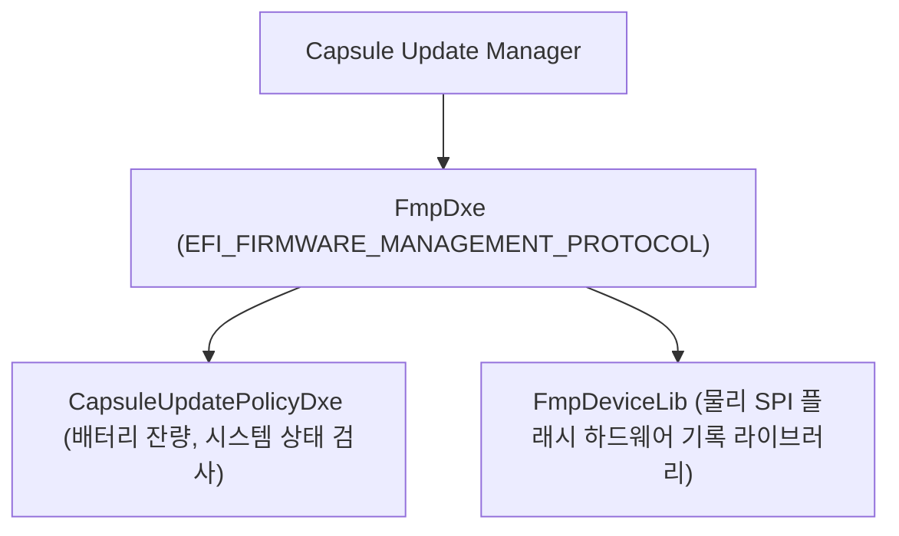
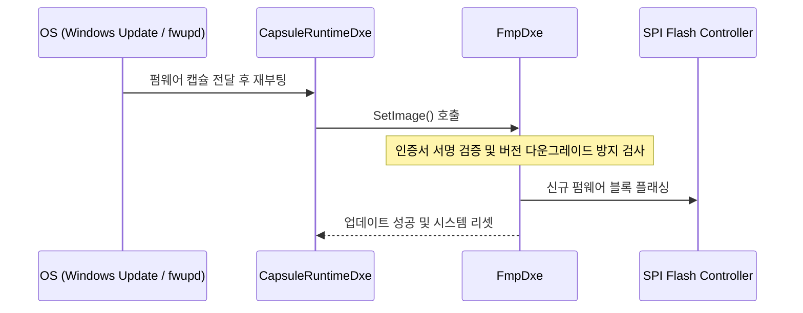

# FmpDevicePkg (Firmware Management Protocol Device Package) 상세 분석 보고서

## 1. 패키지 개요 (Overview)

- **패키지 디렉터리**: `FmpDevicePkg/`
- **분류 (Category)**: Firmware Update
- **주요 실행 단계 (Target Phases)**: `DXE, Runtime`
- **포함된 모듈 수**: 총 13개 (`.inf` 모듈 기준)

UEFI 캡슐 업데이트(Capsule Update) 시 시스템 펌웨어(System BIOS), 마이크로코드, EC, 주변장치 펌웨어를 안전하게 업데이트할 수 있도록 지원하는 FMP(Firmware Management Protocol) 디바이스 구현 프레임워크 패키지입니다.

---

## 2. 패키지 아키텍처 및 시스템 블록 다이어그램

---

## 3. 핵심 아키텍처 및 심층 분석

### 현대적 펌웨어 배포 표준
- Windows Update 또는 Linux `fwupd` (LVFS)를 통한 무중단 원격 펌웨어 자동 업데이트의 디바이스 측 핵심 엔진입니다.

---

## 4. 핵심 실행 워크플로우 및 시퀀스 다이어그램

---

## 5. 제공 및 소비하는 주요 Protocols / PPIs / PCDs

### 5.1 주요 Protocols (DXE/SMM)
- `gEdkiiCapsuleUpdatePolicyProtocolGuid`

---

## 6. 주요 모듈 및 소스 파일 맵 (Module Summary Table)

| 모듈 유형 | 모듈명 (BASE_NAME) | 소스 경로 (.inf) |
|---|---|---|
| `BASE` | **CapsuleUpdatePolicyLibNull** | `Library/CapsuleUpdatePolicyLibNull/CapsuleUpdatePolicyLibNull.inf` |
| `BASE` | **FmpDependencyLib** | `Library/FmpDependencyLib/FmpDependencyLib.inf` |
| `DXE_DRIVER` | **CapsuleUpdatePolicyDxe** | `CapsuleUpdatePolicyDxe/CapsuleUpdatePolicyDxe.inf` |
| `DXE_DRIVER` | **FmpDxe** | `FmpDxe/FmpDxe.inf` |
| `DXE_DRIVER` | **FmpDxeLib** | `FmpDxe/FmpDxeLib.inf` |
| `DXE_DRIVER` | **CapsuleUpdatePolicyLibOnProtocol** | `Library/CapsuleUpdatePolicyLibOnProtocol/CapsuleUpdatePolicyLibOnProtocol.inf` |
| `DXE_DRIVER` | **FmpDependencyCheckLib** | `Library/FmpDependencyCheckLib/FmpDependencyCheckLib.inf` |
| `DXE_DRIVER` | **FmpDependencyCheckLibNull** | `Library/FmpDependencyCheckLibNull/FmpDependencyCheckLibNull.inf` |
| `HOST_APPLICATION` | **FmpDependencyLibUnitTestsHost** | `Test/UnitTest/Library/FmpDependencyLib/FmpDependencyLibUnitTestsHost.inf` |
| `UEFI_APPLICATION` | **FmpDependencyLibUnitTestsUefi** | `Test/UnitTest/Library/FmpDependencyLib/FmpDependencyLibUnitTestsUefi.inf` |
| ... | *(총 13개 모듈 중 대표 모듈 10개 수록)* | ... |

---

## 7. 관련 문서 및 참조 링크

- [EDK II 전체 아키텍처 개요](../EDK2_Architecture_Overview.md)
- [전체 패키지 분석 인덱스](Package_Analysis_Index.md)
- [FatPkg 상세 분석 보고서](FatPkg_Analysis.md)