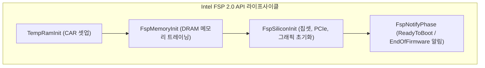

# IntelFsp2Pkg (Intel Firmware Support Package 2.0) 상세 분석 보고서

## 1. 패키지 개요 (Overview)

- **패키지 디렉터리**: `IntelFsp2Pkg/`
- **분류 (Category)**: Silicon Architecture
- **주요 실행 단계 (Target Phases)**: `FSP-T (TempRam), FSP-M (MemoryInit), FSP-S (SiliconInit)`
- **포함된 모듈 수**: 총 17개 (`.inf` 모듈 기준)

인텔이 제공하는 실리콘 초기화 바이너리 블록인 FSP(Firmware Support Package) v2.0/v2.1/v2.2 사양의 헤더, 구조체, 도구 세트를 정의한 패키지입니다.

---

## 2. 패키지 아키텍처 및 시스템 블록 다이어그램

---

## 3. 핵심 아키텍처 및 심층 분석

### 블랙박스 실리콘 추상화
- 인텔의 독점적인 실리콘 레지스터 세부사항을 공개하지 않고도, OEM들이 표준화된 API 호출(`FspMemoryInit`, `FspSiliconInit`)을 통해 인텔 최신 프로세서를 초기화할 수 있도록 지원합니다.

---

## 4. 핵심 실행 워크플로우 및 시퀀스 다이어그램

---

## 5. 제공 및 소비하는 주요 Protocols / PPIs / PCDs

### 5.2 주요 PPIs (PEI)
- `gFspReadyForNotifyPhasePpiGuid`
- `gFspInApiModePpiGuid`
- `gFspmArchConfigPpiGuid`
- `gFspTempRamExitPpiGuid`
- `gEdkiiPeiVariablePpiGuid`
- `gFspiArchConfigPpiGuid`

---

## 6. 주요 모듈 및 소스 파일 맵 (Module Summary Table)

| 모듈 유형 | 모듈명 (BASE_NAME) | 소스 경로 (.inf) |
|---|---|---|
| `BASE` | **BaseCacheAsRamLibNull** | `Library/BaseCacheAsRamLibNull/BaseCacheAsRamLibNull.inf` |
| `BASE` | **BaseCacheLib** | `Library/BaseCacheLib/BaseCacheLib.inf` |
| `BASE` | **BaseDebugDeviceLibNull** | `Library/BaseDebugDeviceLibNull/BaseDebugDeviceLibNull.inf` |
| `BASE` | **BaseFspCommonLib** | `Library/BaseFspCommonLib/BaseFspCommonLib.inf` |
| `BASE` | **BaseFspDebugLibSerialPort** | `Library/BaseFspDebugLibSerialPort/BaseFspDebugLibSerialPort.inf` |
| `BASE` | **BaseFspPlatformLib** | `Library/BaseFspPlatformLib/BaseFspPlatformLib.inf` |
| `PEIM` | **FspNotifyPhasePeim** | `FspNotifyPhase/FspNotifyPhasePeim.inf` |
| `SEC` | **Fsp22SecCoreS** | `FspSecCore/Fsp22SecCoreS.inf` |
| `SEC` | **Fsp24SecCoreM** | `FspSecCore/Fsp24SecCoreM.inf` |
| `SEC` | **Fsp24SecCoreS** | `FspSecCore/Fsp24SecCoreS.inf` |
| `SEC` | **FspSecCoreI** | `FspSecCore/FspSecCoreI.inf` |
| `SEC` | **FspSecCoreM** | `FspSecCore/FspSecCoreM.inf` |
| `SEC` | **FspSecCoreS** | `FspSecCore/FspSecCoreS.inf` |
| ... | *(총 17개 모듈 중 대표 모듈 13개 수록)* | ... |

---

## 7. 관련 문서 및 참조 링크

- [EDK II 전체 아키텍처 개요](../EDK2_Architecture_Overview.md)
- [전체 패키지 분석 인덱스](Package_Analysis_Index.md)
- [FatPkg 상세 분석 보고서](FatPkg_Analysis.md)