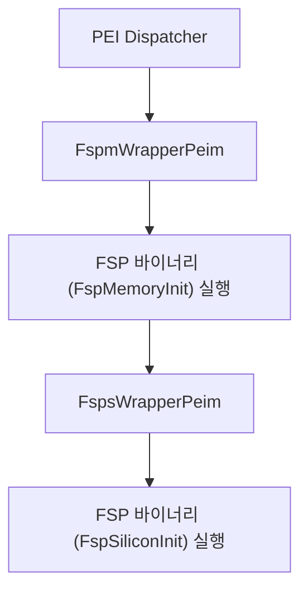

# IntelFsp2WrapperPkg (Intel FSP 2.0 Wrapper Package) 상세 분석 보고서

## 1. 패키지 개요 (Overview)

- **패키지 디렉터리**: `IntelFsp2WrapperPkg/`
- **분류 (Category)**: Silicon Architecture
- **주요 실행 단계 (Target Phases)**: `PEI, DXE`
- **포함된 모듈 수**: 총 13개 (`.inf` 모듈 기준)

IntelFsp2Pkg의 원시 C 함수 포인터 API를 표준 EDK II의 PEIM 및 DXE 드라이버 모듈 체계와 자연스럽게 결합할 수 있도록 래퍼(Wrapper) 레이어를 제공하는 패키지입니다.

---

## 2. 패키지 아키텍처 및 시스템 블록 다이어그램

---

## 3. 핵심 아키텍처 및 심층 분석

### 손쉬운 플랫폼 포팅
- 개발자가 복잡한 어셈블리 호출 규약이나 FSP 컨텍스트 전환 코드를 직접 작성할 필요 없이 일반 PEIM처럼 EDK II 프로젝트에 통합할 수 있습니다.

---

## 4. 핵심 실행 워크플로우 및 시퀀스 다이어그램

---

## 5. 제공 및 소비하는 주요 Protocols / PPIs / PCDs

### 5.1 주요 Protocols (DXE/SMM)
- `gAddPerfRecordProtocolGuid`

### 5.2 주요 PPIs (PEI)
- `gFspSiliconInitDonePpiGuid`
- `gTopOfTemporaryRamPpiGuid`

---

## 6. 주요 모듈 및 소스 파일 맵 (Module Summary Table)

| 모듈 유형 | 모듈명 (BASE_NAME) | 소스 경로 (.inf) |
|---|---|---|
| `BASE` | **FspMeasurementLib** | `Library/BaseFspMeasurementLib/BaseFspMeasurementLib.inf` |
| `BASE` | **BaseFspWrapperApiLib** | `Library/BaseFspWrapperApiLib/BaseFspWrapperApiLib.inf` |
| `BASE` | **BaseFspWrapperPlatformLibSample** | `Library/BaseFspWrapperPlatformLibSample/BaseFspWrapperPlatformLibSample.inf` |
| `BASE` | **BaseFspWrapperPlatformMultiPhaseLibNull** | `Library/BaseFspWrapperPlatformMultiPhaseLibNull/BaseFspWrapperPlatformMultiPhaseLibNull.inf` |
| `DXE_DRIVER` | **FspWrapperNotifyDxe** | `FspWrapperNotifyDxe/FspWrapperNotifyDxe.inf` |
| `PEIM` | **FspiWrapperPeim** | `FspiWrapperPeim/FspiWrapperPeim.inf` |
| `PEIM` | **FspmWrapperPeim** | `FspmWrapperPeim/FspmWrapperPeim.inf` |
| `PEIM` | **FspsWrapperPeim** | `FspsWrapperPeim/FspsWrapperPeim.inf` |
| `PEIM` | **BaseFspWrapperApiTestLibNull** | `Library/BaseFspWrapperApiTestLibNull/BaseFspWrapperApiTestLibNull.inf` |
| `PEIM` | **FspWrapperMultiPhaseProcessLib** | `Library/FspWrapperMultiPhaseProcessLib/FspWrapperMultiPhaseProcessLib.inf` |
| `PEIM` | **PeiFspWrapperApiTestLib** | `Library/PeiFspWrapperApiTestLib/PeiFspWrapperApiTestLib.inf` |
| `SEC` | **PeiFspWrapperHobProcessLibSample** | `Library/PeiFspWrapperHobProcessLibSample/PeiFspWrapperHobProcessLibSample.inf` |
| `SEC` | **SecFspWrapperPlatformSecLibSample** | `Library/SecFspWrapperPlatformSecLibSample/SecFspWrapperPlatformSecLibSample.inf` |

---

## 7. 관련 문서 및 참조 링크

- [EDK II 전체 아키텍처 개요](../EDK2_Architecture_Overview.md)
- [전체 패키지 분석 인덱스](Package_Analysis_Index.md)
- [FatPkg 상세 분석 보고서](FatPkg_Analysis.md)