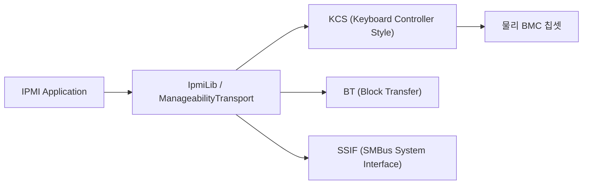
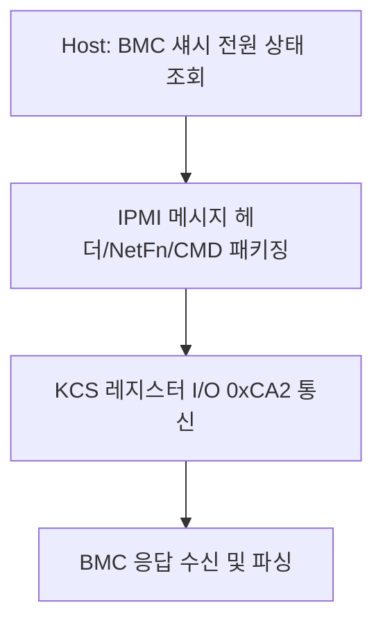

# ManageabilityPkg (Manageability Package) 상세 분석 보고서

## 1. 패키지 개요 (Overview)

- **패키지 디렉터리**: `ManageabilityPkg/`
- **분류 (Category)**: Management & Standards
- **주요 실행 단계 (Target Phases)**: `PEI, DXE, SMM`
- **포함된 모듈 수**: 총 28개 (`.inf` 모듈 기준)

서버 및 워크스테이션 관리를 위한 하드웨어 인터페이스(IPMI, MCTP)와 관리 데이터 전송 프로토콜을 통일된 아키텍처로 추상화한 패키지입니다.

---

## 2. 패키지 아키텍처 및 시스템 블록 다이어그램

---

## 3. 핵심 아키텍처 및 심층 분석

### 핵심 역할
- IPMI KCS 및 SMBus 전송 계층을 단일 인터페이스로 추상화하여 보드 디자인이 바뀌어도 상위 관리 소프트웨어를 무수정 재사용할 수 있습니다.

---

## 4. 핵심 실행 워크플로우 및 시퀀스 다이어그램

---

## 5. 제공 및 소비하는 주요 Protocols / PPIs / PCDs

### 5.1 주요 Protocols (DXE/SMM)
- `gEdkiiPldmProtocolGuid`
- `gEdkiiPldmSmbiosTransferProtocolGuid`
- `gEdkiiMctpProtocolGuid`
- `gEdkiiIpmiBlobTransferProtocolGuid`

---

## 6. 주요 모듈 및 소스 파일 맵 (Module Summary Table)

| 모듈 유형 | 모듈명 (BASE_NAME) | 소스 경로 (.inf) |
|---|---|---|
| `BASE` | **BaseManageabilityTransportHelper** | `Library/BaseManageabilityTransportHelperLib/BaseManageabilityTransportHelper.inf` |
| `BASE` | **BaseManageabilityTransportNull** | `Library/BaseManageabilityTransportNullLib/BaseManageabilityTransportNull.inf` |
| `BASE` | **ManageabilityTransportKcs** | `Library/ManageabilityTransportKcsLib/BaseManageabilityTransportKcs.inf` |
| `BASE` | **PlatformBmcReadyLibNull** | `Library/PlatformBmcReadyLibNull/PlatformBmcReadyLibNull.inf` |
| `DXE_DRIVER` | **DxeManageabilityTransportKcs** | `Library/ManageabilityTransportKcsLib/Dxe/DxeManageabilityTransportKcs.inf` |
| `DXE_DRIVER` | **DxeManageabilityTransportMctp** | `Library/ManageabilityTransportMctpLib/Dxe/DxeManageabilityTransportMctp.inf` |
| `DXE_DRIVER` | **DxeManageabilityTransportSerial** | `Library/ManageabilityTransportSerialLib/Dxe/DxeManageabilityTransportSerial.inf` |
| `DXE_DRIVER` | **DxeManageabilityTransportSsif** | `Library/ManageabilityTransportSsifLib/DxeManageabilityTransportSsif.inf` |
| `DXE_DRIVER` | **PldmProtocolLib** | `Library/PldmProtocolLibrary/Dxe/PldmProtocolLib.inf` |
| `DXE_DRIVER` | **IpmiBlobTransferDxe** | `Universal/IpmiBlobTransferDxe/IpmiBlobTransferDxe.inf` |
| `DXE_SMM_DRIVER` | **IpmiSmm** | `Universal/IpmiProtocol/Smm/IpmiProtocolSmm.inf` |
| `HOST_APPLICATION` | **IpmiBlobTransferDxeUnitTestsHost** | `Universal/IpmiBlobTransferDxe/UnitTest/IpmiBlobTransferTestUnitTestsHost.inf` |
| `PEIM` | **IpmiCommandLib** | `Library/IpmiCommandLib/IpmiCommandLibPei.inf` |
| `PEIM` | **PeiManageabilityTransportSsif** | `Library/ManageabilityTransportSsifLib/PeiManageabilityTransportSsif.inf` |
| `PEIM` | **FrbPei** | `Universal/IpmiFrb/FrbPei.inf` |
| `PEIM` | **IpmiPei** | `Universal/IpmiProtocol/Pei/IpmiPpiPei.inf` |
| `UEFI_DRIVER` | **IpmiCommandLib** | `Library/IpmiCommandLib/IpmiCommandLib.inf` |
| ... | *(총 28개 모듈 중 대표 모듈 17개 수록)* | ... |

---

## 7. 관련 문서 및 참조 링크

- [EDK II 전체 아키텍처 개요](../EDK2_Architecture_Overview.md)
- [전체 패키지 분석 인덱스](Package_Analysis_Index.md)
- [FatPkg 상세 분석 보고서](FatPkg_Analysis.md)