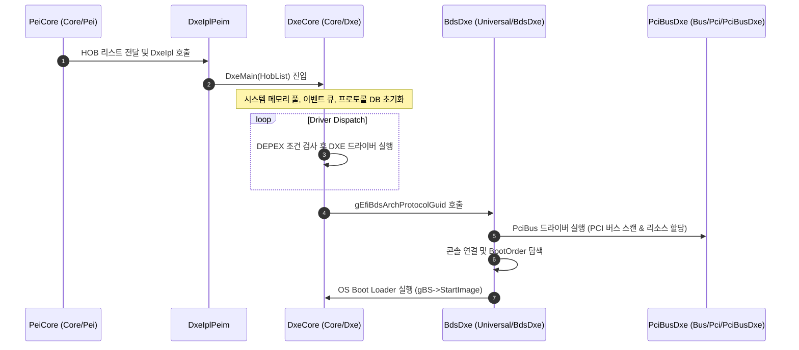

# MdeModulePkg (Module Development Environment Module Package) 상세 분석 보고서

## 1. 패키지 개요 (Overview)

- **패키지 디렉터리**: `MdeModulePkg/`
- **분류 (Category)**: Core Foundation
- **주요 실행 단계 (Target Phases)**: `PEI, DXE, SMM, BDS, Runtime`
- **포함된 모듈 수**: 총 283개 (`.inf` 모듈 기준)

UEFI 및 PI 사양의 핵심 실행 엔진(Core Engine)과 표준 버스/주변장치 범용 드라이버를 제공하는 EDK II의 가장 방대한 중앙 코어 패키지입니다. PEI Core, DXE Core, BDS, 변수 런타임 서비스(NVRAM), PCI 버스 드라이버, USB 스택, 디스크 및 그래픽 콘솔을 포함합니다.

---

## 2. 패키지 아키텍처 및 시스템 블록 다이어그램

```mermaid
flowchart TD
    subgraph MdeModulePkg_Architecture["MdeModulePkg 핵심 모듈 계층 구조"]
        subgraph Cores["1. 시스템 코어 실행기 (Core/)"]
            PEI_CORE["PeiCore<br>(PEIM 디스패치, HOB 생성)"]
            DXE_CORE["DxeCore<br>(프로토콜 DB, 의존성 디스패치, 메모리 관리)"]
            DXE_IPL["DxeIplPeim<br>(PEI -> DXE 전환 브리지)"]
        end

        subgraph Universal["2. 플랫폼 필수 공통 서비스 (Universal/)"]
            VARIABLE["VariableRuntimeDxe<br>(NVRAM 변수 Get/Set 서비스)"]
            BDS["BdsDxe<br>(부팅 정책, 콘솔 연결, OS 로더 호출)"]
            CAPSULE["CapsuleRuntimeDxe<br>(펌웨어 캡슐 업데이트 처리)"]
            SECURITY_STUB["SecurityStubDxe<br>(이미지 로드 인증 검증)"]
            MONOTONIC["MonotonicCounterRuntimeDxe"]
            RESET["ResetSystemRuntimeDxe"]
        end

        subgraph BusDrivers["3. 범용 버스 드라이버 (Bus/)"]
            PCI_BUS["PciBusDxe<br>(PCI Express 열거, 리소스 할당)"]
            USB_BUS["UsbBusDxe / UsbKbDxe / UsbMouseDxe<br>(USB 복합 스택)"]
            ATA_SCSI["AtaAtapiPassThru / ScsiBus / Nvme<br>(스토리지 버스 드라이버)"]
            SD_EMMC["SdMmcPciHcDxe<br>(SD/eMMC 컨트롤러)"]
        end

        subgraph UI_Console["4. 디스플레이 및 입력 (Universal/Console)"]
            GOP["GraphicsConsoleDxe<br>(화면 텍스트 출력)"]
            CON_SPLIT["ConSplitterDxe<br>(다중 입력/출력 다중화)"]
            CON_PLAT["TerminalDxe / SerialDxe<br>(시리얼 콘솔)"]
        end
    end

    PEI_CORE --> DXE_IPL
    DXE_IPL --> DXE_CORE
    DXE_CORE --> Universal
    DXE_CORE --> BusDrivers
    BusDrivers --> UI_Console
```

---

## 3. 핵심 아키텍처 및 심층 분석

### 핵심 서브디렉터리 상세 분석
1. **`Core/`**:
   - `Pei/`: PEI 단계의 메인 루프(`PeiMain`). 등록된 PEIM들을 DEPEX에 맞춰 순차 실행하고 DRAM이 준비되면 HOB를 생성합니다.
   - `Dxe/`: DXE 단계의 심장부. 메모리 할당(`AllocatePages`, `AllocatePool`), 프로토콜 등록(`InstallProtocolInterface`), 핸들 관리, 타이머/이벤트 디스패처를 총괄합니다.
2. **`Universal/Variable/`**:
   - `VariableRuntimeDxe`: 비휘발성 플래시(NVRAM)에 저장되는 UEFI Variable(예: `BootOrder`, `Setup`, `SecureBoot`)을 읽고 쓰는 서비스를 구현하며, SMM 환경과 통신하여 변수의 무결성을 보호합니다.
3. **`Bus/Pci/PciBusDxe/`**:
   - 루트 브리지 하위의 모든 PCI 디바이스를 2단계(Scan $
ightarrow$ Resource Allocation)로 열거하고 BAR(Base Address Register) 주소를 할당합니다.
   - 루트 브리지 하위의 모든 PCI 디바이스를 2단계(Scan → Resource Allocation)로 열거하고 BAR (Base Address Register) 주소를 할당합니다.
---

## 4. 핵심 실행 워크플로우 및 시퀀스 다이어그램

---

## 5. 제공 및 소비하는 주요 Protocols / PPIs / PCDs

### 5.1 주요 Protocols (DXE/SMM)
- `gEfiLoadPeImageProtocolGuid`
- `gEfiPrint2ProtocolGuid`
- `gEfiPrint2SProtocolGuid`
- `gMediaSanitizeProtocolGuid`
- `gEfiGenericMemTestProtocolGuid`
- `gEfiDebuggerConfigurationProtocolGuid`
- `gEfiFaultTolerantWriteProtocolGuid`
- `gEfiSmmFaultTolerantWriteProtocolGuid`
- `gEfiSwapAddressRangeProtocolGuid`
- `gEfiSmmSwapAddressRangeProtocolGuid`
- `gEfiSmmVariableProtocolGuid`
- `gEdkiiVariableLockProtocolGuid`
- *(외 39개 프로토콜 정의 생략)*

### 5.2 주요 PPIs (PEI)
- `gEdkiiPeiFirmwareVolumeShadowPpiGuid`
- `gPeiAtaControllerPpiGuid`
- `gPeiUsb2HostControllerPpiGuid`
- `gPeiUsbControllerPpiGuid`
- `gPeiUsbIoPpiGuid`
- `gPeiSecPerformancePpiGuid`
- `gEfiPeiSmmCommunicationPpiGuid`
- `gPeiSmmAccessPpiGuid`
- `gPeiSmmControlPpiGuid`
- `gPeiPostScriptTablePpiGuid`
- *(외 20개 PPI 정의 생략)*

---

## 6. 주요 모듈 및 소스 파일 맵 (Module Summary Table)

| 모듈 유형 | 모듈명 (BASE_NAME) | 소스 경로 (.inf) |
|---|---|---|
| `BASE` | **ArmFfaConsoleDebugStandaloneMmLib** | `Library/ArmFfaConsoleDebugLib/ArmFfaConsoleDebugStandaloneMmLib.inf` |
| `BASE` | **ArmFfaSecLib** | `Library/ArmFfaLib/ArmFfaSecLib.inf` |
| `BASE` | **BaseBmpSupportLib** | `Library/BaseBmpSupportLib/BaseBmpSupportLib.inf` |
| `BASE` | **BaseHobLibNull** | `Library/BaseHobLibNull/BaseHobLibNull.inf` |
| `BASE` | **BaseIpmiCommandLibNull** | `Library/BaseIpmiCommandLibNull/BaseIpmiCommandLibNull.inf` |
| `BASE` | **BaseIpmiLibNull** | `Library/BaseIpmiLibNull/BaseIpmiLibNull.inf` |
| `DXE_CORE` | **DxeCore** | `Core/Dxe/DxeMain.inf` |
| `DXE_CORE` | **DxeCoreMemoryAllocationLib** | `Library/DxeCoreMemoryAllocationLib/DxeCoreMemoryAllocationLib.inf` |
| `DXE_CORE` | **DxeCoreMemoryAllocationProfileLib** | `Library/DxeCoreMemoryAllocationLib/DxeCoreMemoryAllocationProfileLib.inf` |
| `DXE_CORE` | **DxeCorePerformanceLib** | `Library/DxeCorePerformanceLib/DxeCorePerformanceLib.inf` |
| `DXE_DRIVER` | **CxlDxe** | `Bus/Pci/CxlDxe/CxlDxe.inf` |
| `DXE_DRIVER` | **IncompatiblePciDeviceSupport** | `Bus/Pci/IncompatiblePciDeviceSupportDxe/IncompatiblePciDeviceSupportDxe.inf` |
| `DXE_DRIVER` | **PciHostBridgeDxe** | `Bus/Pci/PciHostBridgeDxe/PciHostBridgeDxe.inf` |
| `DXE_DRIVER` | **SpiBusDxe** | `Bus/Spi/SpiBus/SpiBusDxe.inf` |
| `DXE_DRIVER` | **SpiHcDxe** | `Bus/Spi/SpiHc/SpiHcDxe.inf` |
| `DXE_DRIVER` | **SpiNorFlashJedecSfdpDxe** | `Bus/Spi/SpiNorFlashJedecSfdp/SpiNorFlashJedecSfdpDxe.inf` |
| `DXE_RUNTIME_DRIVER` | **PiSmmIpl** | `Core/PiSmmCore/PiSmmIpl.inf` |
| `DXE_RUNTIME_DRIVER` | **RuntimeDxe** | `Core/RuntimeDxe/RuntimeDxe.inf` |
| `DXE_RUNTIME_DRIVER` | **AuthVariableLibNull** | `Library/AuthVariableLibNull/AuthVariableLibNull.inf` |
| `DXE_RUNTIME_DRIVER` | **DxeRuntimeCapsuleLib** | `Library/DxeCapsuleLibFmp/DxeRuntimeCapsuleLib.inf` |
| `DXE_RUNTIME_DRIVER` | **RuntimeDxeReportStatusCodeLib** | `Library/RuntimeDxeReportStatusCodeLib/RuntimeDxeReportStatusCodeLib.inf` |
| `DXE_RUNTIME_DRIVER` | **RuntimeResetSystemLib** | `Library/RuntimeResetSystemLib/RuntimeResetSystemLib.inf` |
| `DXE_SMM_DRIVER` | **SpiBusSmm** | `Bus/Spi/SpiBus/SpiBusSmm.inf` |
| `DXE_SMM_DRIVER` | **SpiHcSmm** | `Bus/Spi/SpiHc/SpiHcSmm.inf` |
| `DXE_SMM_DRIVER` | **SpiNorFlashJedecSfdpSmm** | `Bus/Spi/SpiNorFlashJedecSfdp/SpiNorFlashJedecSfdpSmm.inf` |
| ... | *(총 283개 모듈 중 대표 모듈 25개 수록)* | ... |

---

## 7. 관련 문서 및 참조 링크

- [EDK II 전체 아키텍처 개요](../EDK2_Architecture_Overview.md)
- [전체 패키지 분석 인덱스](Package_Analysis_Index.md)
- [FatPkg 상세 분석 보고서](FatPkg_Analysis.md)