# MdePkg (Module Development Environment Package) 상세 분석 보고서

## 1. 패키지 개요 (Overview)

- **패키지 디렉터리**: `MdePkg/`
- **분류 (Category)**: Core Foundation
- **주요 실행 단계 (Target Phases)**: `SEC, PEI, DXE, SMM, UEFI Driver, UEFI Application`
- **포함된 모듈 수**: 총 191개 (`.inf` 모듈 기준)

EDK II 전체 프레임워크의 근간이 되는 기초 패키지입니다. UEFI Specification 및 UEFI PI(Platform Initialization) Specification에 정의된 모든 표준 데이터 타입, GUID, Protocol, PPI 정의와 EDK II 개발에 필수적인 기본 C 라이브러리 인터페이스를 제공합니다.

---

## 2. 패키지 아키텍처 및 시스템 블록 다이어그램

```mermaid
flowchart TD
    subgraph MdePkg_Structure["MdePkg 핵심 계층 구조"]
        subgraph BaseSpecs["1. 표준 사양 인터페이스 (Include/)"]
            UEFI_SPEC["UEFI Spec Headers<br>(Protocol, System Table, Boot/Runtime Services)"]
            PI_SPEC["PI Spec Headers<br>(PPI, HOB, SMM, Capsule, Firmware Volume)"]
            STD_TYPES["기본 데이터 타입 & 매크로<br>(Base.h, ProcessorBind.h, Uefi.h, PiPei.h)"]
        end

        subgraph CoreLibs["2. 기초 라이브러리 클래스 (Library/)"]
            BASE_LIB["BaseLib<br>(수학 연산, 비트 조작, CPU 레지스터 접근)"]
            MEM_LIB["BaseMemoryLib / MemoryAllocationLib<br>(메모리 복사/비교/할당)"]
            DEBUG_LIB["DebugLib / PrintLib<br>(디버그 출력, 문자열 포맷팅)"]
            PCD_LIB["PcdLib<br>(PCD 접근 추상화 매크로)"]
            DEV_PATH["DevicePathLib<br>(UEFI 디바이스 패스 파싱 및 생성)"]
            UEFI_BOOT["UefiBootServicesTableLib / UefiRuntimeServicesTableLib<br>(gBS, gST, gRT 전역 포인터 제공)"]
        end

        subgraph Consumers["3. 소비자 (모든 타 EDK II 패키지)"]
            MDE_MOD["MdeModulePkg"]
            CPU_PKG["UefiCpuPkg"]
            SEC_PKG["SecurityPkg"]
            NET_PKG["NetworkPkg"]
        end
    end

    STD_TYPES --> BaseSpecs
    BaseSpecs --> CoreLibs
    CoreLibs --> Consumers
```



---

## 3. 핵심 아키텍처 및 심층 분석

### 핵심 역할 및 아키텍처 특징
1. **사양 정의의 단일 진실 공급원(Single Source of Truth)**:
   - UEFI Forum의 최신 사양을 C 헤더 파일 형태로 구현합니다.
   - `Include/Protocol/`: UEFI 사양에 정의된 100개 이상의 공식 프로토콜 헤더 (`BlockIo.h`, `GraphicsOutput.h`, `SimpleFileSystem.h`, `PciIo.h` 등)
   - `Include/Ppi/`: PI 사양에 정의된 PEI 단계 PPI 헤더 (`CpuIo.h`, `MemoryDiscovered.h`, `MasterBootMode.h` 등)
   - `Include/Guid/`: HOB, 캡슐, 파일시스템 식별용 표준 GUID
2. **독립적이고 이식성이 뛰어난 BaseLib**:
   - OS 커널이나 C 런타임 라이브러리(glibc, MSVCRT)가 전혀 없는 베어메탈 환경에서 64비트 정수 연산, 바이트 스왑, MSR/CR 레지스터 제어, 어셈블리 루틴을 아키텍처별(IA32, X64, ARM, AARCH64, RISCV64, LOONGARCH64)로 완벽 지원합니다.

---

## 4. 핵심 실행 워크플로우 및 시퀀스 다이어그램

```mermaid
sequenceDiagram
    autonumber
    actor Driver as UEFI Driver / Module
    participant UefiBoot as UefiBootServicesTableLib
    participant DevPath as DevicePathLib
    participant Debug as DebugLib
    participant BaseMem as BaseMemoryLib

    Driver->>UefiBoot: gBS->LocateProtocol()
    Note over Driver,UefiBoot: MdePkg에서 제공하는 gBS 포인터를 통해 프로토콜 검색
    Driver->>DevPath: DevicePathFromHandle()
    DevPath-->>Driver: EFI_DEVICE_PATH_PROTOCOL 반환
    Driver->>BaseMem: CopyMem() / ZeroMem()
    Note over Driver,BaseMem: 아키텍처에 최적화된 저수준 어셈블리/C 메모리 연산
    Driver->>Debug: DEBUG((DEBUG_INFO, "Initialization Complete
"))
    Debug-->>Driver: 디버그 콘솔/시리얼 출력
```

---

## 5. 제공 및 소비하는 주요 Protocols / PPIs / PCDs

### 5.1 주요 Protocols (DXE/SMM)
- `gEdkiiMemoryAcceptProtocolGuid`
- `gPcdProtocolGuid`
- `gGetPcdInfoProtocolGuid`
- `gEfiCcMeasurementProtocolGuid`
- `gDtFixupProtocolGuid`
- `gEfiBdsArchProtocolGuid`
- `gEfiCpuArchProtocolGuid`
- `gEfiMetronomeArchProtocolGuid`
- `gEfiMonotonicCounterArchProtocolGuid`
- `gEfiRealTimeClockArchProtocolGuid`
- `gEfiResetArchProtocolGuid`
- `gEfiRuntimeArchProtocolGuid`
- *(외 267개 프로토콜 정의 생략)*

### 5.2 주요 PPIs (PEI)
- `gEfiPeiMasterBootModePpiGuid`
- `gEfiDxeIplPpiGuid`
- `gEfiPeiMemoryDiscoveredPpiGuid`
- `gEfiPeiBootInRecoveryModePpiGuid`
- `gEfiEndOfPeiSignalPpiGuid`
- `gEfiPeiResetPpiGuid`
- `gEfiPeiStatusCodePpiGuid`
- `gEfiPeiSecurity2PpiGuid`
- `gEfiTemporaryRamSupportPpiGuid`
- `gEfiPeiCpuIoPpiInstalledGuid`
- *(외 41개 PPI 정의 생략)*

---

## 6. 주요 모듈 및 소스 파일 맵 (Module Summary Table)

| 모듈 유형 | 모듈명 (BASE_NAME) | 소스 경로 (.inf) |
|---|---|---|
| `BASE` | **ArmFfaMemMgmtLib** | `Library/ArmFfaMemMgmtLib/ArmFfaMemMgmtLib.inf` |
| `BASE` | **ArmBaseLib** | `Library/ArmLib/ArmBaseLib.inf` |
| `BASE` | **ArmSmcLib** | `Library/ArmSmcLib/ArmSmcLib.inf` |
| `BASE` | **ArmSmcLibNull** | `Library/ArmSmcLibNull/ArmSmcLibNull.inf` |
| `BASE` | **ArmSvcLib** | `Library/ArmSvcLib/ArmSvcLib.inf` |
| `BASE` | **BaseArmTrngLibNull** | `Library/BaseArmTrngLibNull/BaseArmTrngLibNull.inf` |
| `DXE_CORE` | **DxeCoreEntryPoint** | `Library/DxeCoreEntryPoint/DxeCoreEntryPoint.inf` |
| `DXE_CORE` | **DxeCoreHobLib** | `Library/DxeCoreHobLib/DxeCoreHobLib.inf` |
| `DXE_CORE` | **DxeCoreEntryPointDynamicInit** | `Library/DynamicStackCookieEntryPointLib/DxeCoreEntryPoint.inf` |
| `DXE_DRIVER` | **DxeExtractGuidedSectionLib** | `Library/DxeExtractGuidedSectionLib/DxeExtractGuidedSectionLib.inf` |
| `DXE_DRIVER` | **DxeHobLib** | `Library/DxeHobLib/DxeHobLib.inf` |
| `DXE_DRIVER` | **DxeHstiLib** | `Library/DxeHstiLib/DxeHstiLib.inf` |
| `DXE_DRIVER` | **DxeIoLibCpuIo2** | `Library/DxeIoLibCpuIo2/DxeIoLibCpuIo2.inf` |
| `DXE_DRIVER` | **DxePcdLib** | `Library/DxePcdLib/DxePcdLib.inf` |
| `DXE_DRIVER` | **DxeRiscvMpxyLib** | `Library/DxeRiscvMpxyLib/DxeRiscvMpxy.inf` |
| `DXE_RUNTIME_DRIVER` | **DxeRuntimeDebugLibSerialPort** | `Library/DxeRuntimeDebugLibSerialPort/DxeRuntimeDebugLibSerialPort.inf` |
| `DXE_RUNTIME_DRIVER` | **DxeRuntimePciExpressLib** | `Library/DxeRuntimePciExpressLib/DxeRuntimePciExpressLib.inf` |
| `DXE_RUNTIME_DRIVER` | **DxeRuntimePciSegmentLibSegmentInfo** | `Library/PciSegmentLibSegmentInfo/DxeRuntimePciSegmentLibSegmentInfo.inf` |
| `DXE_RUNTIME_DRIVER` | **UefiRuntimeLib** | `Library/UefiRuntimeLib/UefiRuntimeLib.inf` |
| `DXE_SMM_DRIVER` | **MmServicesTableLib** | `Library/MmServicesTableLib/MmServicesTableLib.inf` |
| `DXE_SMM_DRIVER` | **SmiHandlerProfileLibNull** | `Library/SmiHandlerProfileLibNull/SmiHandlerProfileLibNull.inf` |
| `DXE_SMM_DRIVER` | **SmmCpuRendezvousLibNull** | `Library/SmmCpuRendezvousLibNull/SmmCpuRendezvousLibNull.inf` |
| `DXE_SMM_DRIVER` | **SmmIoLib** | `Library/SmmIoLib/SmmIoLib.inf` |
| `DXE_SMM_DRIVER` | **SmmIoLibSmmCpuIo2** | `Library/SmmIoLibSmmCpuIo2/SmmIoLibSmmCpuIo2.inf` |
| `DXE_SMM_DRIVER` | **SmmMemLib** | `Library/SmmMemLib/SmmMemLib.inf` |
| ... | *(총 191개 모듈 중 대표 모듈 25개 수록)* | ... |

---

## 7. 관련 문서 및 참조 링크

- [EDK II 전체 아키텍처 개요](../EDK2_Architecture_Overview.md)
- [전체 패키지 분석 인덱스](Package_Analysis_Index.md)
- [FatPkg 상세 분석 보고서](FatPkg_Analysis.md)