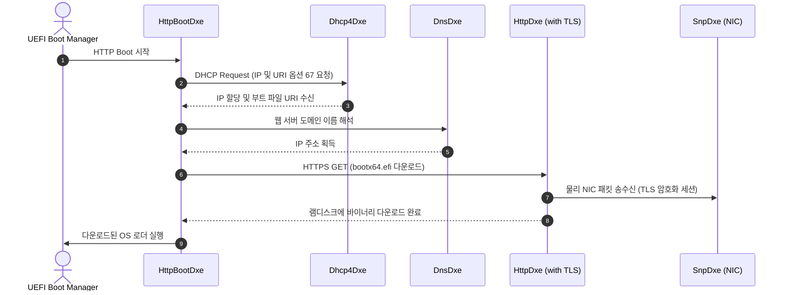

# NetworkPkg (Network Package) 상세 분석 보고서

## 1. 패키지 개요 (Overview)

- **패키지 디렉터리**: `NetworkPkg/`
- **분류 (Category)**: Networking
- **주요 실행 단계 (Target Phases)**: `DXE`
- **포함된 모듈 수**: 총 34개 (`.inf` 모듈 기준)

UEFI 2.x 사양에 규정된 표준 네트워크 통신 스택 전체를 구현한 패키지입니다. 물리 네트워크 카드 드라이버(SNP)부터 TCP/IP 스택, DNS, DHCP, 보안 통신(TLS), PXE 부팅 및 현대적인 UEFI HTTP/HTTPS Boot 스택을 모두 제공합니다.

---

## 2. 패키지 아키텍처 및 시스템 블록 다이어그램

```mermaid
flowchart TD
    subgraph NetworkPkg_Layers["UEFI Network Protocol 계층"]
        subgraph AppLayer["응용 및 부팅 프로토콜 계층"]
            PXE["UefiPxeBcDxe<br>(PXE 2.1 네트워크 부팅)"]
            HTTP_BOOT["HttpBootDxe<br>(HTTP/HTTPS OS 이미지 다운로드 및 부팅)"]
            ISCSI["IScsiDxe<br>(SAN iSCSI 원격 디스크 부팅)"]
        end

        subgraph TransportSecurity["전송 및 보안 계층"]
            TCP["TcpDxe (TCPv4 / TCPv6 전이중 스트림)"]
            UDP["Udp4Dxe / Udp6Dxe (비연결형 데이터그램)"]
            TLS["TlsDxe / TlsAuthConfigDxe (TLS 1.2 / 1.3 보안 세션)"]
            HTTP["HttpDxe / HttpUtilitiesDxe (HTTP 1.1 프로토콜)"]
            DNS["DnsDxe (호스트 이름 해석)"]
            DHCP["Dhcp4Dxe / Dhcp6Dxe (IP 자동 할당)"]
        end

        subgraph InternetLayer["인터넷 네트워크 계층"]
            IP4["Ip4Dxe (IPv4 라우팅 및 패킷 처리)"]
            IP6["Ip6Dxe (IPv6 라우팅 및 SLAAC)"]
            ARP["ArpDxe (IP -> MAC 주소 변환)"]
        end

        subgraph DataLinkLayer["데이터 링크 계층"]
            MNP["MnpDxe<br>(Managed Network Protocol: 패킷 멀티플렉싱)"]
            VLAN["VlanConfigDxe<br>(802.1Q 가상 LAN 태깅)"]
            SNP["SnpDxe<br>(Simple Network Protocol: 하드웨어 NIC 추상화)"]
        end
    end

    AppLayer --> TransportSecurity
    TransportSecurity --> InternetLayer
    InternetLayer --> DataLinkLayer
```

---

## 3. 핵심 아키텍처 및 심층 분석

### 핵심 기능 및 기술 혁신
1. **UEFI HTTP Boot**:
   - 레거시 TFTP 기반의 느리고 불안정한 PXE 부팅을 대체하기 위해 고안된 고속 전송 기술입니다. HTTP/HTTPS를 통해 대용량(수백 MB~수 GB)의 OS 커널/ISO 이미지를 신속하고 안전하게 다운로드합니다.
2. **듀얼 스택(IPv4/IPv6) 완전 지원**:
   - 모든 상위 프로토콜(DHCP, UDP, TCP, PXE)이 IPv4와 IPv6 환경에서 동등하게 동작할 수 있도록 분리 및 모듈화되어 있습니다.
3. **MnpDxe (Managed Network Protocol)**:
   - 하나의 물리 네트워크 인터페이스(`SNP`) 위에 다수의 가상 네트워크 인터페이스가 공존할 수 있도록 패킷 큐잉 및 디스패치를 제어하는 핵심 미들웨어입니다.

---

## 4. 핵심 실행 워크플로우 및 시퀀스 다이어그램

---

## 5. 제공 및 소비하는 주요 Protocols / PPIs / PCDs

### 5.1 주요 Protocols (DXE/SMM)
- `gEfiDpcProtocolGuid`
- `gEdkiiHttpCallbackProtocolGuid`
- `gEdkiiWiFiProfileSyncProtocolGuid`

---

## 6. 주요 모듈 및 소스 파일 맵 (Module Summary Table)

| 모듈 유형 | 모듈명 (BASE_NAME) | 소스 경로 (.inf) |
|---|---|---|
| `DXE_DRIVER` | **DpcDxe** | `DpcDxe/DpcDxe.inf` |
| `DXE_DRIVER` | **HttpUtilitiesDxe** | `HttpUtilitiesDxe/HttpUtilitiesDxe.inf` |
| `DXE_DRIVER` | **DxeDpcLib** | `Library/DxeDpcLib/DxeDpcLib.inf` |
| `DXE_DRIVER` | **DxeHttpIoLib** | `Library/DxeHttpIoLib/DxeHttpIoLib.inf` |
| `DXE_DRIVER` | **DxeHttpLib** | `Library/DxeHttpLib/DxeHttpLib.inf` |
| `DXE_DRIVER` | **DxeIpIoLib** | `Library/DxeIpIoLib/DxeIpIoLib.inf` |
| `HOST_APPLICATION` | **Dhcp6DxeGoogleTest** | `Dhcp6Dxe/GoogleTest/Dhcp6DxeGoogleTest.inf` |
| `HOST_APPLICATION` | **Ip6DxeGoogleTest** | `Ip6Dxe/GoogleTest/Ip6DxeGoogleTest.inf` |
| `HOST_APPLICATION` | **UefiPxeBcDxeGoogleTest** | `UefiPxeBcDxe/GoogleTest/UefiPxeBcDxeGoogleTest.inf` |
| `UEFI_APPLICATION` | **VConfig** | `Application/VConfig/VConfig.inf` |
| `UEFI_DRIVER` | **ArpDxe** | `ArpDxe/ArpDxe.inf` |
| `UEFI_DRIVER` | **Dhcp4Dxe** | `Dhcp4Dxe/Dhcp4Dxe.inf` |
| `UEFI_DRIVER` | **Dhcp6Dxe** | `Dhcp6Dxe/Dhcp6Dxe.inf` |
| `UEFI_DRIVER` | **DnsDxe** | `DnsDxe/DnsDxe.inf` |
| `UEFI_DRIVER` | **HttpBootDxe** | `HttpBootDxe/HttpBootDxe.inf` |
| `UEFI_DRIVER` | **HttpDxe** | `HttpDxe/HttpDxe.inf` |
| ... | *(총 34개 모듈 중 대표 모듈 16개 수록)* | ... |

---

## 7. 관련 문서 및 참조 링크

- [EDK II 전체 아키텍처 개요](../EDK2_Architecture_Overview.md)
- [전체 패키지 분석 인덱스](Package_Analysis_Index.md)
- [FatPkg 상세 분석 보고서](FatPkg_Analysis.md)