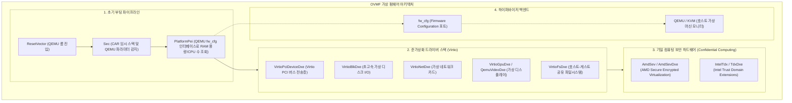
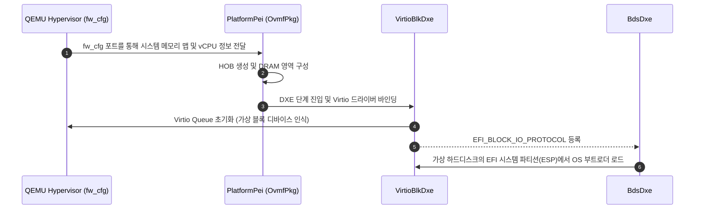

# OvmfPkg (Open Virtual Machine Firmware) 상세 분석 보고서

## 1. 패키지 개요 (Overview)

- **패키지 디렉터리**: `OvmfPkg/`
- **분류 (Category)**: Virtualization & Platforms
- **주요 실행 단계 (Target Phases)**: `SEC, PEI, DXE, SMM, BDS`
- **포함된 모듈 수**: 총 209개 (`.inf` 모듈 기준)

QEMU 및 KVM 가상머신 환경에서 완벽한 UEFI 지원을 제공하기 위해 설계된 오픈소스 펌웨어 패키지입니다. x86_64, IA32, RISC-V, ARM64 아키텍처를 지원하며, 고성능 Virtio 가상 I/O 디바이스 드라이버와 최신 기밀 컴퓨팅(AMD SEV, Intel TDX) 보안 가상화를 선도적으로 구현합니다.

---

## 2. 패키지 아키텍처 및 시스템 블록 다이어그램

---

## 3. 핵심 아키텍처 및 심층 분석

### 핵심 기술 요소
1. **QEMU `fw_cfg` 인터페이스**:
   - 하드웨어 NVRAM이나 마더보드 칩셋 대신, QEMU의 특수 I/O 포트(`0x510`, `0x511`)를 통해 게스트 메모리 크기, ACPI 테이블 원본, 부팅 순서, 커널 파라미터를 즉각 전달받습니다.
2. **Virtio 디바이스 패밀리**:
   - 실제 하드웨어 컨트롤러(AHCI, NVMe, e1000) 에뮬레이션 시 발생하는 VM-Exit 오버헤드를 최소화하기 위해, 공유 메모리 링 버퍼(`vring`) 기반의 고성능 Virtio 드라이버를 기본 내장합니다.
3. **기밀 컴퓨팅 (Confidential Computing)**:
   - 클라우드 환경에서 호스트 하이퍼바이저 관리자조차 가상머신의 메모리를 훔쳐볼 수 없도록 하드웨어 레벨에서 암호화하는 **AMD SEV(-ES/-SNP)** 및 **Intel TDX**의 초기 펌웨어 지원을 주도합니다.

---

## 4. 핵심 실행 워크플로우 및 시퀀스 다이어그램

---

## 5. 제공 및 소비하는 주요 Protocols / PPIs / PCDs

### 5.1 주요 Protocols (DXE/SMM)
- `gVirtioDeviceProtocolGuid`
- `gXenBusProtocolGuid`
- `gXenIoProtocolGuid`
- `gIoMmuAbsentProtocolGuid`
- `gOvmfLoadedX86LinuxKernelProtocolGuid`
- `gOvmfSevMemoryAcceptanceProtocolGuid`
- `gQemuAcpiTableNotifyProtocolGuid`
- `gEfiMpInitLibMpDepProtocolGuid`
- `gEfiMpInitLibUpDepProtocolGuid`

### 5.2 주요 PPIs (PEI)
- `gOvmfTpmDiscoveredPpiGuid`
- `gOvmfTpmMmioAccessiblePpiGuid`
- `gEfiPeiMpInitLibMpDepPpiGuid`
- `gEfiPeiMpInitLibUpDepPpiGuid`

---

## 6. 주요 모듈 및 소스 파일 맵 (Module Summary Table)

| 모듈 유형 | 모듈명 (BASE_NAME) | 소스 경로 (.inf) |
|---|---|---|
| `BASE` | **BlobVerifierLibSevHashes** | `AmdSev/BlobVerifierLibSevHashes/BlobVerifierLibSevHashes.inf` |
| `BASE` | **FdtPciPcdProducerLib** | `Fdt/FdtPciPcdProducerLib/FdtPciPcdProducerLib.inf` |
| `BASE` | **PrePiHobListPointerLibTdx** | `IntelTdx/PrePiHobListPointerLibTdx/PrePiHobListPointerLibTdx.inf` |
| `BASE` | **PeiTdxHelperLib** | `IntelTdx/TdxHelperLib/PeiTdxHelperLib.inf` |
| `BASE` | **SecTdxHelperLib** | `IntelTdx/TdxHelperLib/SecTdxHelperLib.inf` |
| `BASE` | **TdxHelperLibNull** | `IntelTdx/TdxHelperLib/TdxHelperLibNull.inf` |
| `DXE_DRIVER` | **QemuFwCfgAcpiPlatform** | `AcpiPlatformDxe/AcpiPlatformDxe.inf` |
| `DXE_DRIVER` | **SecretDxe** | `AmdSev/SecretDxe/SecretDxe.inf` |
| `DXE_DRIVER` | **AmdSevDxe** | `AmdSevDxe/AmdSevDxe.inf` |
| `DXE_DRIVER` | **AcpiPlatform** | `Bhyve/AcpiPlatformDxe/AcpiPlatformDxe.inf` |
| `DXE_DRIVER` | **SmbiosPlatformDxe** | `Bhyve/SmbiosPlatformDxe/SmbiosPlatformDxe.inf` |
| `DXE_DRIVER` | **CompatImageLoaderDxe** | `CompatImageLoaderDxe/CompatImageLoaderDxe.inf` |
| `DXE_RUNTIME_DRIVER` | **EmuVariableFvbRuntimeDxe** | `EmuVariableFvbRuntimeDxe/Fvb.inf` |
| `DXE_RUNTIME_DRIVER` | **ResetSystemLibMicrovm** | `Library/ResetSystemLib/DxeResetSystemLibMicrovm.inf` |
| `DXE_RUNTIME_DRIVER` | **ResetSystemLib** | `LoongArchVirt/Library/ResetSystemAcpiLib/DxeResetSystemAcpiGedLib.inf` |
| `DXE_RUNTIME_DRIVER` | **FvbServicesRuntimeDxe** | `QemuFlashFvbServicesRuntimeDxe/FvbServicesRuntimeDxe.inf` |
| `DXE_RUNTIME_DRIVER` | **SmmControl2Dxe** | `SmmControl2Dxe/SmmControl2Dxe.inf` |
| `DXE_RUNTIME_DRIVER` | **VirtMmCommunication** | `VirtMmCommunicationDxe/VirtMmCommunication.inf` |
| `DXE_SMM_DRIVER` | **CpuHotplugSmm** | `CpuHotplugSmm/CpuHotplugSmm.inf` |
| `DXE_SMM_DRIVER` | **SmmCpuFeaturesLib** | `Library/SmmCpuFeaturesLib/SmmCpuFeaturesLib.inf` |
| `DXE_SMM_DRIVER` | **FvbServicesSmm** | `QemuFlashFvbServicesRuntimeDxe/FvbServicesSmm.inf` |
| `MM_STANDALONE` | **StandaloneMmCpuFeaturesLib** | `Library/SmmCpuFeaturesLib/StandaloneMmCpuFeaturesLib.inf` |
| `MM_STANDALONE` | **FvbServicesStandaloneMm** | `QemuFlashFvbServicesRuntimeDxe/FvbServicesStandaloneMm.inf` |
| `PEIM` | **SecretPei** | `AmdSev/SecretPei/SecretPei.inf` |
| `PEIM` | **PlatformPei** | `Bhyve/PlatformPei/PlatformPei.inf` |
| ... | *(총 209개 모듈 중 대표 모듈 25개 수록)* | ... |

---

## 7. 관련 문서 및 참조 링크

- [EDK II 전체 아키텍처 개요](../EDK2_Architecture_Overview.md)
- [전체 패키지 분석 인덱스](Package_Analysis_Index.md)
- [FatPkg 상세 분석 보고서](FatPkg_Analysis.md)