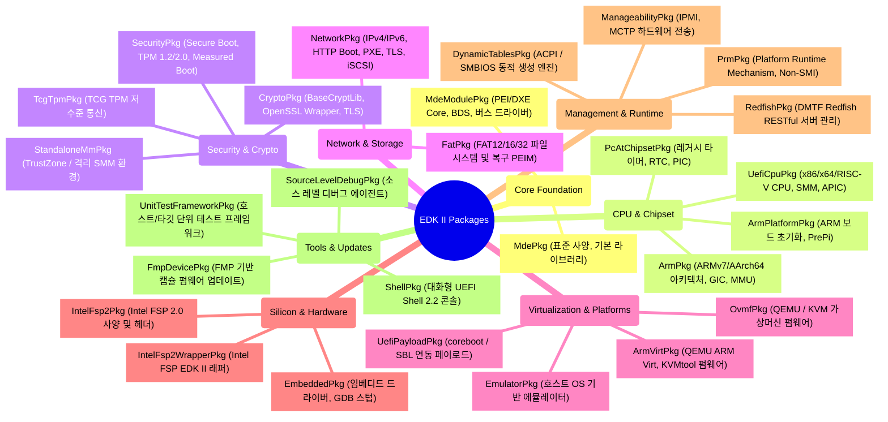
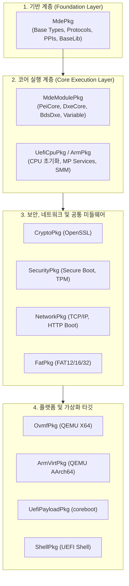

# EDK II 전체 패키지(Package) 상세 분석 인덱스

본 문서는 EDK II(TianoCore) 프레임워크를 구성하는 **총 27개 핵심 패키지**에 대한 상세 분석 보고서의 종합 색인(Index)입니다. 각 패키지별 상세 분석 보고서에는 아키텍처 개요, **Mermaid 기반 블록 다이어그램 및 시퀀스 흐름도**, 핵심 모듈(PEIM, DXE Driver, SMM, Library) 심층 분석, 그리고 주요 프로토콜/PPI/PCD 명세가 수록되어 있습니다.

---

## 1. 전체 패키지 분류 맵 (Package Domain Map)

EDK II의 방대한 패키지들은 시스템 부팅 및 기능 계층에 따라 다음과 같이 체계적으로 분류됩니다.

---

## 2. 패키지 간 의존성 계층 구조 (Package Dependency Hierarchy)

EDK II의 모든 패키지는 `MdePkg`를 공통 기반으로 삼아 계층적으로 빌드 및 링크됩니다.

---

## 3. 전체 패키지별 상세 분석 문서 링크 색인

아래 표에서 각 패키지명을 클릭하시면 해당 패키지의 **상세 분석 보고서(Mermaid 다이어그램 포함)**로 바로 이동할 수 있습니다.

| 번호 | 패키지명 | 분류 | 대상 단계 (Phases) | 핵심 역할 요약 | 상세 분석 링크 |
|:---:|---|---|---|---|:---:|
| 1 | **MdePkg** | Core Foundation | 전 단계 (SEC~RT) | EDK II 표준 타입, Protocol/PPI 인터페이스 명세 및 기본 라이브러리 | [분석 문서 보기](MdePkg_Analysis.md) |
| 2 | **MdeModulePkg** | Core Foundation | PEI, DXE, SMM, BDS | PEI/DXE 코어 엔진, BDS 부트 관리자, NVRAM 변수, 버스 드라이버 | [분석 문서 보기](MdeModulePkg_Analysis.md) |
| 3 | **UefiCpuPkg** | Hardware & Architecture | SEC, PEI, DXE, SMM | x86/x64/RISC-V CPU 초기화, MP Services, Local APIC, SMM 인프라 | [분석 문서 보기](UefiCpuPkg_Analysis.md) |
| 4 | **SecurityPkg** | Security & Crypto | PEI, DXE, SMM | UEFI Secure Boot, TPM 1.2/2.0 Measured Boot, Opal 드라이브 보안 | [분석 문서 보기](SecurityPkg_Analysis.md) |
| 5 | **CryptoPkg** | Security & Crypto | SEC, PEI, DXE, SMM | OpenSSL 기반 EDK II 암호화 라이브러리(BaseCryptLib), TLS 세션 | [분석 문서 보기](CryptoPkg_Analysis.md) |
| 6 | **NetworkPkg** | Networking | DXE | UEFI 2.x 표준 네트워크 스택 (IPv4/IPv6, HTTP Boot, PXE, TLS, iSCSI) | [분석 문서 보기](NetworkPkg_Analysis.md) |
| 7 | **OvmfPkg** | Virtualization & Platforms | SEC, PEI, DXE, BDS | QEMU/KVM 가상머신 펌웨어, Virtio 드라이버, AMD SEV / Intel TDX | [분석 문서 보기](OvmfPkg_Analysis.md) |
| 8 | **ShellPkg** | Tools & Applications | UEFI Application | 대화형 UEFI Shell 2.2 환경, 쉘 명령어, 하드웨어 진단 유틸리티 | [분석 문서 보기](ShellPkg_Analysis.md) |
| 9 | **FatPkg** | Storage / File System | PEI, DXE | FAT12/16/32 고성능 드라이버 및 PEI 복구 전용 파티션/FAT 모듈 | [분석 문서 보기](FatPkg_Analysis.md) |
| 10 | **PcAtChipsetPkg** | Hardware & Architecture | DXE, Runtime | 레거시 PC/AT 칩셋 제어 (HPET 타이머, MC146818 CMOS/RTC 시계) | [분석 문서 보기](PcAtChipsetPkg_Analysis.md) |
| 11 | **ArmPkg** | Hardware & Architecture | SEC, PEI, DXE | ARMv7/AArch64 CPU 아키텍처, 예외 벡터, GIC(인터럽트), MMU 매핑 | [분석 문서 보기](ArmPkg_Analysis.md) |
| 12 | **ArmPlatformPkg** | Hardware & Architecture | SEC, PEI, DXE | ARM 참조 플랫폼 부팅 초기화, DRAM 트레이닝, PrePi 경량 부팅 | [분석 문서 보기](ArmPlatformPkg_Analysis.md) |
| 13 | **ArmVirtPkg** | Virtualization & Platforms | SEC, PEI, DXE | QEMU AArch64 Virt 머신용 펌웨어, FDT(장치 트리) 파싱 및 ACPI 자동 생성 | [분석 문서 보기](ArmVirtPkg_Analysis.md) |
| 14 | **StandaloneMmPkg** | Security & Architecture | Standalone MM | ARM TrustZone(OP-TEE) 또는 격리 보안 파티션에서 구동되는 독립 MM 환경 | [분석 문서 보기](StandaloneMmPkg_Analysis.md) |
| 15 | **RedfishPkg** | Management & Standards | DXE | DMTF Redfish RESTful 서버 관리 표준 스택 (JSON 파서, HTTP 연동) | [분석 문서 보기](RedfishPkg_Analysis.md) |
| 16 | **ManageabilityPkg** | Management & Standards | PEI, DXE, SMM | IPMI(KCS/SSIF), MCTP 하드웨어 베이스보드 관리 제어기(BMC) 전송 계층 | [분석 문서 보기](ManageabilityPkg_Analysis.md) |
| 17 | **DynamicTablesPkg** | Management & Standards | DXE | C 구조체 기반의 런타임 동적 ACPI 및 SMBIOS 테이블 자동 생성 프레임워크 | [분석 문서 보기](DynamicTablesPkg_Analysis.md) |
| 18 | **EmulatorPkg** | Virtualization & Platforms | All (에뮬레이션) | 호스트 OS(Windows/Linux) 상에서 유저 모드 프로세스로 실행되는 EDK II 에뮬레이터 | [분석 문서 보기](EmulatorPkg_Analysis.md) |
| 19 | **UefiPayloadPkg** | Virtualization & Platforms | Payload, DXE, BDS | coreboot 또는 Slim Bootloader 하위 초기화 후 실행되는 UEFI 페이로드 | [분석 문서 보기](UefiPayloadPkg_Analysis.md) |
| 20 | **IntelFsp2Pkg** | Silicon Architecture | FSP-T/M/S | Intel Firmware Support Package(FSP) 2.0 실리콘 초기화 바이너리 사양 | [분석 문서 보기](IntelFsp2Pkg_Analysis.md) |
| 21 | **IntelFsp2WrapperPkg**| Silicon Architecture | PEI, DXE | Intel FSP API를 EDK II PEIM/DXE 드라이버 모델과 연결하는 래퍼 패키지 | [분석 문서 보기](IntelFsp2WrapperPkg_Analysis.md) |
| 22 | **FmpDevicePkg** | Firmware Update | DXE, Runtime | FMP(Firmware Management Protocol) 기반 시스템/장치 캡슐 펌웨어 업데이트 | [분석 문서 보기](FmpDevicePkg_Analysis.md) |
| 23 | **PrmPkg** | Runtime & OS Integration| DXE, OS Runtime | SMM(SMI 지연) 없이 OS 런타임에서 펌웨어 핸들러를 직접 실행하는 최신 메커니즘 | [분석 문서 보기](PrmPkg_Analysis.md) |
| 24 | **TcgTpmPkg** | Security & Cryptography | PEI, DXE | TCG 표준 TPM 1.2 TIS 물리 인터페이스 통신 라이브러리 | [분석 문서 보기](TcgTpmPkg_Analysis.md) |
| 25 | **EmbeddedPkg** | Embedded & Diagnostics | SEC, DXE, Runtime | 임베디드 시리얼 콘솔, GDB 원격 디버깅 스텁, 메트로놈 타이머 유틸리티 | [분석 문서 보기](EmbeddedPkg_Analysis.md) |
| 26 | **SourceLevelDebugPkg**| Embedded & Diagnostics | SEC, PEI, DXE, SMM | 시리얼/USB 디버그 포트를 통해 호스트 WinDbg/GDB와 통신하는 디버그 에이전트 | [분석 문서 보기](SourceLevelDebugPkg_Analysis.md) |
| 27 | **UnitTestFrameworkPkg**| Testing & Quality | Host & Shell | 호스트 OS 및 UEFI Shell 환경을 모두 지원하는 EDK II 공식 단위 테스트 프레임워크 | [분석 문서 보기](UnitTestFrameworkPkg_Analysis.md) |

---

## 4. 참고 문서
- [EDK II 전체 아키텍처 및 라이프사이클 완벽 가이드](EDK2_Architecture_Overview.md)

