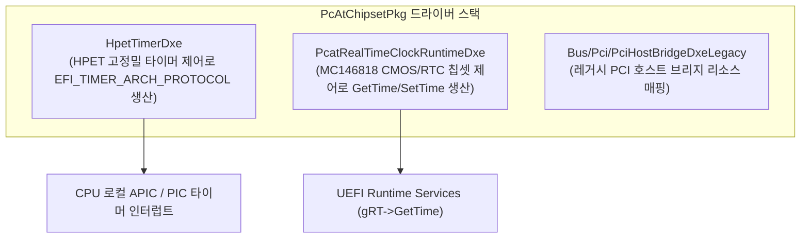

# PcAtChipsetPkg (PC/AT Chipset Package) 상세 분석 보고서

## 1. 패키지 개요 (Overview)

- **패키지 디렉터리**: `PcAtChipsetPkg/`
- **분류 (Category)**: Hardware & Architecture
- **주요 실행 단계 (Target Phases)**: `DXE, Runtime`
- **포함된 모듈 수**: 총 10개 (`.inf` 모듈 기준)

IBM PC/AT 호환 아키텍처에 기반한 전통적인 x86 플랫폼 하드웨어 칩셋(타이머, 인터럽트 컨트롤러, 실시간 시계)을 제어하는 드라이버 패키지입니다.

---

## 2. 패키지 아키텍처 및 시스템 블록 다이어그램

---

## 3. 핵심 아키텍처 및 심층 분석

### 핵심 모듈 분석
1. **`HpetTimerDxe`**: 고정밀 이벤트 타이머(HPET)를 프로그래밍하여 EDK II 타이머 아키텍처 프로토콜을 구현합니다.
2. **`PcatRealTimeClockRuntimeDxe`**: 전원이 꺼져도 배터리로 동작하는 CMOS RTC 하드웨어 레지스터를 직접 조작하여 시스템 날짜와 시간을 유지합니다.

---

## 4. 핵심 실행 워크플로우 및 시퀀스 다이어그램

---

## 5. 제공 및 소비하는 주요 Protocols / PPIs / PCDs

---

## 6. 주요 모듈 및 소스 파일 맵 (Module Summary Table)

| 모듈 유형 | 모듈명 (BASE_NAME) | 소스 경로 (.inf) |
|---|---|---|
| `BASE` | **BaseAcpiTimerLib** | `Library/AcpiTimerLib/BaseAcpiTimerLib.inf` |
| `BASE` | **PeiAcpiTimerLib** | `Library/AcpiTimerLib/PeiAcpiTimerLib.inf` |
| `BASE` | **BaseIoApicLib** | `Library/BaseIoApicLib/BaseIoApicLib.inf` |
| `BASE` | **ResetSystemLib** | `Library/ResetSystemLib/ResetSystemLib.inf` |
| `BASE` | **PcAtSerialPortLib** | `Library/SerialIoLib/SerialIoLib.inf` |
| `DXE_DRIVER` | **HpetTimerDxe** | `HpetTimerDxe/HpetTimerDxe.inf` |
| `DXE_DRIVER` | **DxeAcpiTimerLib** | `Library/AcpiTimerLib/DxeAcpiTimerLib.inf` |
| `DXE_RUNTIME_DRIVER` | **PcRtc** | `PcatRealTimeClockRuntimeDxe/PcatRealTimeClockRuntimeDxe.inf` |
| `MM_STANDALONE` | **StandaloneMmAcpiTimerLib** | `Library/AcpiTimerLib/StandaloneMmAcpiTimerLib.inf` |
| `UEFI_DRIVER` | **IdeController** | `Bus/Pci/IdeControllerDxe/IdeControllerDxe.inf` |

---

## 7. 관련 문서 및 참조 링크

- [EDK II 전체 아키텍처 개요](../EDK2_Architecture_Overview.md)
- [전체 패키지 분석 인덱스](Package_Analysis_Index.md)
- [FatPkg 상세 분석 보고서](FatPkg_Analysis.md)