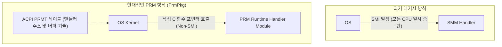
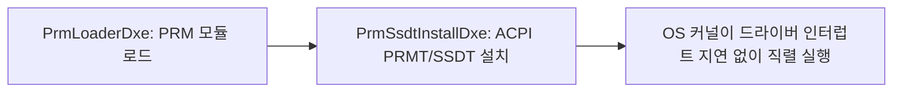

# PrmPkg (Platform Runtime Mechanism Package) 상세 분석 보고서

## 1. 패키지 개요 (Overview)

- **패키지 디렉터리**: `PrmPkg/`
- **분류 (Category)**: Runtime & OS Integration
- **주요 실행 단계 (Target Phases)**: `DXE, OS Runtime`
- **포함된 모듈 수**: 총 15개 (`.inf` 모듈 기준)

과거 SMI(System Management Interrupt)를 통해 SMM 모드로 진입하여 처리하던 칩셋 및 하드웨어 런타임 제어 루틴을, OS 런타임 컨텍스트에서 SMI 인터럽트 발생 없이 직접 안전하게 실행할 수 있도록 지원하는 최신 ACPI 기반 확장 패키지입니다.

---

## 2. 패키지 아키텍처 및 시스템 블록 다이어그램

---

## 3. 핵심 아키텍처 및 심층 분석

### 실시간성(Real-time) 및 성능 혁신
- 서버 및 고성능 컴퓨팅에서 SMM 진입으로 인한 지연 시간(SMI Latency Spikes)을 완전히 제거하여 OS의 실시간성을 획기적으로 향상시킵니다.

---

## 4. 핵심 실행 워크플로우 및 시퀀스 다이어그램

---

## 5. 제공 및 소비하는 주요 Protocols / PPIs / PCDs

### 5.1 주요 Protocols (DXE/SMM)
- `gPrmConfigProtocolGuid`

---

## 6. 주요 모듈 및 소스 파일 맵 (Module Summary Table)

| 모듈 유형 | 모듈명 (BASE_NAME) | 소스 경로 (.inf) |
|---|---|---|
| `DXE_DRIVER` | **DxePrmContextBufferLib** | `Library/DxePrmContextBufferLib/DxePrmContextBufferLib.inf` |
| `DXE_DRIVER` | **DxePrmModuleDiscoveryLib** | `Library/DxePrmModuleDiscoveryLib/DxePrmModuleDiscoveryLib.inf` |
| `DXE_DRIVER` | **DxePrmPeCoffLib** | `Library/DxePrmPeCoffLib/DxePrmPeCoffLib.inf` |
| `DXE_DRIVER` | **PrmLoaderDxe** | `PrmLoaderDxe/PrmLoaderDxe.inf` |
| `DXE_DRIVER` | **PrmSsdtInstallDxe** | `PrmSsdtInstallDxe/PrmSsdtInstallDxe.inf` |
| `DXE_DRIVER` | **DxeAcpiParameterBufferModuleConfigLib** | `Samples/PrmSampleAcpiParameterBufferModule/Library/DxeAcpiParameterBufferModuleConfigLib/DxeAcpiParameterBufferModuleConfigLib.inf` |
| `DXE_RUNTIME_DRIVER` | **PrmConfigDxe** | `PrmConfigDxe/PrmConfigDxe.inf` |
| `DXE_RUNTIME_DRIVER` | **PrmSampleAcpiParameterBufferModule** | `Samples/PrmSampleAcpiParameterBufferModule/PrmSampleAcpiParameterBufferModule.inf` |
| `DXE_RUNTIME_DRIVER` | **PrmSampleContextBufferModule** | `Samples/PrmSampleContextBufferModule/PrmSampleContextBufferModule.inf` |
| `DXE_RUNTIME_DRIVER` | **PrmSampleHardwareAccessModule** | `Samples/PrmSampleHardwareAccessModule/PrmSampleHardwareAccessModule.inf` |
| `HOST_APPLICATION` | **PrmContextBufferLibUnitTestHost** | `Library/DxePrmContextBufferLib/UnitTest/DxePrmContextBufferLibUnitTestHost.inf` |
| `HOST_APPLICATION` | **PrmModuleDiscoveryLibUnitTestHost** | `Library/DxePrmModuleDiscoveryLib/UnitTest/DxePrmModuleDiscoveryLibUnitTestHost.inf` |
| `UEFI_APPLICATION` | **PrmInfo** | `Application/PrmInfo/PrmInfo.inf` |
| ... | *(총 15개 모듈 중 대표 모듈 13개 수록)* | ... |

---

## 7. 관련 문서 및 참조 링크

- [EDK II 전체 아키텍처 개요](../EDK2_Architecture_Overview.md)
- [전체 패키지 분석 인덱스](Package_Analysis_Index.md)
- [FatPkg 상세 분석 보고서](FatPkg_Analysis.md)