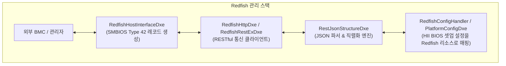
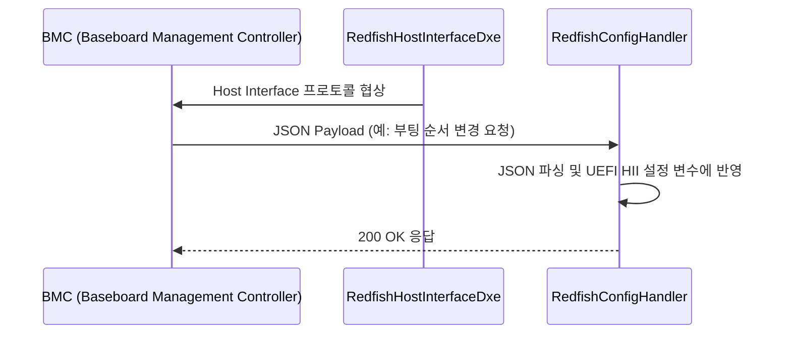

# RedfishPkg (Redfish Package) 상세 분석 보고서

## 1. 패키지 개요 (Overview)

- **패키지 디렉터리**: `RedfishPkg/`
- **분류 (Category)**: Management & Standards
- **주요 실행 단계 (Target Phases)**: `DXE`
- **포함된 모듈 수**: 총 23개 (`.inf` 모듈 기준)

DMTF(Distributed Management Task Force)의 최신 RESTful 서버 관리 표준인 Redfish를 UEFI 펌웨어 레벨에서 구현한 엔터프라이즈 관리 패키지입니다. BIOS 셋업 설정 및 시스템 인벤토리를 JSON 포맷으로 BMC 및 클라우드 오케스트레이터와 연동합니다.

---

## 2. 패키지 아키텍처 및 시스템 블록 다이어그램

---

## 3. 핵심 아키텍처 및 심층 분석

### 엔터프라이즈 데이터센터 혁신
- 전통적인 IPMI 텍스트 명령어를 대체하여 웹 표준(HTTP + JSON)을 통해 데이터센터 서버 수만 대의 BIOS 설정을 원격으로 자동화 구성할 수 있습니다.

---

## 4. 핵심 실행 워크플로우 및 시퀀스 다이어그램

---

## 5. 제공 및 소비하는 주요 Protocols / PPIs / PCDs

### 5.1 주요 Protocols (DXE/SMM)
- `gEdkIIRedfishCredentialProtocolGuid`
- `gEdkIIRedfishCredential2ProtocolGuid`
- `gEdkIIRedfishConfigHandlerProtocolGuid`
- `gEdkIIRedfishPlatformConfigProtocolGuid`
- `gEdkIIRedfishHostInterfaceReadyProtocolGuid`
- `gEdkIIRedfishHttpProtocolGuid`

---

## 6. 주요 모듈 및 소스 파일 맵 (Module Summary Table)

| 모듈 유형 | 모듈명 (BASE_NAME) | 소스 경로 (.inf) |
|---|---|---|
| `BASE` | **BaseUcs2Utf8Lib** | `Library/BaseUcs2Utf8Lib/BaseUcs2Utf8Lib.inf` |
| `DXE_DRIVER` | **DxeRestExLib** | `Library/DxeRestExLib/DxeRestExLib.inf` |
| `DXE_DRIVER` | **JsonLib** | `Library/JsonLib/JsonLib.inf` |
| `DXE_DRIVER` | **RedfishPlatformCredentialLibNull** | `Library/PlatformCredentialLibNull/PlatformCredentialLibNull.inf` |
| `DXE_DRIVER` | **PlatformHostInterfaceBmcUsbNicLib** | `Library/PlatformHostInterfaceBmcUsbNicLib/PlatformHostInterfaceBmcUsbNicLib.inf` |
| `DXE_DRIVER` | **RedfishPlatformHostInterfaceLibNull** | `Library/PlatformHostInterfaceLibNull/PlatformHostInterfaceLibNull.inf` |
| `DXE_DRIVER` | **RedfishContentCodingLibNull** | `Library/RedfishContentCodingLibNull/RedfishContentCodingLibNull.inf` |
| `UEFI_DRIVER` | **HiiUtilityLib** | `Library/HiiUtilityLib/HiiUtilityLib.inf` |
| `UEFI_DRIVER` | **RedfishConfigHandlerDriver** | `RedfishConfigHandler/RedfishConfigHandlerDriver.inf` |
| `UEFI_DRIVER` | **RedfishDiscoverDxe** | `RedfishDiscoverDxe/RedfishDiscoverDxe.inf` |
| `UEFI_DRIVER` | **RedfishRestExDxe** | `RedfishRestExDxe/RedfishRestExDxe.inf` |
| ... | *(총 23개 모듈 중 대표 모듈 11개 수록)* | ... |

---

## 7. 관련 문서 및 참조 링크

- [EDK II 전체 아키텍처 개요](../EDK2_Architecture_Overview.md)
- [전체 패키지 분석 인덱스](Package_Analysis_Index.md)
- [FatPkg 상세 분석 보고서](FatPkg_Analysis.md)