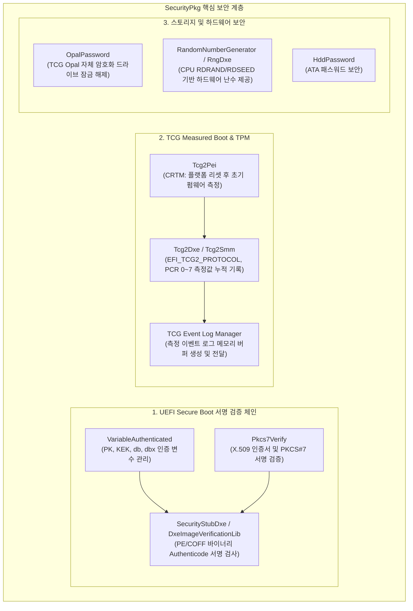
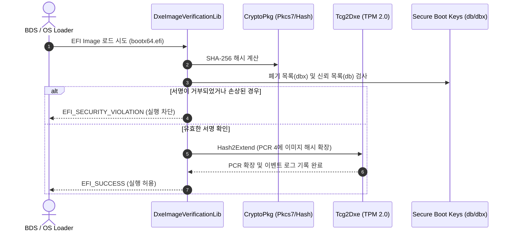

# SecurityPkg (Security Package) 상세 분석 보고서

## 1. 패키지 개요 (Overview)

- **패키지 디렉터리**: `SecurityPkg/`
- **분류 (Category)**: Security & Cryptography
- **주요 실행 단계 (Target Phases)**: `PEI, DXE, SMM`
- **포함된 모듈 수**: 총 114개 (`.inf` 모듈 기준)

시스템 부팅 무결성과 보안을 책임지는 EDK II의 핵심 보안 패키지입니다. UEFI Secure Boot(인증 변수 서명 검증), TPM 1.2 / 2.0 물리 디바이스 제어 및 Measured Boot, TCG 이벤트 로그, Opal 자체 암호화 드라이브 관리, 하드웨어 난수 생성기(RNG)를 제공합니다.

---

## 2. 패키지 아키텍처 및 시스템 블록 다이어그램

---

## 3. 핵심 아키텍처 및 심층 분석

### 핵심 모듈 및 보안 기능
1. **UEFI Secure Boot (`DxeImageVerificationLib`)**:
   - 부트로더, 커널, Option ROM 실행 파일이 신뢰된 기관(Microsoft, OEM)의 서명을 받았는지 검증하여 루트킷(Bootkit) 감염을 원천 차단합니다.
2. **TCG Measured Boot (`Tcg2Dxe`)**:
   - 펌웨어 볼륨, 옵션 롬, 부트 설정값, 부트로더 바이너리를 해시하여 TPM(Trusted Platform Module)의 **PCR (Platform Configuration Register)**에 순차적으로 확장(`PCR Extend`)합니다. OS 진입 후 하드웨어 원격 검증(Remote Attestation)의 토대가 됩니다.
3. **인증 변수 (`VariableAuthenticated`)**:
   - 공문서 암호화 표준(PKCS#7)으로 서명된 데이터만 NVRAM의 보안 변수(`PK`, `KEK`, `db`, `dbx`)에 쓸 수 있도록 강제합니다.

---

## 4. 핵심 실행 워크플로우 및 시퀀스 다이어그램

---

## 5. 제공 및 소비하는 주요 Protocols / PPIs / PCDs

### 5.1 주요 Protocols (DXE/SMM)
- `gTcgLogTestProtocolGuid`

### 5.2 주요 PPIs (PEI)
- `gPeiLockPhysicalPresencePpiGuid`
- `gPeiTpmInitializedPpiGuid`
- `gPeiTpmInitializationDonePpiGuid`
- `gEfiPeiFirmwareVolumeInfoMeasurementExcludedPpiGuid`
- `gEdkiiPeiFirmwareVolumeInfoPrehashedFvPpiGuid`
- `gEdkiiPeiFirmwareVolumeInfoStoredHashFvPpiGuid`
- `gEdkiiTcgPpiGuid`
- `gEdkiiCcPpiGuid`

---

## 6. 주요 모듈 및 소스 파일 맵 (Module Summary Table)

| 모듈 유형 | 모듈명 (BASE_NAME) | 소스 경로 (.inf) |
|---|---|---|
| `BASE` | **CryptlibWrapper** | `DeviceSecurity/OsStub/CryptlibWrapper/CryptlibWrapper.inf` |
| `BASE` | **MemLibWrapper** | `DeviceSecurity/OsStub/MemLibWrapper/MemLibWrapper.inf` |
| `BASE` | **PlatformLibWrapper** | `DeviceSecurity/OsStub/PlatformLibWrapper/PlatformLibWrapper.inf` |
| `BASE` | **SpdmCommonLib** | `DeviceSecurity/SpdmLib/SpdmCommonLib.inf` |
| `BASE` | **SpdmCryptLib** | `DeviceSecurity/SpdmLib/SpdmCryptLib.inf` |
| `BASE` | **SpdmDeviceSecretLibNull** | `DeviceSecurity/SpdmLib/SpdmDeviceSecretLibNull.inf` |
| `DXE_DRIVER` | **HddPasswordDxe** | `HddPassword/HddPasswordDxe.inf` |
| `DXE_DRIVER` | **DxeImageAuthenticationStatusLib** | `Library/DxeImageAuthenticationStatusLib/DxeImageAuthenticationStatusLib.inf` |
| `DXE_DRIVER` | **DxeImageVerificationLib** | `Library/DxeImageVerificationLib/DxeImageVerificationLib.inf` |
| `DXE_DRIVER` | **DxeRsa2048Sha256GuidedSectionExtractLib** | `Library/DxeRsa2048Sha256GuidedSectionExtractLib/DxeRsa2048Sha256GuidedSectionExtractLib.inf` |
| `DXE_DRIVER` | **DxeTcg2PhysicalPresenceLib** | `Library/DxeTcg2PhysicalPresenceLib/DxeTcg2PhysicalPresenceLib.inf` |
| `DXE_DRIVER` | **DxeTcgPhysicalPresenceLib** | `Library/DxeTcgPhysicalPresenceLib/DxeTcgPhysicalPresenceLib.inf` |
| `DXE_RUNTIME_DRIVER` | **AuthVariableLib** | `Library/AuthVariableLib/AuthVariableLib.inf` |
| `DXE_SMM_DRIVER` | **SmmTcg2PhysicalPresenceLib** | `Library/SmmTcg2PhysicalPresenceLib/SmmTcg2PhysicalPresenceLib.inf` |
| `DXE_SMM_DRIVER` | **TcgMorLockSmm** | `Tcg/MemoryOverwriteRequestControlLock/TcgMorLockSmm.inf` |
| `DXE_SMM_DRIVER` | **Tcg2Smm** | `Tcg/Tcg2Smm/Tcg2Smm.inf` |
| `DXE_SMM_DRIVER` | **TcgSmm** | `Tcg/TcgSmm/TcgSmm.inf` |
| `HOST_APPLICATION` | **DxeImageVerificationLibGoogleTest** | `Library/DxeImageVerificationLib/GoogleTest/DxeImageVerificationLibGoogleTest.inf` |
| `HOST_APPLICATION` | **DxeTpm2MeasuredBootLibTest** | `Library/DxeTpm2MeasureBootLib/InternalUnitTest/DxeTpm2MeasureBootLibSanitizationTestHost.inf` |
| `HOST_APPLICATION` | **DxeTpmMeasuredBootLibTest** | `Library/DxeTpmMeasureBootLib/InternalUnitTest/DxeTpmMeasureBootLibSanitizationTestHost.inf` |
| `HOST_APPLICATION` | **SecureBootVariableLibGoogleTest** | `Library/SecureBootVariableLib/GoogleTest/SecureBootVariableLibGoogleTest.inf` |
| `HOST_APPLICATION` | **MockPlatformPKProtectionLib** | `Library/SecureBootVariableLib/UnitTest/MockPlatformPKProtectionLib.inf` |
| `HOST_APPLICATION` | **MockUefiLib** | `Library/SecureBootVariableLib/UnitTest/MockUefiLib.inf` |
| `MM_STANDALONE` | **StandaloneMmTcg2PhysicalPresenceLib** | `Library/SmmTcg2PhysicalPresenceLib/StandaloneMmTcg2PhysicalPresenceLib.inf` |
| `MM_STANDALONE` | **Tcg2StandaloneMm** | `Tcg/Tcg2Smm/Tcg2StandaloneMm.inf` |
| ... | *(총 114개 모듈 중 대표 모듈 25개 수록)* | ... |

---

## 7. 관련 문서 및 참조 링크

- [EDK II 전체 아키텍처 개요](../EDK2_Architecture_Overview.md)
- [전체 패키지 분석 인덱스](Package_Analysis_Index.md)
- [FatPkg 상세 분석 보고서](FatPkg_Analysis.md)