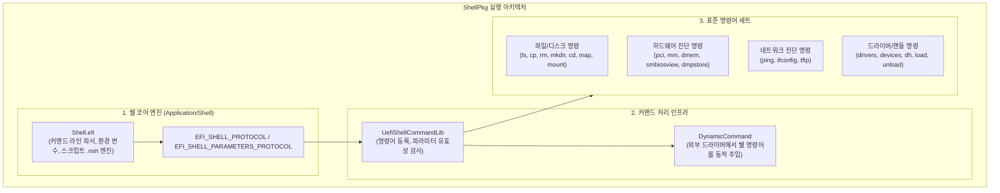
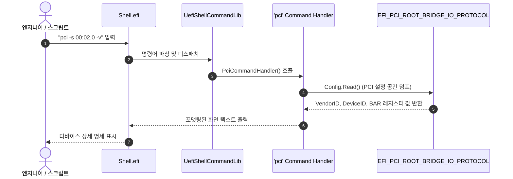

# ShellPkg (UEFI Shell Package) 상세 분석 보고서

## 1. 패키지 개요 (Overview)

- **패키지 디렉터리**: `ShellPkg/`
- **분류 (Category)**: Tools & Applications
- **주요 실행 단계 (Target Phases)**: `UEFI Application (BDS 단계 이후)`
- **포함된 모듈 수**: 총 29개 (`.inf` 모듈 기준)

UEFI Shell Specification 2.2를 완벽하게 준수하는 대화형 쉘 환경 및 커맨드 라인 유틸리티 패키지입니다. OS 부팅 전 단계에서 시스템 점검, 디스크 파티셔닝, 파일 조작, 펌웨어 플래시 업데이트, 네트워크 진단, PCI/SMBIOS 레지스터 덤프를 수행할 수 있는 강력한 관리 콘솔을 제공합니다.

---

## 2. 패키지 아키텍처 및 시스템 블록 다이어그램

---

## 3. 핵심 아키텍처 및 심층 분석

### 핵심 구성 요소
1. **스크립트 실행 엔진 (`startup.nsh`)**:
   - 부팅 시 `startup.nsh` 배치 파일을 자동으로 검색하여 실행할 수 있어, 공장 제조 공정(Factory Line)에서 자동화된 진단 및 펌웨어 업데이트를 수행하는 데 필수적으로 사용됩니다.
2. **동적 커맨드 프로토콜 (`DynamicCommand`)**:
   - 쉘 바이너리를 다시 컴파일하지 않고도, 타 패키지(예: `NetworkPkg`의 tftp, `OvmfPkg`의 initrd)에서 드라이버를 로드하여 쉘 명령어를 실시간으로 추가 확장할 수 있습니다.

---

## 4. 핵심 실행 워크플로우 및 시퀀스 다이어그램

---

## 5. 제공 및 소비하는 주요 Protocols / PPIs / PCDs

### 5.1 주요 Protocols (DXE/SMM)
- `gEfiShellEnvironment2Guid`
- `gEfiShellInterfaceGuid`

---

## 6. 주요 모듈 및 소스 파일 맵 (Module Summary Table)

| 모듈 유형 | 모듈명 (BASE_NAME) | 소스 경로 (.inf) |
|---|---|---|
| `DXE_DRIVER` | **dpDynamicCommand** | `DynamicCommand/DpDynamicCommand/DpDynamicCommand.inf` |
| `DXE_DRIVER` | **httpDynamicCommand** | `DynamicCommand/HttpDynamicCommand/HttpDynamicCommand.inf` |
| `DXE_DRIVER` | **TftpDynamicCommand** | `DynamicCommand/TftpDynamicCommand/TftpDynamicCommand.inf` |
| `DXE_DRIVER` | **VariablePolicyDynamicCommand** | `DynamicCommand/VariablePolicyDynamicCommand/VariablePolicyDynamicCommand.inf` |
| `HOST_APPLICATION` | **MockShellCommandLib** | `Test/Mock/Library/GoogleTest/MockShellCommandLib/MockShellCommandLib.inf` |
| `HOST_APPLICATION` | **MockShellLib** | `Test/Mock/Library/GoogleTest/MockShellLib/MockShellLib.inf` |
| `UEFI_APPLICATION` | **AcpiViewApp** | `Application/AcpiViewApp/AcpiViewApp.inf` |
| `UEFI_APPLICATION` | **Shell** | `Application/Shell/Shell.inf` |
| `UEFI_APPLICATION` | **ShellCTestApp** | `Application/ShellCTestApp/ShellCTestApp.inf` |
| `UEFI_APPLICATION` | **EmptyApplication** | `Application/ShellExecTestApp/SA.inf` |
| `UEFI_APPLICATION` | **ShellSortTestApp** | `Application/ShellSortTestApp/ShellSortTestApp.inf` |
| `UEFI_APPLICATION` | **dp** | `DynamicCommand/DpDynamicCommand/DpApp.inf` |
| `UEFI_DRIVER` | **UefiHandleParsingLib** | `Library/UefiHandleParsingLib/UefiHandleParsingLib.inf` |
| `UEFI_DRIVER` | **UefiShellBcfgCommandLib** | `Library/UefiShellBcfgCommandLib/UefiShellBcfgCommandLib.inf` |
| `UEFI_DRIVER` | **UefiShellCommandLib** | `Library/UefiShellCommandLib/UefiShellCommandLib.inf` |
| `UEFI_DRIVER` | **UefiShellInstall1CommandsLib** | `Library/UefiShellInstall1CommandsLib/UefiShellInstall1CommandsLib.inf` |
| `UEFI_DRIVER` | **UefiShellLib** | `Library/UefiShellLib/UefiShellLib.inf` |
| ... | *(총 29개 모듈 중 대표 모듈 17개 수록)* | ... |

---

## 7. 관련 문서 및 참조 링크

- [EDK II 전체 아키텍처 개요](../EDK2_Architecture_Overview.md)
- [전체 패키지 분석 인덱스](Package_Analysis_Index.md)
- [FatPkg 상세 분석 보고서](FatPkg_Analysis.md)