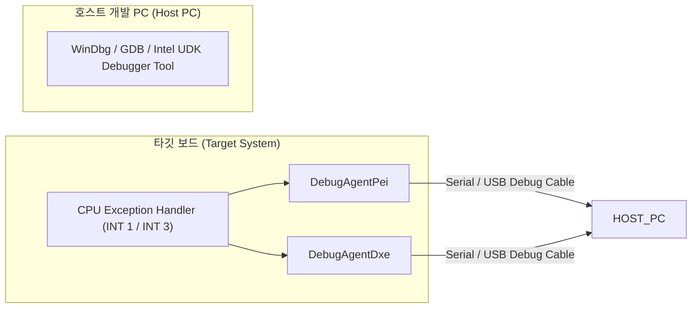
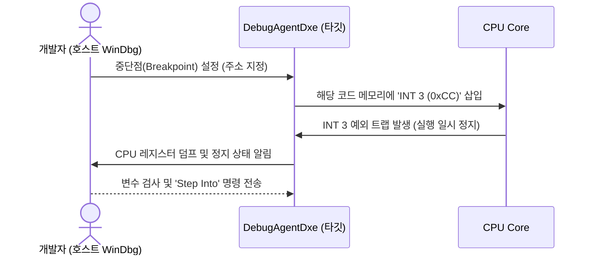

# SourceLevelDebugPkg (Source Level Debug Package) 상세 분석 보고서

## 1. 패키지 개요 (Overview)

- **패키지 디렉터리**: `SourceLevelDebugPkg/`
- **분류 (Category)**: Embedded & Diagnostics
- **주요 실행 단계 (Target Phases)**: `SEC, PEI, DXE, SMM`
- **포함된 모듈 수**: 총 10개 (`.inf` 모듈 기준)

EDK II 소스 레벨 디버깅을 위해 타깃 시스템 내부에 상주하는 디버그 에이전트(Debug Agent) 패키지입니다. 시리얼 포트, USB 2.0/3.0 디버그 포트를 통해 호스트 디버거(WinDbg, Intel UDK Debugger, GDB)와 통신하며 중단점 및 콜스택 조회를 가능하게 합니다.

---

## 2. 패키지 아키텍처 및 시스템 블록 다이어그램

---

## 3. 핵심 아키텍처 및 심층 분석

### 하드웨어 디버거 대체
- 수천만 원 상당의 하드웨어 JTAG 장비 없이도 소프트웨어 기반 디버그 에이전트를 통해 부팅 전 단계의 C 코드 버그를 완벽하게 추적할 수 있습니다.

---

## 4. 핵심 실행 워크플로우 및 시퀀스 다이어그램

---

## 5. 제공 및 소비하는 주요 Protocols / PPIs / PCDs

---

## 6. 주요 모듈 및 소스 파일 맵 (Module Summary Table)

| 모듈 유형 | 모듈명 (BASE_NAME) | 소스 경로 (.inf) |
|---|---|---|
| `BASE` | **DebugCommunicationLibSerialPort** | `Library/DebugCommunicationLibSerialPort/DebugCommunicationLibSerialPort.inf` |
| `BASE` | **DebugCommunicationLibUsb** | `Library/DebugCommunicationLibUsb/DebugCommunicationLibUsb.inf` |
| `BASE` | **PeCoffExtraActionLib** | `Library/PeCoffExtraActionLibDebug/PeCoffExtraActionLibDebug.inf` |
| `DXE_DRIVER` | **DebugAgentDxe** | `DebugAgentDxe/DebugAgentDxe.inf` |
| `DXE_DRIVER` | **DxeDebugAgentLib** | `Library/DebugAgent/DxeDebugAgentLib.inf` |
| `DXE_DRIVER` | **DebugCommunicationLibUsb3Dxe** | `Library/DebugCommunicationLibUsb3/DebugCommunicationLibUsb3Dxe.inf` |
| `DXE_SMM_DRIVER` | **SmmDebugAgentLib** | `Library/DebugAgent/SmmDebugAgentLib.inf` |
| `PEIM` | **DebugAgentPei** | `DebugAgentPei/DebugAgentPei.inf` |
| `PEIM` | **SecPeiDebugAgentLib** | `Library/DebugAgent/SecPeiDebugAgentLib.inf` |
| `PEIM` | **DebugCommunicationLibUsb3Pei** | `Library/DebugCommunicationLibUsb3/DebugCommunicationLibUsb3Pei.inf` |

---

## 7. 관련 문서 및 참조 링크

- [EDK II 전체 아키텍처 개요](../EDK2_Architecture_Overview.md)
- [전체 패키지 분석 인덱스](Package_Analysis_Index.md)
- [FatPkg 상세 분석 보고서](FatPkg_Analysis.md)