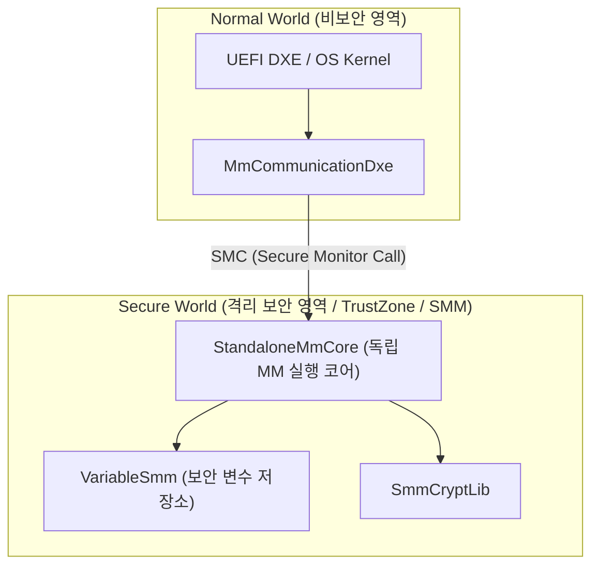
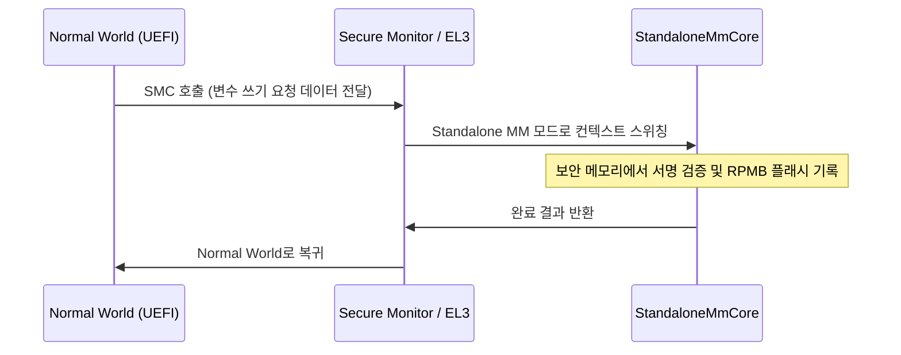

# StandaloneMmPkg (Standalone Management Mode Package) 상세 분석 보고서

## 1. 패키지 개요 (Overview)

- **패키지 디렉터리**: `StandaloneMmPkg/`
- **분류 (Category)**: Security & Architecture
- **주요 실행 단계 (Target Phases)**: `Standalone MM (격리 보안 환경)`
- **포함된 모듈 수**: 총 15개 (`.inf` 모듈 기준)

전통적인 x86 SMM뿐만 아니라, ARM TrustZone 보안 영역(Secure World / OP-TEE) 또는 격리된 하드웨어 보안 파티션에서 독립적으로 실행되는 Standalone MM 환경을 구현하는 패키지입니다.

---

## 2. 패키지 아키텍처 및 시스템 블록 다이어그램

---

## 3. 핵심 아키텍처 및 심층 분석

### 차세대 보안 아키텍처
- 펌웨어 보안 변수와 TPM 비밀 키를 메인 OS나 취약한 하이퍼바이저로부터 완전히 분리된 하드웨어 보안 영역에서 전담 처리합니다.

---

## 4. 핵심 실행 워크플로우 및 시퀀스 다이어그램

---

## 5. 제공 및 소비하는 주요 Protocols / PPIs / PCDs

### 5.1 주요 Protocols (DXE/SMM)
- `gEfiMmEntryNotifyProtocolGuid`
- `gEfiMmExitNotifyProtocolGuid`

### 5.2 주요 PPIs (PEI)
- `gMmCoreFvLocationPpiGuid`

---

## 6. 주요 모듈 및 소스 파일 맵 (Module Summary Table)

| 모듈 유형 | 모듈명 (BASE_NAME) | 소스 경로 (.inf) |
|---|---|---|
| `BASE` | **StandaloneMmPeCoffExtraActionLib** | `Library/StandaloneMmPeCoffExtraActionLib/StandaloneMmPeCoffExtraActionLib.inf` |
| `DXE_DRIVER` | **MmCommunicationNotifyDxe** | `Drivers/MmCommunicationNotifyDxe/MmCommunicationNotifyDxe.inf` |
| `DXE_DRIVER` | **SmmLockBoxMmDependency** | `Library/SmmLockBoxMmDependency/SmmLockBoxMmDependency.inf` |
| `DXE_DRIVER` | **VariableMmDependency** | `Library/VariableMmDependency/VariableMmDependency.inf` |
| `DXE_RUNTIME_DRIVER` | **MmCommunicationDxe** | `Drivers/MmCommunicationDxe/MmCommunicationDxe.inf` |
| `HOST_APPLICATION` | **MmCommunicationDxeGoogleTest** | `Drivers/MmCommunicationDxe/GoogleTest/MmCommunicationDxeGoogleTest.inf` |
| `MM_CORE_STANDALONE` | **StandaloneMmCore** | `Core/StandaloneMmCore.inf` |
| `MM_CORE_STANDALONE` | **HobLib** | `Library/StandaloneMmCoreHobLib/StandaloneMmCoreHobLib.inf` |
| `MM_CORE_STANDALONE` | **MemoryAllocationLib** | `Library/StandaloneMmCoreMemoryAllocationLib/StandaloneMmCoreMemoryAllocationLib.inf` |
| `MM_STANDALONE` | **StandaloneMmExtractGuidedSectionLib** | `Library/StandaloneMmExtractGuidedSectionLib/StandaloneMmExtractGuidedSectionLib.inf` |
| `MM_STANDALONE` | **HobLib** | `Library/StandaloneMmHobLib/StandaloneMmHobLib.inf` |
| `MM_STANDALONE` | **MemLib** | `Library/StandaloneMmMemLib/StandaloneMmMemLib.inf` |
| `MM_STANDALONE` | **MemoryAllocationLib** | `Library/StandaloneMmMemoryAllocationLib/StandaloneMmMemoryAllocationLib.inf` |
| `PEIM` | **StandaloneMmIplPei** | `Drivers/StandaloneMmIplPei/StandaloneMmIplPei.inf` |
| `PEIM` | **MmPlatformHobProducerLibNull** | `Library/MmPlatformHobProducerLibNull/MmPlatformHobProducerLibNull.inf` |

---

## 7. 관련 문서 및 참조 링크

- [EDK II 전체 아키텍처 개요](../EDK2_Architecture_Overview.md)
- [전체 패키지 분석 인덱스](Package_Analysis_Index.md)
- [FatPkg 상세 분석 보고서](FatPkg_Analysis.md)