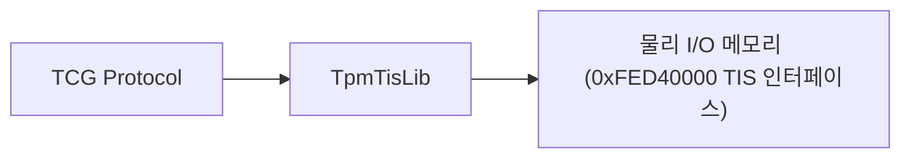
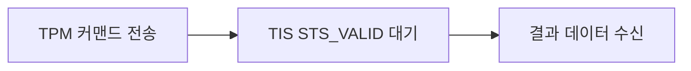

# TcgTpmPkg (TCG TPM Package) 상세 분석 보고서

## 1. 패키지 개요 (Overview)

- **패키지 디렉터리**: `TcgTpmPkg/`
- **분류 (Category)**: Security & Cryptography
- **주요 실행 단계 (Target Phases)**: `PEI, DXE`
- **포함된 모듈 수**: 총 2개 (`.inf` 모듈 기준)

TCG(Trusted Computing Group) 표준 TPM 1.2 물리 칩셋과의 저수준 TIS(TPM Interface Specification) 통신 드라이버 및 기본 라이브러리를 제공하는 패키지입니다.

---

## 2. 패키지 아키텍처 및 시스템 블록 다이어그램

---

## 3. 핵심 아키텍처 및 심층 분석

### 하위 호환성
- 현대적인 TPM 2.0 중심의 `SecurityPkg`와 상호 보완적으로 레거시 TPM 1.2 하드웨어를 직접 제어할 수 있는 저수준 레퍼런스를 제공합니다.

---

## 4. 핵심 실행 워크플로우 및 시퀀스 다이어그램

---

## 5. 제공 및 소비하는 주요 Protocols / PPIs / PCDs

---

## 6. 주요 모듈 및 소스 파일 맵 (Module Summary Table)

| 모듈 유형 | 모듈명 (BASE_NAME) | 소스 경로 (.inf) |
|---|---|---|
| `BASE` | **PlatformTpmNullLib** | `Library/PlatformTpmNullLib/PlatformTpmNullLib.inf` |
| `BASE` | **TpmLib** | `Library/TpmLib/TpmLib.inf` |

---

## 7. 관련 문서 및 참조 링크

- [EDK II 전체 아키텍처 개요](../EDK2_Architecture_Overview.md)
- [전체 패키지 분석 인덱스](Package_Analysis_Index.md)
- [FatPkg 상세 분석 보고서](FatPkg_Analysis.md)