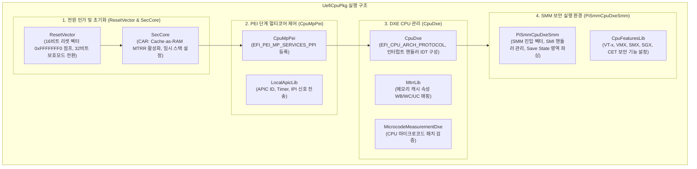
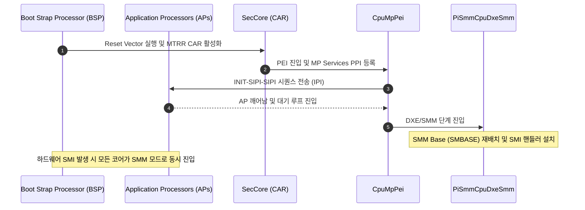

# UefiCpuPkg (UEFI CPU Package) 상세 분석 보고서

## 1. 패키지 개요 (Overview)

- **패키지 디렉터리**: `UefiCpuPkg/`
- **분류 (Category)**: Hardware & Architecture
- **주요 실행 단계 (Target Phases)**: `SEC, PEI, DXE, SMM`
- **포함된 모듈 수**: 총 75개 (`.inf` 모듈 기준)

x86, x64 및 RISC-V 프로세서의 초기화, 멀티프로세서(MP) 서비스, SMM(System Management Mode) 인프라, CPU Reset Vector 및 캐시(MTRR) 제어를 전담하는 하드웨어 저수준 패키지입니다.

---

## 2. 패키지 아키텍처 및 시스템 블록 다이어그램

---

## 3. 핵심 아키텍처 및 심층 분석

### 핵심 모듈 및 서브디렉터리 분석
1. **`ResetVector/`**:
   - x86 CPU가 전원을 켰을 때 실행되는 최초의 명령(`0xFFFFFFF0`)이 위치합니다. 16비트 Real Mode에서 GDT를 로드하고 32비트 Flat Protected Mode 또는 64비트 Long Mode로 전환합니다.
2. **`SecCore/`**:
   - 물리 메모리(DRAM)가 없는 상태에서 CPU L2/L3 캐시를 임시 RAM으로 활용하는 **CAR (Cache-as-RAM)** 메커니즘을 구성하고, PEI Core 호출을 위한 스택을 준비합니다.
3. **`PiSmmCpuDxeSmm/`**:
   - SMM(System Management Mode)의 CPU 제어를 총괄합니다. SMI(System Management Interrupt) 발생 시 CPU 코어들이 SMM RAM(SMRAM)으로 점프하여 안전한 고신뢰 코드(UEFI 보안 변수 보호, 전원 관리)를 실행할 수 있도록 환경을 조성합니다.

---

## 4. 핵심 실행 워크플로우 및 시퀀스 다이어그램

---

## 5. 제공 및 소비하는 주요 Protocols / PPIs / PCDs

### 5.1 주요 Protocols (DXE/SMM)
- `gEfiSmmCpuServiceProtocolGuid`
- `gEdkiiSmmCpuRendezvousProtocolGuid`
- `gEfiSmMonitorInitProtocolGuid`
- `gRiscVEfiBootProtocolGuid`

### 5.2 주요 PPIs (PEI)
- `gEdkiiPeiMpServices2PpiGuid`
- `gEdkiiPeiShadowMicrocodePpiGuid`
- `gRepublishSecPpiPpiGuid`

---

## 6. 주요 모듈 및 소스 파일 맵 (Module Summary Table)

| 모듈 유형 | 모듈명 (BASE_NAME) | 소스 경로 (.inf) |
|---|---|---|
| `BASE` | **AmdSvsmLibNull** | `Library/AmdSvsmLibNull/AmdSvsmLibNull.inf` |
| `BASE` | **ArmMmuBaseLib** | `Library/ArmMmuLib/ArmMmuBaseLib.inf` |
| `BASE` | **UefiCpuBaseArchSupportLib** | `Library/BaseArchSupportLib/BaseArchSupportLib.inf` |
| `BASE` | **BaseRiscVMmuLib** | `Library/BaseRiscVMmuLib/BaseRiscVMmuLib.inf` |
| `BASE` | **BaseXApicLib** | `Library/BaseXApicLib/BaseXApicLib.inf` |
| `BASE` | **BaseXApicX2ApicLib** | `Library/BaseXApicX2ApicLib/BaseXApicX2ApicLib.inf` |
| `DXE_DRIVER` | **CpuDxe** | `CpuDxe/CpuDxe.inf` |
| `DXE_DRIVER` | **CpuDxeRiscV64** | `CpuDxeRiscV64/CpuDxeRiscV64.inf` |
| `DXE_DRIVER` | **CpuFeaturesDxe** | `CpuFeatures/CpuFeaturesDxe.inf` |
| `DXE_DRIVER` | **CpuIo2Dxe** | `CpuIo2Dxe/CpuIo2Dxe.inf` |
| `DXE_DRIVER` | **CpuMmio2Dxe** | `CpuMmio2Dxe/CpuMmio2Dxe.inf` |
| `DXE_DRIVER` | **CpuS3DataDxe** | `CpuS3DataDxe/CpuS3DataDxe.inf` |
| `DXE_SMM_DRIVER` | **CpuIo2Smm** | `CpuIo2Smm/CpuIo2Smm.inf` |
| `DXE_SMM_DRIVER` | **AmdSysCallLibNull** | `Library/AmdSysCallLibNull/AmdSysCallLibNull.inf` |
| `DXE_SMM_DRIVER` | **SmmCpuExceptionHandlerLib** | `Library/CpuExceptionHandlerLib/SmmCpuExceptionHandlerLib.inf` |
| `DXE_SMM_DRIVER` | **AmdMmSaveStateLib** | `Library/MmSaveStateLib/AmdMmSaveStateLib.inf` |
| `DXE_SMM_DRIVER` | **IntelMmSaveStateLib** | `Library/MmSaveStateLib/IntelMmSaveStateLib.inf` |
| `DXE_SMM_DRIVER` | **AmdSmmCpuFeaturesLib** | `Library/SmmCpuFeaturesLib/AmdSmmCpuFeaturesLib.inf` |
| `HOST_APPLICATION` | **CpuPageTableLibUnitTestHost** | `Library/CpuPageTableLib/UnitTest/CpuPageTableLibUnitTestHost.inf` |
| `HOST_APPLICATION` | **MtrrLibUnitTestHost** | `Library/MtrrLib/UnitTest/MtrrLibUnitTestHost.inf` |
| `MM_STANDALONE` | **CpuIo2StandaloneMm** | `CpuIo2Smm/CpuIo2StandaloneMm.inf` |
| `MM_STANDALONE` | **AmdStandaloneMmCpuFeaturesLib** | `Library/SmmCpuFeaturesLib/AmdStandaloneMmCpuFeaturesLib.inf` |
| `MM_STANDALONE` | **StandaloneMmCpuFeaturesLib** | `Library/SmmCpuFeaturesLib/StandaloneMmCpuFeaturesLib.inf` |
| `MM_STANDALONE` | **PiSmmCpuStandaloneMm** | `PiSmmCpuDxeSmm/PiSmmCpuStandaloneMm.inf` |
| `PEIM` | **CpuFeaturesPei** | `CpuFeatures/CpuFeaturesPei.inf` |
| ... | *(총 75개 모듈 중 대표 모듈 25개 수록)* | ... |

---

## 7. 관련 문서 및 참조 링크

- [EDK II 전체 아키텍처 개요](../EDK2_Architecture_Overview.md)
- [전체 패키지 분석 인덱스](Package_Analysis_Index.md)
- [FatPkg 상세 분석 보고서](FatPkg_Analysis.md)