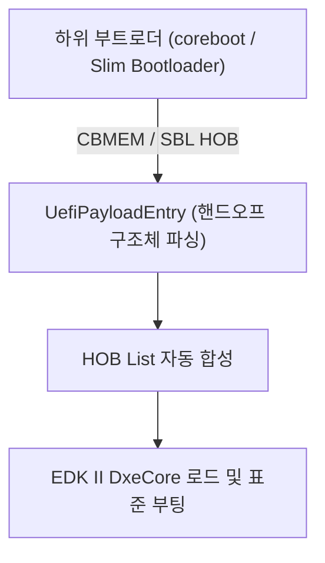

# UefiPayloadPkg (UEFI Payload Package) 상세 분석 보고서

## 1. 패키지 개요 (Overview)

- **패키지 디렉터리**: `UefiPayloadPkg/`
- **분류 (Category)**: Virtualization & Platforms
- **주요 실행 단계 (Target Phases)**: `Payload Entry -> DXE -> BDS`
- **포함된 모듈 수**: 총 42개 (`.inf` 모듈 기준)

Coreboot나 Intel Slim Bootloader(SBL)와 같은 오픈소스 경량 부트로더가 초기 하드웨어(CPU, DRAM)를 설정한 이후, 상위 표준 UEFI 환경을 제공하기 위해 페이로드(Payload) 형태로 탑재되는 패키지입니다.

---

## 2. 패키지 아키텍처 및 시스템 블록 다이어그램

---

## 3. 핵심 아키텍처 및 심층 분석

### 융합 아키텍처
- Coreboot의 초고속 부팅 속도와 EDK II의 완전한 UEFI/Secure Boot 호환성을 결합할 때 표준으로 채택됩니다.

---

## 4. 핵심 실행 워크플로우 및 시퀀스 다이어그램

---

## 5. 제공 및 소비하는 주요 Protocols / PPIs / PCDs

### 5.2 주요 PPIs (PEI)
- `gEfiPayLoadHobBasePpiGuid`
- `gUplReadyToPayloadPpiGuid`

---

## 6. 주요 모듈 및 소스 파일 맵 (Module Summary Table)

| 모듈 유형 | 모듈명 (BASE_NAME) | 소스 경로 (.inf) |
|---|---|---|
| `BASE` | **AcpiTimerLib** | `Library/AcpiTimerLib/AcpiTimerLib.inf` |
| `BASE` | **BaseSerialPortLibHob** | `Library/BaseSerialPortLibHob/BaseSerialPortLibHob.inf` |
| `BASE` | **BuildFdtLib** | `Library/BuildFdtLib/BuildFdtLib.inf` |
| `BASE` | **CbParseLib** | `Library/CbParseLib/CbParseLib.inf` |
| `BASE` | **CbSerialPortLib** | `Library/CbSerialPortLib/CbSerialPortLib.inf` |
| `BASE` | **CustomFdtNodeParserLib** | `Library/CustomFdtNodeParserLib/CustomFdtNodeParserLib.inf` |
| `DXE_DRIVER` | **BlSupportDxe** | `BlSupportDxe/BlSupportDxe.inf` |
| `DXE_DRIVER` | **DxeBaseSerialPortLibHob** | `Library/BaseSerialPortLibHob/DxeBaseSerialPortLibHob.inf` |
| `DXE_DRIVER` | **DxeHobLib** | `Library/DxeHobLib/DxeHobLib.inf` |
| `DXE_DRIVER` | **FlashDeviceLib** | `Library/FlashDeviceLib/FlashDeviceLib.inf` |
| `DXE_DRIVER` | **FmpDeviceSmmLib** | `Library/FmpDeviceSmmLib/FmpDeviceSmmLib.inf` |
| `DXE_DRIVER` | **HobParseLib** | `Library/HobParseLib/HobParseLib.inf` |
| `DXE_RUNTIME_DRIVER` | **SmmControlRuntimeDxe** | `SmmControlRuntimeDxe/SmmControlRuntimeDxe.inf` |
| `DXE_RUNTIME_DRIVER` | **SmmStoreFvbRuntimeDxe** | `SmmStoreFvb/SmmStoreFvbRuntimeDxe.inf` |
| `DXE_SMM_DRIVER` | **BlSupportSmm** | `BlSupportSmm/BlSupportSmm.inf` |
| `DXE_SMM_DRIVER` | **FvbSmm** | `FvbRuntimeDxe/FvbSmm.inf` |
| `DXE_SMM_DRIVER` | **PchSmiDispatchSmm** | `PchSmiDispatchSmm/PchSmiDispatchSmm.inf` |
| `PEIM` | **FitPayloadLoaderPeim** | `PayloadLoaderPeim/FitPayloadLoaderPeim.inf` |
| `PEIM` | **PayloadLoaderPeim** | `PayloadLoaderPeim/PayloadLoaderPeim.inf` |
| `SEC` | **PayloadEntryHelperLib** | `Library/PayloadEntryHelperLib/PayloadEntryHelperLib.inf` |
| `SEC` | **MemoryAllocationLib** | `Library/PayloadEntryMemoryAllocationLib/PayloadEntryMemoryAllocationLib.inf` |
| `SEC` | **FitUniversalPayloadEntry** | `UefiPayloadEntry/FitUniversalPayloadEntry.inf` |
| `SEC` | **PayloadEntry** | `UefiPayloadEntry/UefiPayloadEntry.inf` |
| `SEC` | **UniversalPayloadEntry** | `UefiPayloadEntry/UniversalPayloadEntry.inf` |
| `UEFI_DRIVER` | **GraphicsOutputDxe** | `GraphicsOutputDxe/GraphicsOutputDxe.inf` |
| ... | *(총 42개 모듈 중 대표 모듈 25개 수록)* | ... |

---

## 7. 관련 문서 및 참조 링크

- [EDK II 전체 아키텍처 개요](../EDK2_Architecture_Overview.md)
- [전체 패키지 분석 인덱스](Package_Analysis_Index.md)
- [FatPkg 상세 분석 보고서](FatPkg_Analysis.md)