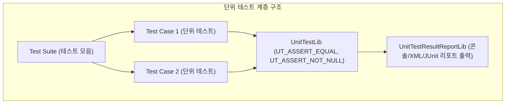
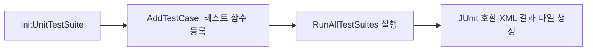

# UnitTestFrameworkPkg (Unit Test Framework Package) 상세 분석 보고서

## 1. 패키지 개요 (Overview)

- **패키지 디렉터리**: `UnitTestFrameworkPkg/`
- **분류 (Category)**: Testing & Quality
- **주요 실행 단계 (Target Phases)**: `Host OS Native 실행 및 UEFI Shell 실행`
- **포함된 모듈 수**: 총 42개 (`.inf` 모듈 기준)

EDK II 전용 단위 테스트 프레임워크 패키지입니다. GoogleTest 또는 CppUnitTest와 유사한 테스트 스위트, 테스트 케이스, 모의 객체(Mocking), 어설션(Assertion) 기능을 제공하여 호스트 OS 기반 단위 테스트 및 실제 타깃 UEFI Shell 환경에서의 기능 검증을 모두 지원합니다.

---

## 2. 패키지 아키텍처 및 시스템 블록 다이어그램

---

## 3. 핵심 아키텍처 및 심층 분석

### CI/CD 품질 보증
- EDK II GitHub CI 파이프라인과 통합되어, 코드가 머지되기 전에 호스트 환경에서 수천 개의 유닛 테스트를 자동으로 수행하고 코드 커버리지를 측정합니다.

---

## 4. 핵심 실행 워크플로우 및 시퀀스 다이어그램

---

## 5. 제공 및 소비하는 주요 Protocols / PPIs / PCDs

---

## 6. 주요 모듈 및 소스 파일 맵 (Module Summary Table)

| 모듈 유형 | 모듈명 (BASE_NAME) | 소스 경로 (.inf) |
|---|---|---|
| `BASE` | **CmockaLib** | `Library/CmockaLib/CmockaLib.inf` |
| `BASE` | **DebugLibPosix** | `Library/Posix/DebugLibPosix/DebugLibPosix.inf` |
| `BASE` | **TimerLibPosix** | `Library/Posix/TimerLibPosix/TimerLibPosix.inf` |
| `BASE` | **UnitTestDebugAssertLib** | `Library/UnitTestDebugAssertLib/UnitTestDebugAssertLib.inf` |
| `BASE` | **UnitTestPeiServicesTablePointerLib** | `Library/UnitTestPeiServicesTablePointerLib/UnitTestPeiServicesTablePointerLib.inf` |
| `DXE_DRIVER` | **UnitTestBootLibNull** | `Library/UnitTestBootLibNull/UnitTestBootLibNull.inf` |
| `DXE_DRIVER` | **SampleUnitTestDxe** | `Test/UnitTest/Sample/SampleUnitTest/SampleUnitTestDxe.inf` |
| `DXE_DRIVER` | **SampleUnitTestDxeExpectFail** | `Test/UnitTest/Sample/SampleUnitTestExpectFail/SampleUnitTestDxeExpectFail.inf` |
| `DXE_DRIVER` | **SampleUnitTestDxeGenerateException** | `Test/UnitTest/Sample/SampleUnitTestGenerateException/SampleUnitTestDxeGenerateException.inf` |
| `DXE_SMM_DRIVER` | **SampleUnitTestSmm** | `Test/UnitTest/Sample/SampleUnitTest/SampleUnitTestSmm.inf` |
| `DXE_SMM_DRIVER` | **SampleUnitTestSmmExpectFail** | `Test/UnitTest/Sample/SampleUnitTestExpectFail/SampleUnitTestSmmExpectFail.inf` |
| `DXE_SMM_DRIVER` | **SampleUnitTestSmmGenerateException** | `Test/UnitTest/Sample/SampleUnitTestGenerateException/SampleUnitTestSmmGenerateException.inf` |
| `HOST_APPLICATION` | **FunctionMockLib** | `Library/FunctionMockLib/FunctionMockLib.inf` |
| `HOST_APPLICATION` | **GoogleTestLib** | `Library/GoogleTestLib/GoogleTestLib.inf` |
| `HOST_APPLICATION` | **SubhookLib** | `Library/SubhookLib/SubhookLib.inf` |
| `HOST_APPLICATION` | **UnitTestDebugAssertLibHost** | `Library/UnitTestDebugAssertLib/UnitTestDebugAssertLibHost.inf` |
| `HOST_APPLICATION` | **SampleGoogleTestHost** | `Test/GoogleTest/Sample/SampleGoogleTest/SampleGoogleTestHost.inf` |
| `HOST_APPLICATION` | **SampleGoogleTestHostExpectFail** | `Test/GoogleTest/Sample/SampleGoogleTestExpectFail/SampleGoogleTestHostExpectFail.inf` |
| `PEIM` | **SampleUnitTestPei** | `Test/UnitTest/Sample/SampleUnitTest/SampleUnitTestPei.inf` |
| `PEIM` | **SampleUnitTestPeiExpectFail** | `Test/UnitTest/Sample/SampleUnitTestExpectFail/SampleUnitTestPeiExpectFail.inf` |
| `PEIM` | **SampleUnitTestPeiGenerateException** | `Test/UnitTest/Sample/SampleUnitTestGenerateException/SampleUnitTestPeiGenerateException.inf` |
| `UEFI_APPLICATION` | **UnitTestBootLibUsbClass** | `Library/UnitTestBootLibUsbClass/UnitTestBootLibUsbClass.inf` |
| `UEFI_APPLICATION` | **UnitTestPersistenceLibSimpleFileSystem** | `Library/UnitTestPersistenceLibSimpleFileSystem/UnitTestPersistenceLibSimpleFileSystem.inf` |
| `UEFI_APPLICATION` | **SampleUnitTestUefiShell** | `Test/UnitTest/Sample/SampleUnitTest/SampleUnitTestUefiShell.inf` |
| `UEFI_APPLICATION` | **SampleUnitTestUefiShellExpectFail** | `Test/UnitTest/Sample/SampleUnitTestExpectFail/SampleUnitTestUefiShellExpectFail.inf` |
| ... | *(총 42개 모듈 중 대표 모듈 25개 수록)* | ... |

---

## 7. 관련 문서 및 참조 링크

- [EDK II 전체 아키텍처 개요](../EDK2_Architecture_Overview.md)
- [전체 패키지 분석 인덱스](Package_Analysis_Index.md)
- [FatPkg 상세 분석 보고서](FatPkg_Analysis.md)