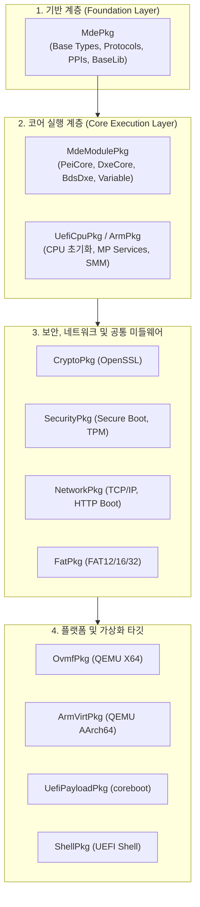

# EDK II (TianoCore) 펌웨어 기술 문서 저장소

본 저장소는 **EDK II(EFI Development Kit II / TianoCore)** 펌웨어 프레임워크의 전체 아키텍처 및 핵심 27개 패키지(Package)에 대한 심층 기술 분석 문서를 수록하고 있습니다.

UEFI 및 UEFI PI 사양을 기반으로 한 부팅 라이프사이클, 핵심 프로그래밍 모델(PPI, Protocol, HOB, PCD), 빌드 메타데이터 시스템, 그리고 각 패키지별 모듈 구조와 시퀀스 다이어그램을 제공합니다.

---

## 📑 핵심 가이드 문서 바로가기

| 문서명 | 설명 | 바로가기 |
|---|---|:---:|
| **EDK II 전체 아키텍처 및 완벽 가이드** | 부팅 7단계 라이프사이클(SEC~AL), Handle/Protocol, PPI, HOB, PCD, 드라이버 모델, 빌드 시스템(.dec/.inf/.dsc/.fdf), 바이너리 계층 구조 | [문서 열기](EDKII/EDK2_Architecture_Overview.md) |
| **전체 패키지 상세 분석 인덱스** | 27개 핵심 패키지의 도메인 분류 맵, 패키지 의존성 계층 구조 및 종합 색인 표 | [색인 열기](EDKII/Package_Analysis_Index.md) |

---

## 🗺️ 패키지 분류 및 의존성 계층

EDK II 프레임워크는 `MdePkg`를 최하단 공통 기반으로 하여 계층형 아키텍처를 형성합니다.



---

## 📦 전체 27개 패키지 상세 분석 목록

각 패키지 보고서에는 **패키지 아키텍처 다이어그램, 핵심 모듈(PEIM/DXE/SMM/Lib) 분석, 프로토콜/PPI/PCD 명세, 시퀀스 흐름도**가 포함되어 있습니다.

### 1. 기반 및 코어 (Core Foundation)
* [MdePkg](EDKII/MdePkg_Analysis.md) : UEFI/PI 표준 타입, 인터페이스 정의 및 기본 라이브러리 (모든 패키지의 기반)
* [MdeModulePkg](EDKII/MdeModulePkg_Analysis.md) : PEI/DXE 코어 디스패처, BDS 부트 관리자, NVRAM 변수 드라이버 및 공통 버스 드라이버

### 2. 프로세서 및 칩셋 (CPU & Chipset)
* [UefiCpuPkg](EDKII/UefiCpuPkg_Analysis.md) : x86/x64/RISC-V 프로세서 초기화, MP Services, Local APIC 및 전통 SMM 인프라
* [PcAtChipsetPkg](EDKII/PcAtChipsetPkg_Analysis.md) : 레거시 PC/AT 호환 칩셋(HPET 고정밀 타이머, MC146818 CMOS/RTC 실시간 시계)
* [ArmPkg](EDKII/ArmPkg_Analysis.md) : ARMv7/AArch64 아키텍처, 예외 벡터, GIC(Generic Interrupt Controller), MMU 변환
* [ArmPlatformPkg](EDKII/ArmPlatformPkg_Analysis.md) : ARM 레퍼런스 플랫폼 부팅, 메모리 컨트롤러 초기화 및 PrePi 경량 부팅

### 3. 보안 및 암호화 (Security & Cryptography)
* [SecurityPkg](EDKII/SecurityPkg_Analysis.md) : UEFI Secure Boot (PK/KEK/db/dbx), TPM 1.2/2.0 측정 부팅(Measured Boot), Opal 드라이브 보안
* [CryptoPkg](EDKII/CryptoPkg_Analysis.md) : OpenSSL 기반 암호화 라이브러리(BaseCryptLib), RSA/ECC/SHA, TLS 보안 세션
* [StandaloneMmPkg](EDKII/StandaloneMmPkg_Analysis.md) : ARM TrustZone(OP-TEE) 또는 격리 보안 파티션에서 구동되는 독립형 Management Mode
* [TcgTpmPkg](EDKII/TcgTpmPkg_Analysis.md) : TCG 표준 TPM 1.2 TIS 물리 인터페이스 하드웨어 통신

### 4. 네트워크 및 스토리지 (Network & Storage)
* [NetworkPkg](EDKII/NetworkPkg_Analysis.md) : UEFI 2.x 표준 네트워크 스택 (IPv4/IPv6, PXE, HTTP/HTTPS Boot, TLS, iSCSI, DNS)
* [FatPkg](EDKII/FatPkg_Analysis.md) : FAT12/16/32 고성능 파일시스템 드라이버 및 PEI 복구 전용 FAT 모듈

### 5. 가상화 및 타깃 플랫폼 (Virtualization & Platforms)
* [OvmfPkg](EDKII/OvmfPkg_Analysis.md) : QEMU/KVM x86_64 가상머신 펌웨어, Virtio 디바이스 드라이버, AMD SEV / Intel TDX 기밀 컴퓨팅
* [ArmVirtPkg](EDKII/ArmVirtPkg_Analysis.md) : QEMU AArch64 Virt 머신용 펌웨어, FDT(장치 트리) 파싱 및 ACPI 자동 생성
* [EmulatorPkg](EDKII/EmulatorPkg_Analysis.md) : 호스트 OS(Windows/Linux) 유저 모드 프로세스 상에서 실행되는 EDK II 개발/디버깅 에뮬레이터
* [UefiPayloadPkg](EDKII/UefiPayloadPkg_Analysis.md) : coreboot 또는 Slim Bootloader 하위 초기화 후 구동되는 경량 UEFI 페이로드

### 6. 실리콘 및 하드웨어 연동 (Silicon & Hardware)
* [IntelFsp2Pkg](EDKII/IntelFsp2Pkg_Analysis.md) : Intel FSP(Firmware Support Package) 2.0 실리콘 초기화 바이너리 사양 (FSP-T/M/S)
* [IntelFsp2WrapperPkg](EDKII/IntelFsp2WrapperPkg_Analysis.md) : Intel FSP API를 EDK II PEIM/DXE 실행 모델로 연결하는 래퍼
* [EmbeddedPkg](EDKII/EmbeddedPkg_Analysis.md) : 임베디드 SoC 시리얼 드라이버, GDB 원격 디버깅 스텁, 메트로놈 타이머

### 7. 관리 표준 및 런타임 (Management & Standards)
* [RedfishPkg](EDKII/RedfishPkg_Analysis.md) : DMTF Redfish RESTful 서버 관리 표준 스택 (JSON 파서, HTTP BMC 통신)
* [ManageabilityPkg](EDKII/ManageabilityPkg_Analysis.md) : IPMI(KCS/SSIF), MCTP 하드웨어 베이스보드 관리 제어기(BMC) 전송 계층
* [DynamicTablesPkg](EDKII/DynamicTablesPkg_Analysis.md) : C 구조체 설정 기반의 런타임 ACPI / SMBIOS 테이블 동적 생성 프레임워크
* [PrmPkg](EDKII/PrmPkg_Analysis.md) : Platform Runtime Mechanism (SMM/SMI 지연 없이 OS 런타임에서 펌웨어 핸들러를 직접 실행)

### 8. 업데이트, 도구 및 테스트 (Tools & Diagnostics)
* [ShellPkg](EDKII/ShellPkg_Analysis.md) : UEFI Shell 2.2 대화형 CLI 환경, 내장 명령어 모음, 하드웨어 진단 유틸리티
* [FmpDevicePkg](EDKII/FmpDevicePkg_Analysis.md) : FMP(Firmware Management Protocol) 기반 시스템/장치 캡슐(Capsule) 펌웨어 업데이트
* [SourceLevelDebugPkg](EDKII/SourceLevelDebugPkg_Analysis.md) : 시리얼/USB 디버그 포트를 통해 호스트 WinDbg/GDB와 연동하는 소스 레벨 디버그 에이전트
* [UnitTestFrameworkPkg](EDKII/UnitTestFrameworkPkg_Analysis.md) : 호스트 OS 및 UEFI Shell 환경을 모두 지원하는 EDK II 공식 단위 테스트 프레임워크

---

## 📊 종합 색인 표

| 번호 | 패키지명 | 도메인 분류 | 대상 단계 | 주요 기능 | 상세 문서 |
|:---:|---|---|---|---|:---:|
| 1 | **MdePkg** | Core Foundation | 전 단계 (SEC~RT) | EDK II 기본 데이터 타입, Protocol/PPI 인터페이스 정의, 기본 라이브러리 | [분석서](EDKII/MdePkg_Analysis.md) |
| 2 | **MdeModulePkg** | Core Foundation | PEI, DXE, SMM, BDS | PEI/DXE 코어 엔진, BDS 부트 관리자, NVRAM 변수 관리, 버스 드라이버 | [분석서](EDKII/MdeModulePkg_Analysis.md) |
| 3 | **UefiCpuPkg** | Hardware & Architecture | SEC, PEI, DXE, SMM | x86/x64/RISC-V CPU 초기화, MP Services, Local APIC, 전통 SMM 인프라 | [분석서](EDKII/UefiCpuPkg_Analysis.md) |
| 4 | **SecurityPkg** | Security & Crypto | PEI, DXE, SMM | UEFI Secure Boot, TPM 1.2/2.0 Measured Boot, Opal 드라이브 보안 | [분석서](EDKII/SecurityPkg_Analysis.md) |
| 5 | **CryptoPkg** | Security & Crypto | SEC, PEI, DXE, SMM | OpenSSL 기반 BaseCryptLib, RSA/ECC/SHA, TLS 보안 세션 | [분석서](EDKII/CryptoPkg_Analysis.md) |
| 6 | **NetworkPkg** | Networking | DXE | UEFI 표준 네트워크 스택 (IPv4/IPv6, PXE, HTTP Boot, TLS, iSCSI) | [분석서](EDKII/NetworkPkg_Analysis.md) |
| 7 | **OvmfPkg** | Virtualization & Platforms | SEC, PEI, DXE, BDS | QEMU/KVM 가상머신 펌웨어, Virtio 드라이버, AMD SEV / Intel TDX | [분석서](EDKII/OvmfPkg_Analysis.md) |
| 8 | **ShellPkg** | Tools & Applications | UEFI Application | UEFI Shell 2.2 대화형 환경, 쉘 명령어, 하드웨어 진단 도구 | [분석서](EDKII/ShellPkg_Analysis.md) |
| 9 | **FatPkg** | Storage / File System | PEI, DXE | FAT12/16/32 고성능 파일시스템 및 PEI 복구 전용 FAT 모듈 | [분석서](EDKII/FatPkg_Analysis.md) |
| 10 | **PcAtChipsetPkg** | Hardware & Architecture | DXE, Runtime | 레거시 PC/AT 칩셋 제어 (HPET 타이머, MC146818 RTC/CMOS) | [분석서](EDKII/PcAtChipsetPkg_Analysis.md) |
| 11 | **ArmPkg** | Hardware & Architecture | SEC, PEI, DXE | ARMv7/AArch64 아키텍처, 예외 벡터 처리, GIC 인터럽트, MMU | [분석서](EDKII/ArmPkg_Analysis.md) |
| 12 | **ArmPlatformPkg** | Hardware & Architecture | SEC, PEI, DXE | ARM 참조 플랫폼 부팅, DRAM 컨트롤러 초기화, PrePi 부팅 | [분석서](EDKII/ArmPlatformPkg_Analysis.md) |
| 13 | **ArmVirtPkg** | Virtualization & Platforms | SEC, PEI, DXE | QEMU AArch64 Virt 펌웨어, FDT 파싱 및 ACPI 테이블 자동 생성 | [분석서](EDKII/ArmVirtPkg_Analysis.md) |
| 14 | **StandaloneMmPkg** | Security & Architecture | Standalone MM | ARM TrustZone(OP-TEE) 또는 격리 환경용 독립 MM 코어 | [분석서](EDKII/StandaloneMmPkg_Analysis.md) |
| 15 | **RedfishPkg** | Management & Standards | DXE | DMTF Redfish RESTful 서버 관리 스택 (JSON 파서, HTTP 연동) | [분석서](EDKII/RedfishPkg_Analysis.md) |
| 16 | **ManageabilityPkg** | Management & Standards | PEI, DXE, SMM | IPMI(KCS/SSIF), MCTP 하드웨어 BMC 제어기 전송 계층 | [분석서](EDKII/ManageabilityPkg_Analysis.md) |
| 17 | **DynamicTablesPkg** | Management & Standards | DXE | C 구조체 정의 기반 ACPI 및 SMBIOS 테이블 런타임 자동 생성 | [분석서](EDKII/DynamicTablesPkg_Analysis.md) |
| 18 | **EmulatorPkg** | Virtualization & Platforms | All (에뮬레이션) | 호스트 OS(Windows/Linux) 상에서 실행되는 EDK II 개발 에뮬레이터 | [분석서](EDKII/EmulatorPkg_Analysis.md) |
| 19 | **UefiPayloadPkg** | Virtualization & Platforms | Payload, DXE, BDS | coreboot 또는 Slim Bootloader 하위 초기화 후 구동되는 UEFI 페이로드 | [분석서](EDKII/UefiPayloadPkg_Analysis.md) |
| 20 | **IntelFsp2Pkg** | Silicon Architecture | FSP-T/M/S | Intel Firmware Support Package(FSP) 2.0 바이너리 인터페이스 사양 | [분석서](EDKII/IntelFsp2Pkg_Analysis.md) |
| 21 | **IntelFsp2WrapperPkg**| Silicon Architecture | PEI, DXE | Intel FSP API를 EDK II PEIM/DXE 모델에 통합하는 래퍼 패키지 | [분석서](EDKII/IntelFsp2WrapperPkg_Analysis.md) |
| 22 | **FmpDevicePkg** | Firmware Update | DXE, Runtime | FMP 프로토콜 기반 캡슐(Capsule) 펌웨어 업데이트 구현체 | [분석서](EDKII/FmpDevicePkg_Analysis.md) |
| 23 | **PrmPkg** | Runtime & OS Integration| DXE, OS Runtime | SMM/SMI 지연 없는 OS 런타임 펌웨어 실행 메커니즘 (PRM) | [분석서](EDKII/PrmPkg_Analysis.md) |
| 24 | **TcgTpmPkg** | Security & Cryptography | PEI, DXE | TCG 표준 TPM 1.2 TIS 물리 인터페이스 하드웨어 통신 | [분석서](EDKII/TcgTpmPkg_Analysis.md) |
| 25 | **EmbeddedPkg** | Embedded & Diagnostics | SEC, DXE, Runtime | 임베디드 시리얼 드라이버, GDB 원격 디버깅 스텁, 메트로놈 타이머 | [분석서](EDKII/EmbeddedPkg_Analysis.md) |
| 26 | **SourceLevelDebugPkg**| Embedded & Diagnostics | SEC, PEI, DXE, SMM | 시리얼/USB 디버그 포트 기반 소스 레벨 디버그 에이전트 | [분석서](EDKII/SourceLevelDebugPkg_Analysis.md) |
| 27 | **UnitTestFrameworkPkg**| Testing & Quality | Host & Shell | 호스트 OS 및 UEFI Shell 환경용 EDK II 공식 단위 테스트 프레임워크 | [분석서](EDKII/UnitTestFrameworkPkg_Analysis.md) |

---

## 📁 저장소 디렉터리 구조

```text
docs/
├── README.md                          # 본 문서 (전체 프로젝트 안내 및 인덱스)
├── GEMINI.md                          # Antigravity 작업 및 자율 진행 규칙
└── EDKII/                             # EDK II 기술 문서 디렉터리
    ├── EDK2_Architecture_Overview.md  # EDK II 전체 아키텍처 & 라이프사이클 가이드
    ├── Package_Analysis_Index.md      # 패키지 분석 전체 인덱스
    ├── MdePkg_Analysis.md             # 1. MdePkg 상세 분석
    ├── MdeModulePkg_Analysis.md       # 2. MdeModulePkg 상세 분석
    ├── UefiCpuPkg_Analysis.md         # 3. UefiCpuPkg 상세 분석
    ├── SecurityPkg_Analysis.md        # 4. SecurityPkg 상세 분석
    ├── CryptoPkg_Analysis.md          # 5. CryptoPkg 상세 분석
    ├── NetworkPkg_Analysis.md         # 6. NetworkPkg 상세 분석
    ├── OvmfPkg_Analysis.md            # 7. OvmfPkg 상세 분석
    ├── ShellPkg_Analysis.md           # 8. ShellPkg 상세 분석
    ├── FatPkg_Analysis.md             # 9. FatPkg 상세 분석
    ├── PcAtChipsetPkg_Analysis.md     # 10. PcAtChipsetPkg 상세 분석
    ├── ArmPkg_Analysis.md             # 11. ArmPkg 상세 분석
    ├── ArmPlatformPkg_Analysis.md     # 12. ArmPlatformPkg 상세 분석
    ├── ArmVirtPkg_Analysis.md         # 13. ArmVirtPkg 상세 분석
    ├── StandaloneMmPkg_Analysis.md    # 14. StandaloneMmPkg 상세 분석
    ├── RedfishPkg_Analysis.md         # 15. RedfishPkg 상세 분석
    ├── ManageabilityPkg_Analysis.md   # 16. ManageabilityPkg 상세 분석
    ├── DynamicTablesPkg_Analysis.md   # 17. DynamicTablesPkg 상세 분석
    ├── EmulatorPkg_Analysis.md        # 18. EmulatorPkg 상세 분석
    ├── UefiPayloadPkg_Analysis.md     # 19. UefiPayloadPkg 상세 분석
    ├── IntelFsp2Pkg_Analysis.md       # 20. IntelFsp2Pkg 상세 분석
    ├── IntelFsp2WrapperPkg_Analysis.md# 21. IntelFsp2WrapperPkg 상세 분석
    ├── FmpDevicePkg_Analysis.md       # 22. FmpDevicePkg 상세 분석
    ├── PrmPkg_Analysis.md             # 23. PrmPkg 상세 분석
    ├── TcgTpmPkg_Analysis.md          # 24. TcgTpmPkg 상세 분석
    ├── EmbeddedPkg_Analysis.md        # 25. EmbeddedPkg 상세 분석
    ├── SourceLevelDebugPkg_Analysis.md# 26. SourceLevelDebugPkg 상세 분석
    └── UnitTestFrameworkPkg_Analysis.md # 27. UnitTestFrameworkPkg 상세 분석
```

---

## 🧭 추천 학습 경로

1. **입문 및 기초 다지기**: [EDK II 전체 아키텍처 및 완벽 가이드](EDKII/EDK2_Architecture_Overview.md)를 먼저 확인하여 전원 인가부터 OS 로딩까지의 7단계 흐름(SEC $\rightarrow$ PEI $\rightarrow$ DXE $\rightarrow$ BDS $\rightarrow$ TSL $\rightarrow$ RT $\rightarrow$ AL)과 Protocol, PPI, HOB의 동작 원리를 이해합니다.
2. **코어 인프라 이해**: [MdePkg](EDKII/MdePkg_Analysis.md)와 [MdeModulePkg](EDKII/MdeModulePkg_Analysis.md)를 통해 실제 디스패처와 표준 인터페이스 구현 방식을 파악합니다.
3. **관심 분야별 심화 학습**:
   - **보안/가상화 관심 개발자**: [SecurityPkg](EDKII/SecurityPkg_Analysis.md), [CryptoPkg](EDKII/CryptoPkg_Analysis.md), [OvmfPkg](EDKII/OvmfPkg_Analysis.md), [StandaloneMmPkg](EDKII/StandaloneMmPkg_Analysis.md)
   - **CPU/칩셋 관심 개발자**: [UefiCpuPkg](EDKII/UefiCpuPkg_Analysis.md), [ArmPkg](EDKII/ArmPkg_Analysis.md), [IntelFsp2WrapperPkg](EDKII/IntelFsp2WrapperPkg_Analysis.md)
   - **서버/원격 관리 관심 개발자**: [RedfishPkg](EDKII/RedfishPkg_Analysis.md), [ManageabilityPkg](EDKII/ManageabilityPkg_Analysis.md), [DynamicTablesPkg](EDKII/DynamicTablesPkg_Analysis.md), [PrmPkg](EDKII/PrmPkg_Analysis.md)