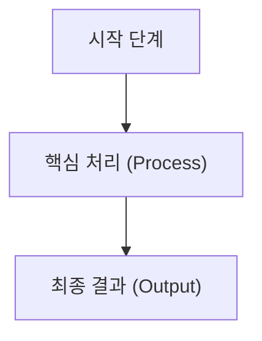

# File Summarizer Skill (with Gemini & Mermaid)

이 스킬은 다양한 형식(HTML, Word `.docx`, PowerPoint `.pptx`, PDF `.pdf`, 일반 텍스트 및 코드)의 파일을 분석하여 구조화된 한국어 요약 마크다운(`.md`) 문서를 생성하고, 내용에 맞는 **Mermaid 다이어그램**을 자동으로 도출하는 절차를 안내합니다.

---

## 1. 사용 시점 (When to Activate)
- 사용자가 특정 문서나 파일의 내용을 요약해 달라고 요청할 때
- HTML 웹페이지, Word 문서, PPT 슬라이드, PDF 보고서 등의 분석을 원할 때
- 문서 내용을 바탕으로 시스템 구조도, 업무 흐름도, 시퀀스 다이어그램 등의 시각화(Mermaid)를 요청할 때

---

## 2. 작업 절차 (Step-by-Step Workflow)

### 1단계: 파일 형식 식별 및 내용 확인
사용자가 지정한 대상 파일의 확장자를 확인합니다:
- **텍스트/마크다운/코드 (`.txt`, `.md`, `.json`, `.csv`, `.c`, `.h`, `.py` 등)**:
  - `view_file` 도구로 직접 읽거나 에이전트 내에서 탐색
- **웹 문서 (`.html`, `.htm`)**:
  - `view_file` 또는 `chores/summarize_file.py`의 파서를 통해 텍스트 및 구조 추출
- **오피스 문서 (`.docx`, `.pptx`)**:
  - `chores/summarize_file.py` 스크립트를 실행하여 텍스트 및 표 추출
- **PDF 문서 (`.pdf`)**:
  - Gemini API의 네이티브 멀티모달(`application/pdf`) 기능을 활용할 수 있도록 `python chores/summarize_file.py "<file_path>"` 실행

### 2단계: 요약 스크립트 실행 또는 직접 생성
1. **스크립트 실행 방식 (권장)**:
   ```powershell
   python d:\code\docs\chores\summarize_file.py "<대상_파일_경로>"
   ```
   - 이 명령어는 자동으로 파일 내용을 추출하고, Gemini API를 호출하여 `[파일명]_summary.md` 파일을 생성합니다.
   
2. **에이전트 직접 요약 방식 (API 키 미설정 또는 대화형 요청 시)**:
   - 파일 내용을 읽은 후 아래의 **요약 표준 템플릿**과 **Mermaid 작성 규칙**을 엄격히 준수하여 마크다운 파일로 작성합니다.

---

## 3. 요약 문서 표준 템플릿

결과 마크다운 문서는 다음 구조로 작성되어야 합니다:

```markdown
# 📄 [문서 제목 또는 핵심 주제]

## 1. 문서 개요 (Overview)
- **문서명/파일**: `[파일명]`
- **문서 포맷**: `[포맷]`
- **대상 독자 및 목적**: [문서가 다루는 대상과 목적 간략 정리]
- **핵심 키워드**: `키워드1`, `키워드2`, `키워드3`

## 2. 핵심 요약 (Executive Summary)
[문서의 가장 중요한 핵심 내용을 3~5문장으로 명확하게 요약]

## 3. 상세 내용 및 핵심 분석 (Key Content & Analysis)
[섹션/장/슬라이드별 핵심 내용, 주요 데이터, 표 등 정리]

## 4. 시각화 다이어그램 (Mermaid Diagrams)
[문서의 이해를 돕는 프로세스, 구조, 흐름을 Mermaid로 표현]



## 5. 결론 및 주요 시사점 (Key Takeaways & Action Items)
- **주요 결론**: 핵심 결론 요약
- **권장 조치/적용점**: 실무 적용 및 참고 사항
```

---

## 4. Mermaid 다이어그램 작성 필수 규칙

1. **지원 다이어그램 유형**:
   - 업무 흐름 / 순서도: `flowchart TD` 또는 `flowchart LR`
   - 컴포넌트 / 인터랙션: `sequenceDiagram`
   - 수명 주기 / 상태 변화: `stateDiagram-v2`
   - 클래스 / 모듈 구조: `classDiagram`
   - 데이터베이스 / 엔티티 관계: `erDiagram`

2. **문법 안전성 원칙**:
   - 괄호 `()`, 대괄호 `[]`, 공백, 특수문자가 들어간 라벨은 반드시 큰따옴표로 감싸기:
     * 올바른 예: `id1["초기화 (Phase 1)"]`
     * 잘못된 예: `id1[초기화 (Phase 1)]` (문법 오류 유발)
   - 노드 ID는 알파벳과 숫자로 간단하게 지정 (예: `A`, `B`, `step1`, `step2`).
   - HTML 태그(`<br>`, `<b>` 등)를 라벨 내에 사용하지 마세요.

---

## 5. 결과 확인 및 안내
- 생성이 완료되면 생성된 파일의 경로를 사용자에게 클릭 가능한 링크 형식(`file:///...`)으로 명확히 안내합니다.
